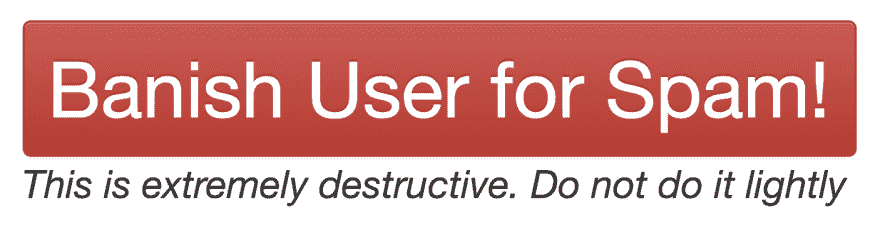
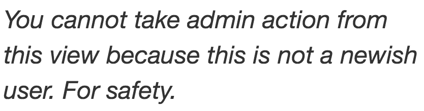

# 夏威夷导弹警报是软件开发者的错

> 原文：<https://dev.to/ben/the-hawaii-missile-alert-was-the-software-developers-fault-2bid>

周六意外触发导弹警报的员工[按错了按钮](https://www.washingtonpost.com/news/post-nation/wp/2018/01/14/hawaii-missile-alert-how-one-employee-pushed-the-wrong-button-and-caused-a-wave-of-panic/?utm_term=.74ea7eac546c)。这是一个灾难性的错误，让美国人惊慌失措，四处逃窜。不用说，这是一种应该不惜一切代价避免的事故。请看《华盛顿邮报》相关文章中的这段话。重点是我的。

> 根据该州发布的时间表，上午 8 点 05 分左右，夏威夷紧急情况雇员启动了内部测试。从电脑程序的下拉菜单中，他看到了两个选项:“试射导弹警报”和“导弹警报”他应该选择前者；正如现在世界上大部分人所知，他选择了后者，启动了现实生活中的导弹预警。

没错。触发警报的人是通过从下拉菜单中选择并选择错误的菜单来触发警报的。这不是人为错误，这是软件设计错误。未能解释这一事件是绝对的疏忽。我不知道其他人是怎么做的，但是当我在设计具有潜在破坏性后果的界面时，我会非常小心地去做。

在这个网站 [dev.to](https://dev.to/) 上，一个软件开发人员分享帖子的社区平台，就像你现在正在阅读的这个，管理员有几个内部接口来执行相当具有破坏性的行为。我们可能采取的一个行动是禁止某人发送垃圾邮件。在这样做的时候，我们把所有坏演员的帖子和评论都拿下来，不允许他们再次注册这样做。这个按钮在我们的后端看起来是这样的:

[T2】](https://res.cloudinary.com/practicaldev/image/fetch/s--5kg8NnbF--/c_limit%2Cf_auto%2Cfl_progressive%2Cq_auto%2Cw_880/https://thepracticaldev.s3.amazonaws.com/i/8euqck78zwsr1qqnqo86.png)

甚至没有*那么*具有破坏性。如果需要，我们可以恢复这些数据。

此外，只有当用户有资格对其执行此操作时，才可以访问该屏幕。如果我为大多数用户访问同一个页面，我会在该按钮所在的位置看到以下消息:

[T2】](https://res.cloudinary.com/practicaldev/image/fetch/s--23UiASMq--/c_limit%2Cf_auto%2Cfl_progressive%2Cq_auto%2Cw_880/https://thepracticaldev.s3.amazonaws.com/i/k5ri4d0uffmybp3r82se.png)

这意味着管理员必须手动执行所有操作。这是一项耗时的活动，没有人可能会偶然做。

我们犯错的后果微乎其微。最坏的情况是丢失一些数据。这是我们非常不想做的事情，但最终也没什么大不了的。提醒一个国家它正受到攻击是一件大事。软件开发人员不能发布使这种人为错误成为可能的界面。能犯的错，终究会犯。我们称这种类型的错误为“胖指法”，这种错误经常发生。

当然，创造按钮的设计者和开发者并不是按下按钮的人，但这场灾难是他们的错。这不是推手的疏忽，也不是他们的训练系统。错误时有发生，我经常犯错误，你也一样，但是让我们从这次错误中吸取教训，写出更好的软件。

*不要脸的塞因为这个帖子得到了很多飞来飞去的社交流量:*

如果你仍然是我们平台上的潜伏者，我建议你现在花一分钟创建你的账户。成为我们开发社区的一员将会有很多收获，我们非常欢迎您的加入。🙏❤️