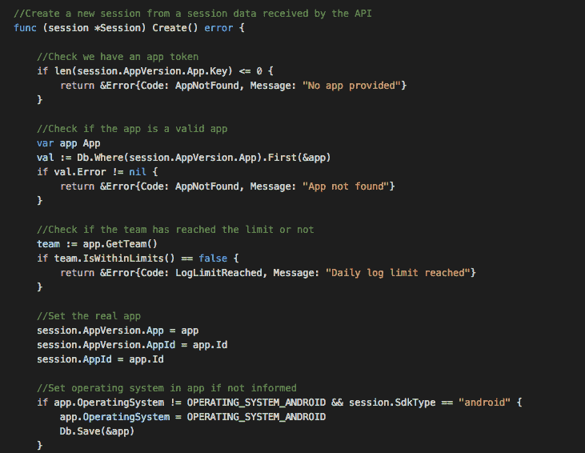
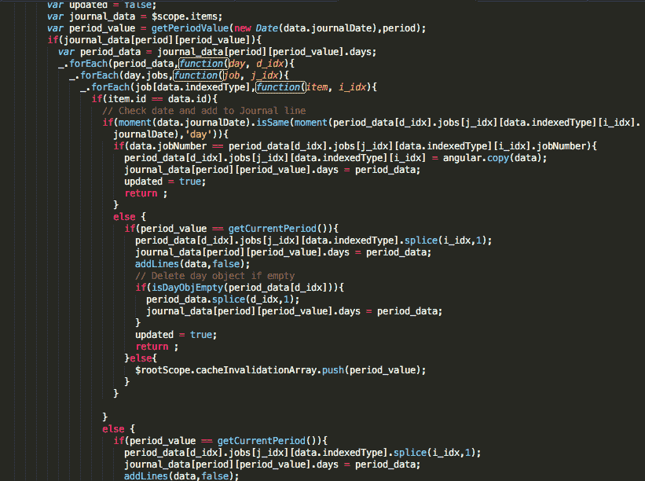

# 高质量评论的重要性

> 原文：<https://dev.to/bugfenderapp/the-importance-of-quality-comments>

你让代码自己说话吗？或者你评论直到母牛回家？

在 [Mobile Jazz](https://www.mobilejazz.com/) 我们为客户开发移动应用和网站。我们致力于交付高质量的软件，对我们来说，这意味着关注最小的细节。

开发人员中一个永恒的热门话题是对代码进行评论。甚至在我们的团队内部，我们也就此展开了热烈的内部讨论:一些人很少对他们的代码发表评论，而另一些人则喜欢大放厥词。

添加注释的主要目的之一是帮助将来的工作。在我们的例子中，这一点尤其重要，因为它使我们能够同时从事不同的项目，或者仅仅每隔 X 个月从事一个项目。

让我们看一个真实的例子，它来自我们从一个开发人员那里继承的一些代码。我们遇到了一个本应轻而易举就能解决的问题。但是，由于一个糟糕的评论，它很快变成了一个真正的头痛。

以下是截图:

[T2】](https://res.cloudinary.com/practicaldev/image/fetch/s--cWd9E8KX--/c_limit%2Cf_auto%2Cfl_progressive%2Cq_auto%2Cw_880/https://bugfender.com/wp-content/uploads/2017/03/importance-of-comments-01.png)

如您所见，注释清楚地表明有一个自定义库 jar，但这并没有真正帮助我们。原因如下:

*   通常，注释放在它所引用的代码之前，而不是之后。在这种情况下，注释指的是凌空. jar 库。所以这是开发商的错误；在向代码添加注释时，整个团队应该保持一致。
*   该描述没有提供任何信息，它只是说我们出于某种未知的原因正在使用一个定制的 jar。如果我们知道为什么需要这些改变，情况会好得多。
*   它没有指出自定义库源代码的位置，也没有指出如何构建它。

如你所见，评论**很重要**。通常开发人员不会太在意评论，因为对他们来说，他们正在做的事情是显而易见的。

然而，想象一下，这个特定的开发人员离开了公司。团队的其他成员也是如此，持续两年。现在，公司里没有人理解这个评论，当一个新的开发人员需要深入研究代码时——哎呀，没有办法知道发生了什么。这正是本例中发生的情况。

此外，您应该始终记录您对现有库所做的任何更改，并保留修改版本的代码。然后，您可以通过注释本身添加到代码和变更文档的链接。如果您使用的是 GitHub 中的公共库，最好创建原始库的一个分支，并将修改后的版本保存在您的 GitHub 帐户中。

厨师太多会破坏汤吗？绝对不行。

有太多评论总比没有好。例如，在我的情况下，我同时从事许多不同的项目和语言，所以对我来说，当涉及到快速理解正在发生的事情时，对代码进行评论会有很大的帮助。

让我们看看另一个例子，这次是带有质量注释的代码。

下面的截图包含了一些来自 [Bugfender](https://www.bugfender.com/) 的 GO 代码。即使你不懂围棋，对 Bugfender 一无所知，你也可以很容易地理解代码:

[T2】](https://res.cloudinary.com/practicaldev/image/fetch/s--oyRW-bvn--/c_limit%2Cf_auto%2Cfl_progressive%2Cq_auto%2Cw_880/https://bugfender.com/wp-content/uploads/2017/03/importance-of-comments-02.png)

是的，大多数注释可能看起来是多余的，因为代码非常干净和清晰，但是用纯文本格式的注释可以让任何人在几秒钟内理解函数在做什么。不需要了解 GO 或产品中的模型。如果您想更深入地研究代码的某个特定领域，这会变得容易得多。

现在，看一下下面我们从一个客户那里继承的一些代码的截图:

[T2】](https://res.cloudinary.com/practicaldev/image/fetch/s--xhjoz_oQ--/c_limit%2Cf_auto%2Cfl_progressive%2Cq_auto%2Cw_880/https://bugfender.com/wp-content/uploads/2017/03/importance-of-comments-03.png)

是的，代码中有一些注释，但是即使有注释也很难理解代码在做什么，因为它们没有提供足够的信息。

代码越复杂，应该有越多的注释。

## 结论

在 Bugfender 和 Mobile Jazz，我们非常重视代码质量。我们总是确保我们的项目是用干净、清晰的代码编写的，可以很容易地被理解并传递给我们的客户。

这是我们写评论的蓝图:

*   评论是关键。写下来！
*   思考代码/应用程序的未来。你可能不在这里，或者可能几年内都不会重游此地。从现在起一年后你能理解代码吗？
*   当你写评论的时候，想象一下通过另一个开发者第一次看到它们的眼光来阅读它们。它们有意义吗？
*   记录/保存您对库所做的任何更改。如果您正在构建项目，这是必不可少的。

你们公司有评论规则吗？和我们一起分享吧！