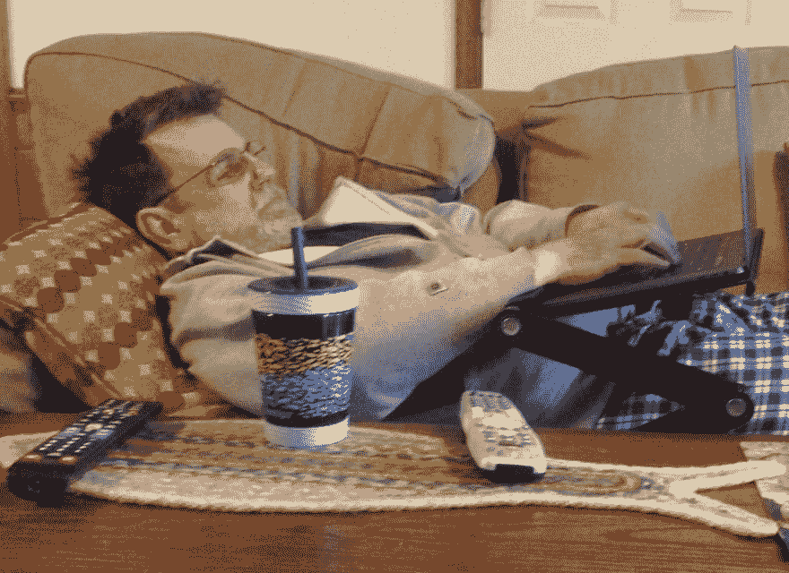

# 卧榻与卧榻技术

> 原文：<https://dev.to/dondenoncourt/the-lying-desk-and-the-patate-technique-cg0>

[T2】](https://res.cloudinary.com/practicaldev/image/fetch/s--eWblQGq0--/c_limit%2Cf_auto%2Cfl_progressive%2Cq_auto%2Cw_880/https://thepracticaldev.s3.amazonaws.com/i/fupt4powqmccahrntpty.jpg%3Fraw%3Dtrue)

# 卧榻与卧榻之术

我们都听说过站立式办公桌，甚至跑步机办公桌。特别之处在于，坐在办公桌前是一种新的吸烟方式。从运动、锻炼、卡路里等方面来看，这都很好，但要明白睡眠比锻炼更重要。事实上，专家说他们是平等的，但是他们总是在“运动”之前列出或说“睡眠”，所以你去吧。

介绍平躺桌。你可以在地板上做，但我更喜欢好的沙发。

## Patate 技术

我的才华不止于躺桌:我们都听说过，你们中的许多人可能会练习番茄工作法。好吧，我把番茄红素增加了-通过反转。我不是工作 25 分钟然后休息 5 分钟，而是小睡 25 分钟然后工作 5 分钟。我称之为 patate 技术(Patate 在意大利语中是土豆的意思，基本上是番茄的反义词。)

睡眠的重要性怎么强调都不为过。不要相信我。听听世界睡眠专家吉姆·加菲根是怎么说的:“鉴于我对睡眠的热情，我对午睡的感受并不奇怪。我相信午睡。”加菲根接着谈到了午睡的重要性:“我知道午睡通常是为婴儿和老人准备的，但我不歧视。”

你可能在想:白天打盹会不会影响你晚上的睡眠？嗯，这就是躺桌和 Patate 技术的妙处。在一天的辛苦工作之后，我得到了充分的休息，以至于我可以在深夜做生活中真正重要的事情:脸书、狂看网飞、Snapchat、Twitter 和发短信。