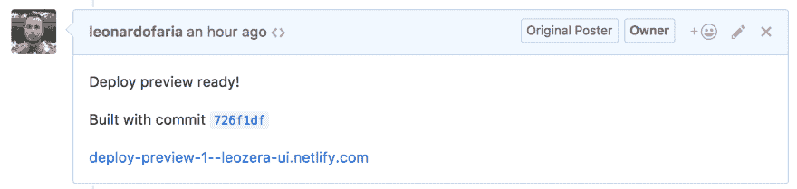
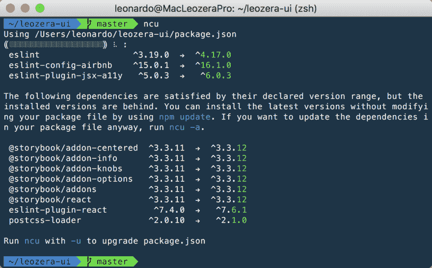

# 关于构件库建设的思考

> 原文：<https://dev.to/leonardofaria/thoughts-on-building-components-libraries-2gkj>

*[原载于我的博客](http://bit.ly/2FGBuwY)*

几个月前，我们在 thinkfic 开始使用 React。使用 React 的挑战之一是创建可重用的组件，不仅从外观和感觉的角度，而且在不同的项目中是可共享的。

我没有创建元素(或组件)库的概念。老实说，到处都有关于它的播客、课程和例子，但是如何开始呢？当您从头开始创建项目时，您会面临几个问题:

*   如何设计组件的样式？萨斯？手写笔？样式组件？
*   如何展现元素？
*   图书馆怎么建？巴贝尔？Webpack？
*   如何发布库？去 NPM 还是不去 NPM？
*   如何利用集成和 CI 为自己服务？

很多决定，你可能不知道所有的答案。Startup Life 不会让你为所欲为——任何事情都有成本和代价。为什么我要讲这个故事？因为我想分享我的想法，所以我创建了一个 [**库来记录**](https://github.com/leonardofaria/leozera-ui) 我们正在做的事情。

## 造型

样式化组件改变了我们对事物进行样式化的方式，但是许多人仍然在使用 Sass，尤其是当它们来自 Rails 时(比如我们的例子)。

如果您已经在 Sass 中做了一些事情，那么就没有理由迁移到样式化组件。此外，如果您将所有内容都保存在 Sass 中，您仍然可以很容易地导出编译后的样式——比如 bootstrap.css。

## 显示元素

当主题是展示一个组件及其属性时，故事书可能是最好的选择。我对故事书的两点看法:

*   他们有非常好的空闲时间，这是无穷无尽的知识来源。
*   插件非常有用，值得花时间测试一下。例如[旋钮](https://github.com/storybooks/storybook/tree/master/addons/knobs)，让你通过浏览器改变道具。相当方便。
*   您可以使用 Github 页面托管您的故事书。这非常简单，像 [gh-pages](https://github.com/tschaub/gh-pages) 或 [branchsite](https://github.com/enriquecaballero/branchsite) 这样的项目就能完成任务。
*   你也可以使用 [Netlify](https://www.netlify.com/) 托管你的故事书。老实说，这是我最喜欢的方法，因为你可以构建主分支作为官方文档，构建所有额外的提交——并在[拉请求](https://github.com/leonardofaria/leozera-ui/pull/1)中获得它们！

## 建筑图书馆

这里有几种不同的方法。我正在使用 Babel 单独编译 ES6 组件和 webpack，以便在一个文件中构建所有内容。

在我写这篇文章的时候 [webpack 4](https://medium.com/webpack/webpack-4-beta-try-it-today-6b1d27d7d7e2) 是测试版。性能提升相当惊人。

## 出版图书馆

同样，在 NPM 有不同的方法来发布图书馆。现在，我有一个`yarn run publish`命令，它将修改版本，构建库并发布构建好的`dist`目录。

这种方法非常手动，但像 [np](https://github.com/sindresorhus/np) 、 [npm-bump](https://github.com/mgol/npm-bump) 和 [pmm](https://github.com/d4rkr00t/pmm) 这样的包可以在这里有所帮助。也可以用`yarn version`——如果你是纱人的话。

## 使用集成

我在资源库中添加了 CircleCI，因为我以前每天都使用它。它运行由 jest 创建的测试，并在将代码覆盖上传到 Codecov 之后。CircleCI 和 Codecov 对于开源项目都是免费的。当然你可以使用 [Travis CI](https://travis-ci.org/) 和[套装](https://coveralls.io/)，对于开源项目也是免费的。

最近刚搞清楚的一个项目是[节点安全平台](https://nodesecurity.io/)。它的工作是监控你的仓库中的漏洞威胁。Github 也[提供](https://help.github.com/articles/about-security-alerts-for-vulnerable-dependencies)同样的服务。

谈到外部依赖，你可能会想到[格林守护者](https://greenkeeper.io/)或[依赖者。io](https://www.dependencies.io/) 。它们都监视您的 package.json，并创建单独的 Pull 请求来更新您的存储库中的包。另外两个选项是:`yarn outdated`或 [ncu](https://www.npmjs.com/package/npm-check-updates) :

[T2】](https://www.npmjs.com/package/npm-check-updates)

最后，我想添加一个 npm 脚本来更新 authors 文件。我在这里拍:

```
git log --format='%aN <%aE>' | sort -u --ignore-case | grep -v 'users.noreply.github.com' > AUTHORS.txt && git commit AUTHORS.txt -m 'Update AUTHORS' || true 
```

Enter fullscreen mode Exit fullscreen mode

如果你对`git commit AUTHORS.txt -m 'Update AUTHORS' || true`很好奇。我们并不总是会修改文本文件，所以我需要`|| true`来确保脚本即使在 git 报告错误后也能继续运行，因为没有要提交的更改。

## 额外资源

我在这里添加了一些关于这个主题的有用链接:

*   播客:[顶级货架风格指南](http://frontendhappyhour.com/episodes/top-shelf-style-guides/):这里有很多想法和链接——顺便说一下，这个播客真的很好
*   课程:[创建可重用组件](https://www.pluralsight.com/courses/react-creating-reusable-components)
*   (迷你)-课程:[在 NPM 上发布 JavaScript 包](https://egghead.io/courses/publish-javascript-packages-on-npm) -因为这个迷你课程我找到了 [np](https://github.com/sindresorhus/np) ，前面引用过。
*   网站:[风格指南](http://styleguides.io/) - 496 网站风格指南及盘点...
*   灵感:[蚂蚁设计](https://ant.design/)
*   灵感:[图集](https://atlaskit.atlassian.com/)
*   灵感:[肚子](https://nikgraf.github.io/belle/)
*   灵感:[索环](http://grommet.io/)
*   灵感:[语义 UI](https://react.semantic-ui.com/)
*   灵感: [UI React 套件](http://reactsymbols.com/)

感谢我的同事 [Akio](https://github.com/akiokio) 对此的帮助(以及[在 reactjs.org 库](https://github.com/reactjs/reactjs.org/pull/338#issuecomment-346891946)上展示 Netlify)以及我的 Thinkific 的其他同事。