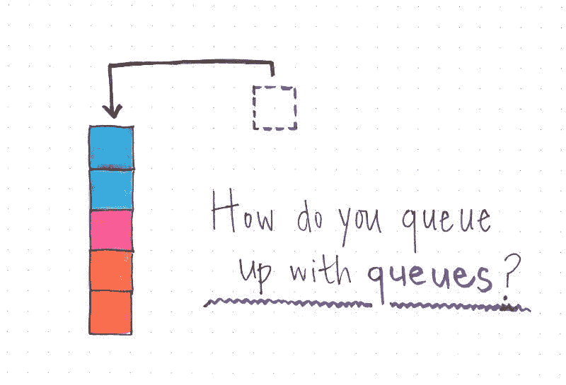
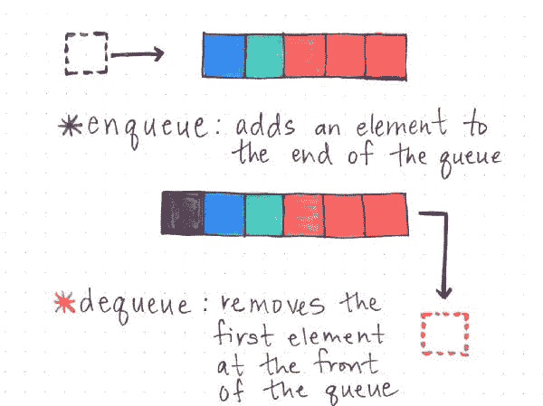
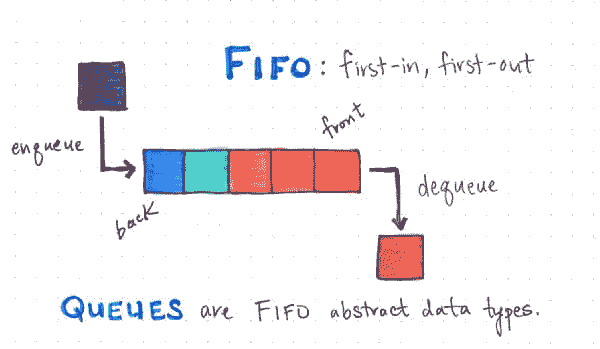
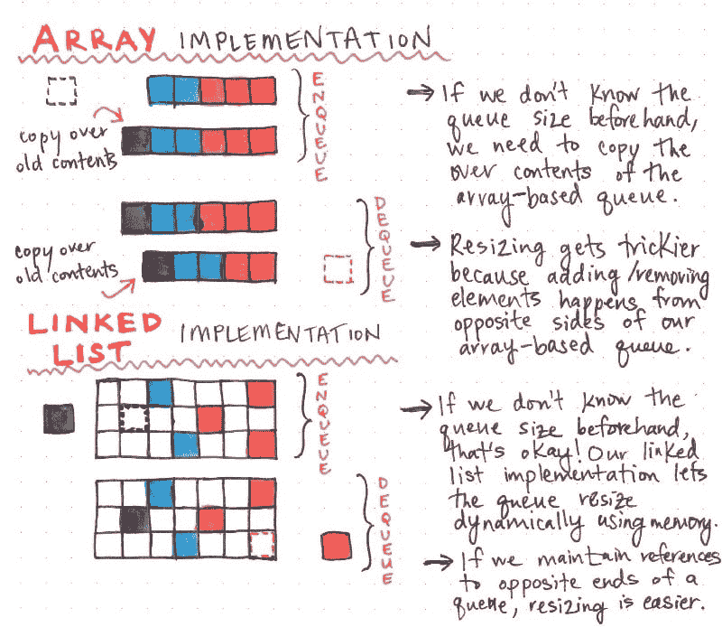
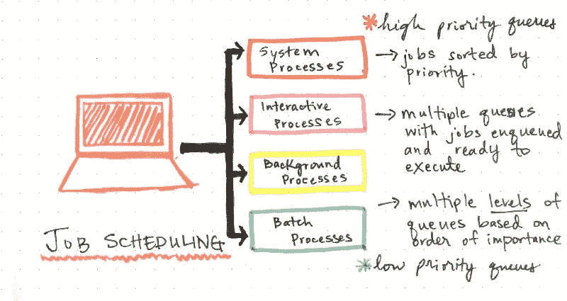
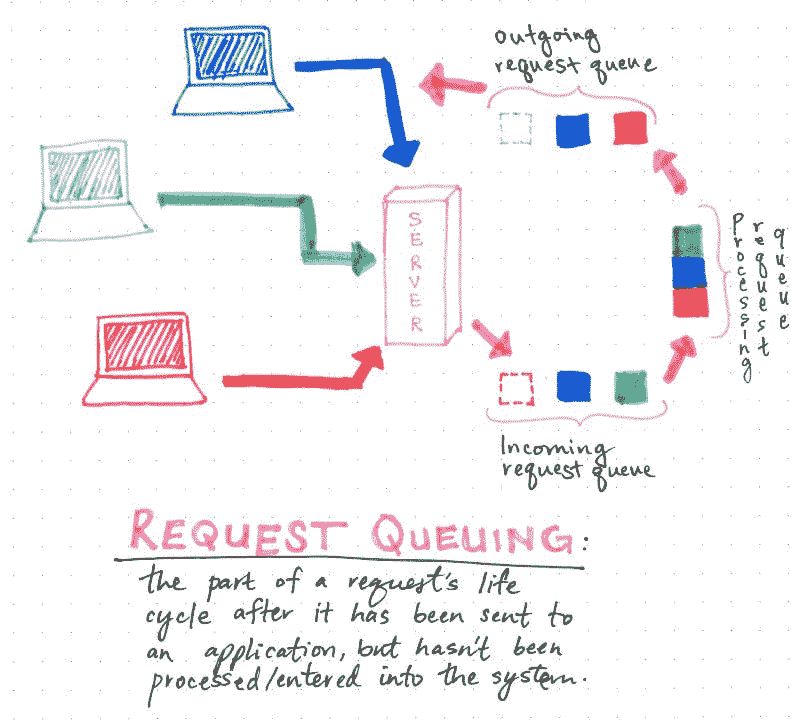

# 排队还是不排队

> 原文：<https://dev.to/vaidehijoshi/to-queue-or-not-to-queue>

当我第一次了解后台工作和调度工人时，我才刚刚开始学习编码六个月。一开始，我并没有质疑这一切是如何运作的。我只是试着学习如何使用 T1，并让 T2 使用 T3。

但是几个月后，我开始想知道这一切是如何运作的；然而，与此同时，我被所有向我介绍的新事物所淹没，以至于我甚至没有试图回答潜伏在脑海深处的问题*它是如何工作的*，而是专注于简单地尝试*首先让它工作*。

然后，一年后，在一次各地的工作面试中，有人问我关于工作和日程安排的问题，以及我认为这一切是如何运作的。我猜？我曾说过，作业是数组中的一堆对象，您只需遍历并完成它们，然后在它们完成时移除它们。事实证明，我离真相并不远。

我最喜欢抽象的一点是，一旦你开始在一个系统、语言或代码库中找到一种抽象模式，那么在其他地方识别这些模式就变得容易多了。有些模式在很多软件中使用，即使我们一天中多次使用它们，我们也不需要考虑它们。其中一个抽象是用于实现作业、工人，甚至最简单的网络请求——它们被称为**队列**。它们到处都是！

### 一个人如何排队？

[T2】](https://res.cloudinary.com/practicaldev/image/fetch/s--rEJy5ks5--/c_limit%2Cf_auto%2Cfl_progressive%2Cq_auto%2Cw_880/https://cdn-images-1.medium.com/max/800/1%2AysEhV_E5aT_ICEcpTMpIyQ.jpeg)

在计算机科学课程中，队列和堆栈经常被放在一起教授，因为它们非常相似，尽管它们的用途和实现完全不同。我们已经很了解[栈如何工作](https://medium.com/basecs/stacks-and-overflows-dbcf7854dc67#.3l76d12dq)，以及我们如何只能从一侧添加和删除元素。

> 这就是队列和堆栈的不同之处:它们是以完全不同的方式构造和构建的。

[T2】](https://res.cloudinary.com/practicaldev/image/fetch/s--PtOzIEMm--/c_limit%2Cf_auto%2Cfl_progressive%2Cq_auto%2Cw_880/https://cdn-images-1.medium.com/max/600/1%2AVs3HF926_6s7vI_OCv3rTQ.jpeg)

一个**队列**是一个线性抽象数据类型，可以包含一长串元素。但是重要的是要记住它们是如何变大和变小的。

有些术语我们以前可能听说过，实际上是从向队列结构中添加或从中删除元素的术语中派生出来的。向队列中添加元素的过程称为**入队**，而从队列中移除元素的过程称为**出队**。然而，关于队列如何工作的有趣的事情是在发生入队和出队的*。*

[T2】](https://res.cloudinary.com/practicaldev/image/fetch/s--Adx_3bs---/c_limit%2Cf_auto%2Cfl_progressive%2Cq_auto%2Cw_880/https://cdn-images-1.medium.com/max/600/1%2AwN83zdV3arHyUl5GQXxRfw.jpeg)

如果我们想到在熟食店或开胃商店排队，事情通常是这样的:你取一个号码，然后等待轮到你。最先到达的人是最先被招待的人。大多数线路都是这样工作的，对吗？

队列数据结构也是如此:队列前面的第一个元素是第一个被服务的元素——或者，在大多数情况下，是第一个被处理、处理或运行的元素，这取决于元素是什么。

> 队列在很大程度上遵循先进先出的原则。队列中的第一个元素，或队列前面的元素，总是第一个被处理并从队列中移除。

如果我们最终忘记了关于队列和堆栈的所有其他知识，这可能是需要记住的最重要的区别:堆栈是后进先出(LIFO)结构，而队列是先进先出(FIFO)结构。

### 队列和链表:最好的朋友

队列和堆栈总是作为并行主题出现的一个原因是，为了构造这两种数据类型，我们最终会编写类似的函数。例如，尽管它们的函数名称不同，但许多功能是相同的:

1.  堆栈的**推送**功能类似于队列的**入队**功能
2.  堆栈的**弹出**函数类似于队列的**出列**函数
3.  总的来说， **size** 和 **isEmpty** 是非常有用的函数

然而，它们出现在一起并且看起来如此纠结还有另一个原因:它们都可以被实现为一个**数组**或一个**链接的** **列表**。

正如我们从上周的[深度探讨](https://medium.com/basecs/stacks-and-overflows-dbcf7854dc67#.3l76d12dq)中已经知道的，如果推到堆栈上的元素超过了数组的分配大小，那么将堆栈实现为数组会导致非常混乱的堆栈溢出。那么说到排队，是怎么回事呢？

事实证明，数组可能最终成为队列的*甚至* *更糟糕的*实现工具，这取决于情况和环境。

当我们提前知道数据结构的大小时，数组会非常强大。但是很多时候(特别是队列)，我们并不知道我们的队列会有多长。那么当我们必须将一个元素排队时会发生什么呢？嗯，如果我们事先不知道队列的大小，而我们使用的是一个数组，那么我们很可能会很快用完分配的内存和空间。因此，我们需要复制数组的内容，然后分配更多的空间和内存，*然后*将一个新元素放入队列的末尾。

但是基于数组的队列实现还有另外一个增加的复杂性:我们需要能够在数组的后面排队，从前面出列——这并不总是很糟糕，因为访问数组中的第一个或最后一个元素并不需要花费*太多的时间，但是它不像栈那样简单，栈中元素的添加和删除都发生在结构的一端。随着我们阵列的增长，我们将需要能够访问一端和另一端，因此时空复杂性将会增加。*

[T2】](https://res.cloudinary.com/practicaldev/image/fetch/s--DuLghZ5C--/c_limit%2Cf_auto%2Cfl_progressive%2Cq_auto%2Cw_880/https://cdn-images-1.medium.com/max/800/1%2AeXw4QWGVK_3ktaQ_LDchsA.jpeg)

然而，有了队列的[链表](https://medium.com/basecs/whats-a-linked-list-anyway-part-1-d8b7e6508b9d#.cdpluymb9)实现，事情就简单多了。我们不需要提前担心队列的大小，因为内存可以分布，我们的队列的链表实现可以动态增长(只要我们不使用*所有的*计算机内存)。入队和出队变得容易得多，因为我们可以简单地在内存中找到一个空白空间，添加一个引用其下一个邻居**的**节点**。不需要像阵列实现那样复制和重新创建队列。而且，如果我们在列表的开头和结尾添加指针引用，我们也不需要遍历整个结构来使一个元素入队或出队！**

事实上，一旦去掉遍历队列的需要，队列上的*入队*和*出队*函数的时空复杂度就变成了**常数时间**，或**O(1)**；也就是说，无论队列变得多大或多小，添加或删除一个元素所花费的时间保持不变。

当然，以数组或链表的形式实现堆栈和队列是完全可能和有效的。但是重要的是要认识到这两种实现之间的差异，以及什么时候一种可能比另一种更有用。

### 隐藏线路，秘密队列

既然我们已经知道了队列是如何工作的，是什么使它们不同于堆栈，以及我们可能希望何时以及如何实现它们，那么让我们在这里回答一个更大的问题:*这些为什么重要？*

嗯，这其实很重要。原因是:到处都在排队。他们就在我们周围！我们只需要更深入地看看我们每天使用的东西是如何在它们的抽象下工作的。

如果你是一个后端开发人员，你有可能不得不安排后台作业，或者工人，或者必须在一个单独的线程上运行的任务，或者作为一个不同的进程。在任何给定时间运行作业或启动在后台运行多个工作线程的任务的方法都是通过**作业调度器**来执行的，该调度器在单独的线程中运行一个队列，并以 FIFO 的方式执行作业——添加到队列中的第一个作业将运行，并从队列中删除，直到队列为空且所有后台作业都已处理完毕。

如果您是一名前端开发人员，您可能使用过 jQuery，甚至可能不得不使用它的 API 创建动画。jQuery API 使用队列来允许一系列函数在 DOM 中的元素上异步执行，并建立一个“步骤”的**队列**，从一个 CSS 值转换到另一个值，以创建一个平滑的动画。事实上，jQuery 的 API 实际上有一个`dequeue()`函数，您可以调用它从队列中的一个元素移动到下一个元素！

但是不仅仅是在我们作为开发人员的生活中，或者在我们的代码库世界中，队列很重要。它们也存在于我们个人机器的环境中！

运行操作系统的软件有自己的进程队列，这些进程必须在任何给定的时间运行。但是，一般来说，这不像一次运行一系列进程那么简单；相反，你的机器必须在任何给定的时间运行不同重要性的不同进程。有时，这被实现为一个**多级优先级队列**，它根据优先级顺序调度要被划分的进程，然后根据它们的重要性级别执行队列。

[T2】](https://res.cloudinary.com/practicaldev/image/fetch/s--HPcPBZCZ--/c_limit%2Cf_auto%2Cfl_progressive%2Cq_auto%2Cw_880/https://cdn-images-1.medium.com/max/800/1%2AwEOMvhOi4ftHx8-4HGI4qw.jpeg)

例如，系统进程队列通常比后台进程队列优先；因此，后台进程队列将不得不等待轮到它，直到系统进程队列已经运行并完全执行，直到下一个队列可以开始执行。

但是让我们进一步缩小。队列在宏观层面上是什么样的？不仅仅是我们的单个机器一直在运行并发队列。遍布世界各地的服务器(运行世界各地构建的大量不同的应用程序！)也可以使用“你猜对了”队列来处理事情！

当多台(想一想成百上千)机器请求数据或将数据发送到应用程序的服务器时，服务器可能会被大量请求淹没。你有没有想过它是如何处理这些请求的？以及它如何处理所有这些…而不会爆炸？

疯狂是有方法的，事实证明，这个方法就是一个队列。**请求排队**是在请求进入待处理的应用程序之前处理请求的过程。

[T2】](https://res.cloudinary.com/practicaldev/image/fetch/s--oDN7Ce7g--/c_limit%2Cf_auto%2Cfl_progressive%2Cq_auto%2Cw_880/https://cdn-images-1.medium.com/max/800/1%2AIOyP9S_Al9PoXxV_Xry_RA.jpeg)

例如，如果 100 个人都试图在黑色星期五访问亚马逊的网站进行大拍卖，他们的一堆请求可能会到达离他们最近的一台服务器。该服务器将处理所有这些传入的请求，将它们一个接一个地排入一个**传入请求队列**。这些请求将一个接一个地进入应用程序并被处理。当需要对亚马逊主页上的 100 台机器做出响应时，系统会将响应按照处理的顺序排列在**外发请求队列**中。

想想就觉得很神奇，对吧？一个小小的队列结构主宰着网络，让所有的软件运行，帮助我们排队，让互联网像今天这样(几乎)运转良好。

### 资源

你和我一样爱排队吗？那么，在这种情况下，你可能想看看这些了不起的资源！

1.  [书库和队列](http://introcs.cs.princeton.edu/java/43stack/)，罗伯特·塞奇威克教授&凯文·韦恩
2.  线性结构:队列，新德里大学
3.  [日程安排](http://read.seas.harvard.edu/~kohler/class/05s-osp/notes/notes5.html,)艾迪·科勒教授
4.  [队列](https://www.cs.auckland.ac.nz/software/AlgAnim/queues.html)，约翰·莫里斯教授
5.  [队列:链表实现](https://www.cs.bu.edu/teaching/c/queue/linked-list/types.html)，罗伯特·皮茨教授