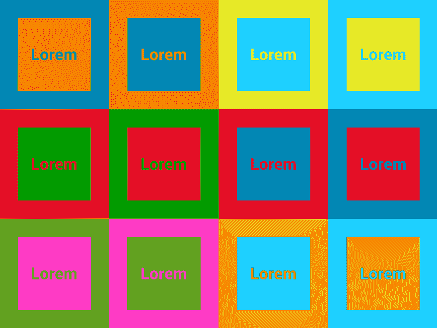
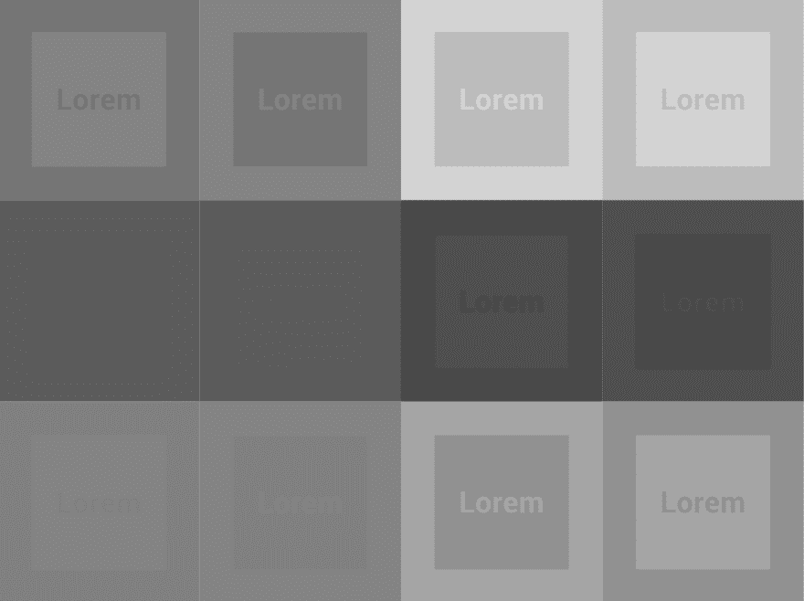
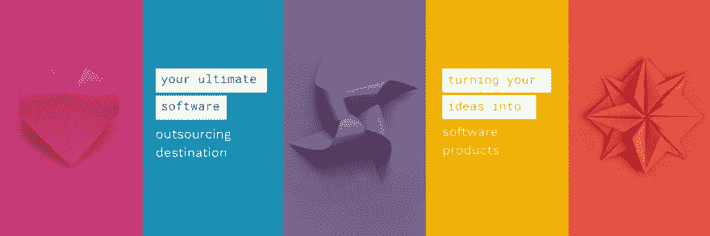
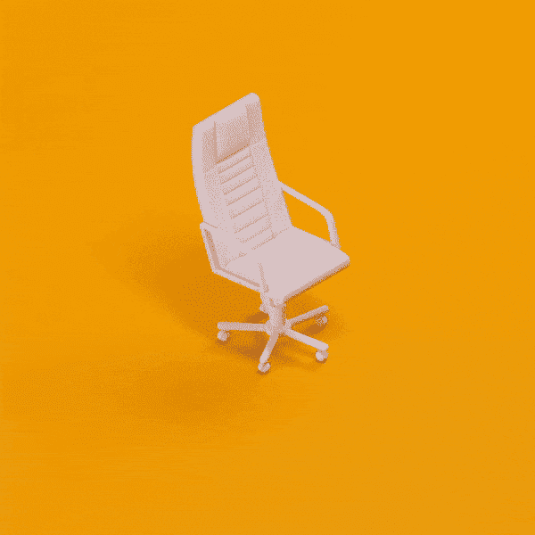

# 棘手的用户界面设计趋势

> 原文：<https://dev.to/galyna_chekan/tricky-ui-design-trends-and-how-to-use-them-3jkf>

跟随最新的用户界面设计趋势并保持领先通常被认为是设计社区的先决条件。每个 UI 设计师最怕的就是被称为过时或不相关。因此，了解流行的东西是有意义的。技术、时尚、媒体，当然还有可用性决定了设计趋势。有些可能会持续一段时间，但大多数只有一两年的寿命。虽然在设计界保持领先是必须的，但重要的是要记住，不是所有的设计趋势都是我们的朋友，盲目跟随它们可能不是最好的主意。

我们想仔细看看一些非常流行的用户界面设计趋势，如果滥用，很容易适得其反，损害你的设计，而不是增强它。

## 更大胆、更明亮、更有色彩

色彩是最稳定的设计趋势之一。几年前，设计师更喜欢中性和柔和的配色方案，以创造干净和时尚的未来设计。但是随着[材质设计](https://material.io/)的到来，潮流已经转移到了更明亮的色调。大胆的色调、柔和的环境和明亮的亮点对于材料设计来说都是必不可少的，它们成为了今年最流行的 UI 设计趋势之一。新鲜的 [Dropbox 重新设计](https://dropbox.design/)的到来只能证明它仍然强劲。明亮的口音鼓励用户互动，并有助于提供用户体验。他们创造了一个声明，一个富有表现力的设计，它不仅能抓住用户的注意力，还能让他们谈论它。

但是除了它们的优点之外，大胆的颜色也很棘手。他们可以通过帮助产品在展台上引起注意来改变印刷设计，从而实现销售。另一方面，在 UI 中，当寻求用户的注意力时，需要考虑其他事情，例如振动的颜色和文本的易读性。明亮、饱和色的结果之一就是我们所说的振动色。著名的色彩理论家约瑟夫·艾伯斯在他的书《色彩的相互作用》中警告人们不要使用这种颜色，“这种最初令人兴奋的效果也会给我们的眼睛带来侵略性的感觉，甚至经常会让我们感到不舒服。人们发现它很少被使用，除了在广告中起到尖叫的效果，因此它令人不愉快，不喜欢，并且被避免使用

除了具有侵略性和令人不快，振动的颜色还会损害文本的可读性。当两种明亮且饱和的颜色相邻出现时，颜色之间的边缘会产生一种发光的扭曲效果。这些模糊的振动边缘对于 UI 字体、小图标和其他细节元素来说尤其危险。更不用说它们对于人眼来说简直难以理解。

[T2】](https://res.cloudinary.com/practicaldev/image/fetch/s--HCgsHr30--/c_limit%2Cf_auto%2Cfl_progressive%2Cq_auto%2Cw_880/https://blog.pixetic.com/wp-content/uploads/2018/04/vibrating-colors.png)

[Dangerous bright color combinations](https://webdesign.tutsplus.com/articles/why-you-should-avoid-vibrating-color-combinations--cms-25621)

Another aspect to be taken into consideration is color blindness. Below are the same color combinations as seen by colorblind. And if these color choices may hurt the eyes of an average person, a colorblind person simply won’t see anything. Though there are different levels of colorblindness, it should be noted regarding accessibility.

[T2】](https://res.cloudinary.com/practicaldev/image/fetch/s--Wg3hraOF--/c_limit%2Cf_auto%2Cfl_progressive%2Cq_auto%2Cw_880/https://blog.pixetic.com/wp-content/uploads/2018/04/color-blindness.png)

[The same color combinations as seen by colorblind](https://webdesign.tutsplus.com/articles/why-you-should-avoid-vibrating-color-combinations--cms-25621)

Bright colors can be a powerful tool. But like almost everything else, they are best when used in moderation. Too many can make your design look flashy, while with too few you run the risk of looking boring. When going for bolder tones, try to stick maximum to three primary colors, the more color you use, the more complicated it is to achieve a balance. The 60-30-10 interior design rule, where 60% is your dominant color, 30% for a secondary color and 10% – accent, color can work for your interface as well.

**Bright and expressive but not harming usability**

[by Pixetic Design Agency](https://pixetic.com/)

## 用动画叙述

动画很有趣，而且给你的网页设计提供了很多机会。并且根据[本网站的分析](https://ihatetomatoes.net/web-animation-trends/)，顶级获奖网站 100%使用 CSS 动画。它有助于交流事物，解释事物如何工作或如何做某事。但更重要的是，他们变得更加深思熟虑，并用于创建网站的叙述。今天，动画不仅仅是一些娱乐效果，而是一个精心选择和定时的元素，成为故事的一部分。使用动画来讲故事的一个最好的例子是由[国家地理](https://www.nationalgeographic.com/magazine/2016/05/yellowstone-national-parks-bears-video/)从熊的角度讲述的一个国家公园的故事。

尽管它们令人兴奋，但仍有一些不足之处值得一提。说到用户体验，性能是一个关键。过于沉重的动画会增加加载时间，跳动甚至根本不工作。动画的目的是使用户的任务更容易和更快地完成。但是当过度使用时，它们会产生相反的效果，妨碍用户，而不是帮助和引导他们。另一个潜在的威胁可能来自毫无理由地添加动画。当它不能解决一个问题时，它会让人分心和困惑。

如果你决定做动画，那就做得有意义。首先要清楚地定义为什么你需要使用它，它能如何帮助你的用户，如果它一点也不烦人。它们还通过使用户体验更流畅来帮助塑造用户体验。将动画融入用户界面的一个好方法是用它们来讲述一个故事。

**A simple story about complex things. Explaining UX process by creating animated metaphor**

[by Pixetic Web Design Agency](https://pixetic.com/)

But no matter what UI design trends are closer to you, it’s important to make them your own. Trends come and go, but the impression you build stays. And in the sea of choices, best is to find the one that reflects your brand’s identity. There’s one design trend that will probably won’t go out of style – it’s user first. Every aesthetic choice you make should be for the sake of your users, of helping, guiding them, making their experience better and easier. Focus on making your design simpler and more refined in terms of usability, and you will always be on point.

[Check out more works by Pixetic Web Design Agency](https://pixetic.com/)

帖子[棘手的用户界面设计趋势以及如何使用它们](https://blog.pixetic.com/tricky-design-trends/)首先出现在[数字设计机构 Pixetic](https://pixetic.com/) 上。