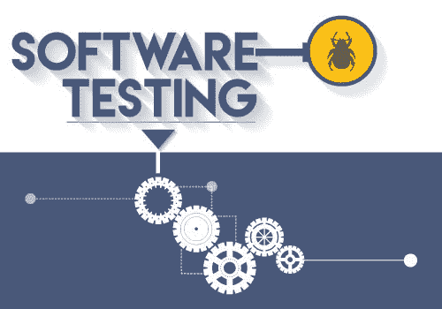
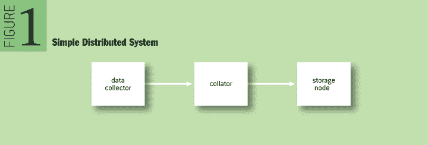

# 分布式软件测试的真正意义

> 原文：<https://dev.to/nishthasinghuk/true-significance-of-testing-for-distributed-software-jb>

由于各种原因，分布式系统尤其难以编程，即从设计到管理工作，尤其是难以测试。现在，即使在最好的情况下测试任何正常的系统，也意味着你有权在你的方式中找到错误。无论这听起来有多令人费解，考虑到所有的标准问题，将它们乘以在多个机器上运行的用多种语言编写的多个流程，就有可能发生真正的灾难。

作为软件测试人员，我们经常听说测试很重要。在自动化测试的帮助下，人们可以很容易地最小化发布到产品中的错误数量，有助于防止回归，提高代码质量，补充文档，并使代码审查更容易。简而言之，测试人员的职责是通过增加系统正常运行时间和让开发人员致力于新功能而不是救火来节省商业资金。

[T2】](https://res.cloudinary.com/practicaldev/image/fetch/s--c25IxiwA--/c_limit%2Cf_auto%2Cfl_progressive%2Cq_auto%2Cw_880/http://www.testbytes.net/wp-content/uploads/2016/02/27-2-2016-Role-of-Software-Testing-in-Development.jpg)

任何不完全在一台计算机上运行的软件都被称为分布式软件。如今，几乎所有的 web 应用程序都是分布式软件。从远程数据存储、内部 REST APIs 到第三方 API、内容交付网络等都是这些应用程序所依赖的服务器。此外，分布式软件的概念提出了新的挑战，需要一种[深思熟虑的软件测试方法](https://www.tatvasoft.co.uk/services/software-testing-and-qa-services.php)。

**下面的帖子讨论了测试分布式系统的一般策略，即端到端测试**

在测试领域中，一个常见而又至关重要的陷阱是检查单个系统的输入和输出。许多专业人士倾向于忽略这类问题，并最终造成许多问题。一个简单的分布式系统由三部分组成:一部分收集数据，一部分将所有数据收集到一致的消息中，一部分接收数据并将其存储起来以供以后检索。

[T2】](https://res.cloudinary.com/practicaldev/image/fetch/s--wOKLoY9p--/c_limit%2Cf_auto%2Cfl_progressive%2Cq_auto%2Cw_880/http://deliveryimages.acm.org/10.1145/2810000/2800697/maddox1.png)

不管为每个组件编写测试有多容易，事情都可能从一端到另一端出错。像数据到达的顺序和时间这样的错误可能有点棘手，会导致各种各样的错误。为了以一种好的方式解决这个问题，人们可以很容易地想到制作所有的组件，以便它们可以在本地运行。通过这样做，您可以控制系统元素的实例何时启动和关闭，当元素分布在不同的机器上时，这是很困难的。除此之外，您还可以将进程放在同一个机器上，并在虚拟机中运行它们，这提供了与在同一台机器上运行它们相同的功能。

此外，您还可能遇到只能访问分布式系统的单个组件的情况。例如，您可以编写一个第三方系统，该系统整理来自各种不同来源的数据，以便为用户汇集数据。在这种情况下，模拟器被证明是最有价值的工具之一，可以帮助开发和调试系统组件。但是，我个人还是想劝你，要意识到它们的局限性，不要过于依赖它们。

**结论**

我希望本文中概述的策略可以为更有效地测试系统提供一些帮助。