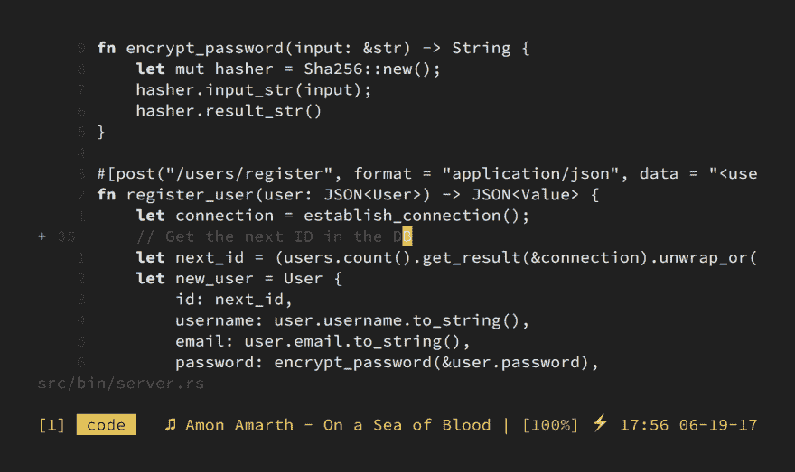

# 关闭语法高亮显示

> 原文：<https://dev.to/huytd/turning-off-the-syntax-highlighter-8af>

良好的...首先，这是一个众所周知的话题，已经在各地广泛讨论。

*   [1][https://www . robertmelton . com/project/syntax-highlighting-off/](https://www.robertmelton.com/project/syntax-highlighting-off/)
*   [2][https://dudzik.co/digress-into-development/syntax-off/](https://dudzik.co/digress-into-development/syntax-off/)
*   [3][http://www.linusakesson.net/programming/syntaxhighlighting/](http://www.linusakesson.net/programming/syntaxhighlighting/)
*   [【4】https://groups.google.com/forum/#!msg/golang-nuts/hjhcaail 0 so/kg 3 bhv 6 qfij](https://groups.google.com/forum/#!msg/golang-nuts/hJHCAaiL0so/kG3BHV6QFfIJ)
*   [5][http://howivim.com/2016/damian-conway/](http://howivim.com/2016/damian-conway/)
*   [https://twitter.com/enneff/status/710071512330477568](https://twitter.com/enneff/status/710071512330477568)
*   [7][https://www.youtube.com/watch?feature=player_embedded&v = dkZFtimgAcM # t = 15 m58 s](https://www.youtube.com/watch?feature=player_embedded&v=dkZFtimgAcM#t=15m58s)

所以我从今年五月开始关闭我的 Vim 的语法颜色，已经五个月了。

[T2】](https://res.cloudinary.com/practicaldev/image/fetch/s--6JFOs50s--/c_limit%2Cf_auto%2Cfl_progressive%2Cq_auto%2Cw_880/https://thefullsnack.com/posts/img/no-color-vim.png)

我现在可以确定它确实有一些好处。

*   更加专注于工作，这意味着更高的生产力
*   更好地阅读/理解代码，甚至更快
*   Vim 运行速度也更快
*   变得更酷了，我的同事们现在把我当成一个来自火星的人

有没有人做同样的事情？

这是我在我的 vim [上使用的配色方案](https://gist.github.com/huytd/8394f21bda3a08be025813c060d64e75)