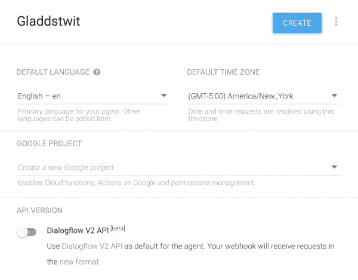
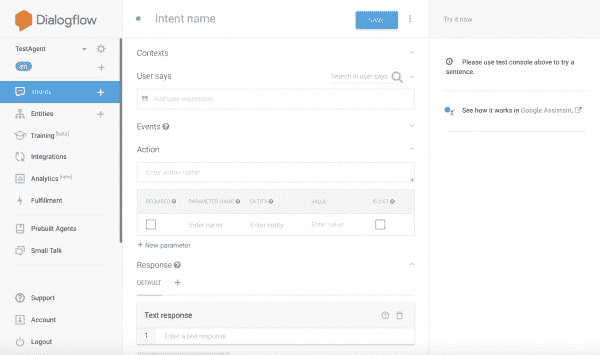
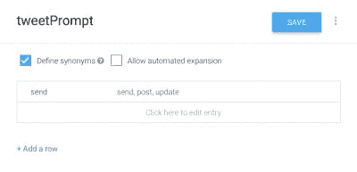
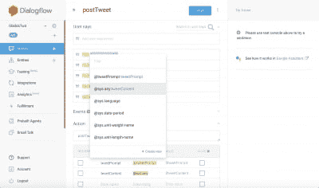
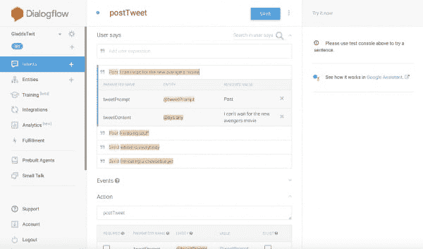

# 谷歌之家的推特

> 原文：<https://dev.to/gladdstone/twitter-for-the-google-home-37dp>

*最初发布在我的[博客](http://joefarrell.me/index.php/2018/01/30/twitter-for-google-home/)*

如果你在 Twitter 上关注我(你[应该](http://www.twitter.com/Pithpifth))，你会意识到我是这个平台的狂热粉丝。所以很自然的，当我今年终于有了一个 Google Home 时，我做的第一件事就是开始修补这个平台，以使用我的 Twitter 帐户——现在，Google Home 开发软件允许自动整合 Twitter，但它不是解决所有问题的方法，我需要一些更有魅力的东西。

第一步是选择我的语言。这很简单，我花了几周时间探索 NodeJS，这似乎是一个发展我的技能的绝佳机会。随着我的开发，这个应用程序经历了许多迭代和平台。有时候用快递，有时候不用。我部署了 Firebase，然后是 Heroku，AWS Lambda，然后回到 Firebase，然后是 Google Cloud Functions(基本上是 Firebase)。

但我今天要讨论的是生产最终产品的过程，或者更确切地说，是今天存在的产品，虽然远非完美，但却是实用的，对于任何有兴趣开始 Google Home 开发的人来说，这是一个极好的起点。

## Dialogflow 入门

[T2】](https://res.cloudinary.com/practicaldev/image/fetch/s--lgJz7KDr--/c_limit%2Cf_auto%2Cfl_progressive%2Cq_auto%2Cw_880/http://joefarrell.me/wp-content/uploads/2018/01/dialogflow-logo.png)

[T2】](https://res.cloudinary.com/practicaldev/image/fetch/s--qKZwmdfM--/c_limit%2Cf_auto%2Cfl_progressive%2Cq_auto%2Cw_880/http://joefarrell.me/wp-content/uploads/2018/01/Screen-Shot-2018-01-25-at-8.32.28-AM-e1516887280252.png)

为了构建 Google Home，你需要做的第一件事就是用 Google 的专用开发环境来设置自己。在这种情况下，Dialogflow 是一个专门的平台，用于训练 Google Home 对你的声音做出响应，并将必要的数据传递给你的应用程序。在我看来，这是构建应用程序最酷的部分，因为它不仅容易上手，而且一旦你注册了谷歌账户，你的应用程序就可以立即在同一账户下的任何谷歌主页上进行测试。

注册很简单，你可能已经有了一个谷歌账户，所以让我们继续，到我们的控制台。

一旦你到达你的控制台，你需要做的第一件事是创建一个新的代理，这将是你与你的 web 应用程序交互的方法，这将构成你的 Google Home 技能的后端。在这里，您将设置基本信息——技能名称、语言、默认时区，您还可以在这里设置一个 web 挂钩，但是我们现在将把它留为空白。我们稍后再来讨论。

[T2】](https://res.cloudinary.com/practicaldev/image/fetch/s--WmLwHTmM--/c_limit%2Cf_auto%2Cfl_progressive%2Cq_auto%2Cw_880/http://joefarrell.me/wp-content/uploads/2018/01/Screen-Shot-2018-01-25-at-8.55.41-AM-e1516889531365.png)

恭喜你。你已经正式创建了一个谷歌主页技能。算是吧。它实际上还没有做任何事情，但是它确实存在。

从这里开始，你将训练你的应用程序，也就是说，当用户说出关键短语时，你将训练它以预定的方式做出响应。首先，请转到左侧的“意向”栏，选择“创建意向”

[T2】](https://res.cloudinary.com/practicaldev/image/fetch/s--jvv1Crpz--/c_limit%2Cf_auto%2Cfl_progressive%2Cq_auto%2Cw_880/http://joefarrell.me/wp-content/uploads/2018/01/Screen-Shot-2018-01-30-at-8.48.44-AM-e1517320172762.png)

这里有很多信息，所以让我们花一分钟来分解一下。首先，你有了你的意向名称。这只是出于组织的目的，所以给它起个名字，让你知道它是做什么的。

“用户说”栏是你向谷歌提供样本短语来训练它识别命令的地方。

“动作”栏是我们设置动作名称的地方，该动作将由我们的应用程序的后端执行(本质上是一个函数)。下面是将作为参数传递给该操作的数据值和类型。我们一会儿就来深入探讨这个问题。

下面是你的短信回复，和你想的一模一样。对于这个应用程序，我们将把它留为空白，因为我们发送的响应将需要确认 tweet 是否被正确发送，因此它将需要由我们的后端处理。

最后，我们有两个下拉菜单-履行和谷歌助理。继续操作，下拉 Fulfillment 并选择“使用 webhook”这将使这个意图在我们的后端应用程序上执行一个动作。

[T2】](https://res.cloudinary.com/practicaldev/image/fetch/s--B3jtHrsU--/c_limit%2Cf_auto%2Cfl_progressive%2Cq_auto%2Cw_880/http://joefarrell.me/wp-content/uploads/2018/01/Screen-Shot-2018-01-30-at-9.17.19-AM-e1517321942934.png)

接下来，我们需要创建一个实体。这个实体将允许我们识别用户想要做什么——在这种情况下，发布一条 tweet。所以转到左边的“实体”并选择“创建实体”这将我们带到一个有两列的表。第一列是我们的主要值，或者是 Google Assistant 会识别为实体的单词。在右边，我们可以定义这个值的同义词。我们希望我们的用户能够通过说“发送[推文]”来发送推文左边的值是 send。现在我们可以转到右边的列，输入一些同义词——post、tweet、update 等。

当你准备好了，命名它——在我的例子中，我称这个实体为 tweetPrompt，因为它提示应用程序发送一条新的 tweet。现在点击保存，回到你的意图。

现在我们已经创建了实体，让我们设置事件参数。首先，我们设置参数名 tweetPrompt。这是一个实体类型@tweetPrompt(我们刚刚创建的那个)，它的值是$tweetPrompt(我们很快就会设置它)。

我们有了提示，现在我们需要内容。实际上，我们在这里要做的是给 Google Assistant 写一张空白支票来兑现，方法是将除 tweetPrompt(即“Tweet[所有这些东西都在这里]”)之外的所有东西都扔进去。我们将调用这个参数 tweetContent，我们需要它有一个@sys.any 的实体类型。这将允许 Google Assistant 获取用户所说的任何内容作为这个参数的值。最后，将值设置为$tweetContent。

现在剩下要做的就是指导 Google Assistant 如何为我们设置这些值。这可能有点棘手，特别是对于 tweetContent，但以我的经验，四五个可靠的例子足以让它对事情应该如何发展有足够的把握。

[](https://res.cloudinary.com/practicaldev/image/fetch/s--GbpjAfl9--/c_limit%2Cf_auto%2Cfl_progressive%2Cq_auto%2Cw_880/http://joefarrell.me/wp-content/uploads/2018/01/Screen-Shot-2018-01-30-at-9.30.37-AM-e1517322885661.png) 让我们继续到“用户说”并键入我们的第一个例子。键入“发送我正在吃奶酪汉堡”,然后按回车键。这将为您创建第一个示例。Dialogflow 应该能够挑选出单词“Send”并将其设置为您的 tweetPrompt，但您的 tweetContent 将需要我们的干预。要设置 tweetContent，只需突出显示消息的剩余部分。这将弹出一个包含“@sys.any:tweetContent”的对话框。选择此选项，文本的该部分将高亮显示。

就是这样！现在重复四到五次(记住使用你的 tweetPrompt 实体的同义词)以完成训练。[T2】](https://res.cloudinary.com/practicaldev/image/fetch/s--wzfHljmi--/c_limit%2Cf_auto%2Cfl_progressive%2Cq_auto%2Cw_880/http://joefarrell.me/wp-content/uploads/2018/01/Screen-Shot-2018-01-30-at-9.32.51-AM-e1517322816820.png)

## firebase/谷歌云功能

对于这个项目，我们将使用 Firebase 来托管我们的应用程序。原因是 Firebase 是谷歌云功能的一部分，正如你所想象的，它与我们的 Dialogflow 应用程序配合得非常好。托管的其他选择可能是像亚马逊网络服务，或 Heroku 这样的东西，它们都有自己的优点和缺点，但为了简单起见，我们在这里将重点放在 Firebase 和谷歌云功能上。

首先，让我们在开发机器上创建一个本地目录。在这种情况下，我把我的叫做“Gladdstwit”现在，在您选择的终端中导航到这个目录(对我来说，我在 Windows 上使用 PowerShell，在 OSX 上使用 stock terminal，尽管那里有各种各样的选项)。首先，您需要安装 NodeJS 和 NPM。如果您不确定，可以检查它们是否安装了

 `node -v
npm -v` 

```
 If you don't have them, take a moment to download and set these up. This process will vary from operating system to operating system.

Now that we have Node and NPM ready, we can create out Firebase application. First, we run <code>npm install -g firebase-tools</code>. This will install Firebase globally on our machine. Now we have to login to Firebase using <code>firebase login</code>. This is a handy command that will allow you to authenticate within the browser.

With Firebase set up and authenticated, we can create our application within our working directory using <code>firebase init functions</code>. Once you've completed setup for your JavaScript app, your project directory should look something like this (pulled from the Google documentation)

<p class="prettyprint"><code><span class="pln">myproject
</span><span class="pun">+-</span> <span class="pun">.</span><span class="pln">firebaserc    </span><span class="com"># Hidden file that helps you quickly switch between</span><span class="pln">
</span><span class="pun">|</span><span class="pln">                 </span><span class="com"># projects with `firebase use`</span><span class="pln">
</span><span class="pun">|</span><span class="pln">
</span><span class="pun">+-</span><span class="pln"> firebase</span><span class="pun">.</span><span class="pln">json  </span><span class="com"># Describes properties for your project</span><span class="pln">
</span><span class="pun">|</span><span class="pln">
</span><span class="pun">+-</span><span class="pln"> functions</span><span class="pun">/</span><span class="pln">     </span><span class="com"># Directory containing all your functions code</span><span class="pln">
</span><span class="pun">|</span><span class="pln">
</span><span class="pun">+-</span> <span class="pun">.</span><span class="pln">eslintrc</span><span class="pun">.</span><span class="pln">json  </span><span class="com"># Optional file containing rules for JavaScript linting.</span><span class="pln">
</span><span class="pun">|</span><span class="pln">
</span><span class="pun">+-</span> <span class="kwd">package</span><span class="pun">.</span><span class="pln">json  </span><span class="com"># npm package file describing your Cloud Functions code</span><span class="pln">
</span><span class="pun">|</span><span class="pln">
</span><span class="pun">+-</span><span class="pln"> index</span><span class="pun">.</span><span class="pln">js      </span><span class="com"># main source file for your Cloud Functions code</span><span class="pln">
</span><span class="pun">|</span><span class="pln">
</span><span class="pun">+-</span><span class="pln"> node_modules</span><span class="pun">/</span> <span class="com"># directory where your dependencies (declared in</span><span class="pln">
</span><span class="com"># package.json) are installed</span></code>

Now that our directory is set up, lets go back to Dialogflow for a moment to grab some boilerplate code that Google was ever so considerate to supply for us. To get it, navigate to "Fulfillment" on the left sidebar. This will take us to the page from which we can manage our web hook. For now, turn on the Inline Editor, this is where our boilerplate code will come from.


Go ahead and copy the text from the inline editor into your index.js file, then turn of Inline Editor and enable Webhook, we'll come back to this momentarily. Now we're ready to build our application!

<h2>Building our NodeJS Application</h2>

All right, so you have your Dialogflow project, you've got your boilerplate code, it's time to get to coding. Before we start modifying the boilerplate, I recommend taking a few minutes to explore the code provided. The whole thing is fairly straight forward, and with a few minutes of reading, you can pretty easily get a feel for what we're going to be doing, here.

By default, the Dialogflow boilerplate code uses several NodeJS modules, but we'll need one more to allow us to communicate with the Twitter API. Now, there are several ways to do this is through the twit module. In addition to the twit module, we'll also need to include our own config.js file (this will house the necessary information that will be passed to the twit module). Once that's done, your require section should look something like this

[caption id="attachment_83" align="aligncenter" width="600"] <em>                                                     Don't forget to npm install twit!</em>[/caption]

Next we need to set up the config.js file. This file will contain four unique keys provided to you by Twitter. To get these, you'll need to go to apps.twitter.com and select "Create new app."


Here, you'll set your application's name, description, and associated website. Most importantly, remember to change your app's permissions from "Read Only" to "Read and Write" (otherwise our application won't work - obviously). If you intend to include direct message functionality later on, accessing those is a separate permission, and you will need to activate that instead.

Now that your app is created, you can go to your Keys and Access Tokens tab. You will need four forms of identification from here to access the Twitter API - consumer key, consumer secret, access token, and access token secret. These will all be encapsulated within a JSON object in your config.js file. Remember not to store these values anywhere someone might see them!


And there you have it! You are now ready to connect to the Twitter API. Only one step remains, and that is to process the user request to your application.

In order to do this, we'll be working with the processV1Request function. This is the function that handles standard web hook requests from Dialogflow. There is also a processV2Request function, which includes some further functionality, but is currently in beta, and we won't be dealing with it today.

The key to the processV1Request function is its actionHandlers. This contains all of the possible actions that your application can take. The first one that we'll look at is called "input.welcome." This handles the welcome message when your user opens the application from their Google Home, and as you might imagine, it's fairly simple. 
```

Enter fullscreen mode Exit fullscreen mode

input.welcome': () => {
//使用 Google lib 上的操作来响应 Google 请求；对于其他请求，使用 JSON
if(request source = = = Google assistant request){
sendGoogleResponse('欢迎使用 Gladdstwit，Google Home 的 Twitter 客户端);//向用户
} else {
Send response(‘欢迎使用 Gladdstwit，Google Home 的 Twitter 客户端。’);//向用户发送简单响应
}
}，

```
 The first thing it does is verify that you are indeed connecting to it via a Google Assistant device, and then sends your message back. Easy enough. This is the rough format for all of your action handlers, and should give you a fairly good idea of what needs to happen from here on out.

Now, let's create the function that sends your tweet. We'll call this postTweet, and we'll enter it immediately after the "input.welcome" function for simplicity's sake.

Notice above the constants that are declared at the very start of the processV1Request function. The one we want to focus on right now is called "parameters." These are the values that the Google Home will pass to your application - for our purposes, this will be the tweet that our user wishes to post. So what we want to do is get that value out of parameters and send it to Twitter with the instructions to post it as a tweet.

We know that the parameter's name is tweetContent, so we can retrieve it from parameters like you would any other JSON object. 
```

Enter fullscreen mode Exit fullscreen mode

" post tweet ":()= > {
response user = " Success！"；
let status text = parameters . tweet content；
//发布推文

if(request source = = = Google assistant request){
send Google response(response user)；
}
else {
send response(response user)；
}
}，

```
 So now we have our tweet, we have a confirmation response to send to our user upon success, all we have to do is communicate with the Twitter API. Luckily, twit makes this extremely easy. The function, in this case, is called twitter.post(), and it takes three values - "statuses/updates", a string that defines where we are posting (our status), the status text itself in JSON format (this can also take other values, but for now we'll stick with just the plain text), and an error function (error).

Personally, rather than build a separate function, I prefer to use an arrow function to handle the error method. In this case, the code looks something like this. 
```

Enter fullscreen mode Exit fullscreen mode

Twitter . post(" status/update "，{status: statusText}，(err，data，RES)= > {
if(err){
response user = " Something happed error "；
}
else {
//response user = " Success！"；
}
})；

```
 So, when you're done, your entire action handler should look like this. 
```

Enter fullscreen mode Exit fullscreen mode

" post tweet ":()= > {
response user = " Success！"；
letstatusText = parameters . tweet content；
Twitter . post(" status/update "，{status:statusText}，(err，data，RES)=>{
if(err){
responseToUser = "有事出错"；
}
else {
//response user = " Success！"；
}
})；
if(request source = = = googleAssistantRequest){
send googleresponse(response user)；
}
else {
send response(response user)；
}
}，

```
 Not so bad, right? Thanks to the magic of Node, connecting Google and Twitter is extremely easy, and with this function implemented, we're ready to deploy our application! So go on back to your terminal and type

<center><code>firebase deploy</code></center>

In order to deploy your application. Once that's done, we can go to our Google Cloud Functions. From the menu, go to "Cloud Functions" and select your function name. Under the "trigger" menu, you will find a URL of type HTTP Trigger. Copy this URL and paste it into your webhook URL into Dialogflow and save.

That's it! You're ready to test. We can do this in a couple of ways. Dialogflow offers it's own emulator, or, if you signed up with the same account connected to your Google Home, you can simply tell your Google Home "Talk to [name of your application]."

This has a ways to go before it's ready to be called a "useful" app, but hopefully it has been helpful in showing you the ropes of working with Dialogflow and Google Cloud Functions.

**Thank you!**
This is my first attempt at something this long, I hope you enjoyed reading it. If you feel confused about something, or if I left something out (possible, if not downright likely), leave a comment or shoot me a tweet!
You can follow me on Twitter <a href="http://www.twitter.com/Pithpifth">@Pithpifth</a>
Or see my (brand-spanking new) blog at <a href="http://joefarrell.me">joefarrell.me</a> 
```

Enter fullscreen mode Exit fullscreen mode