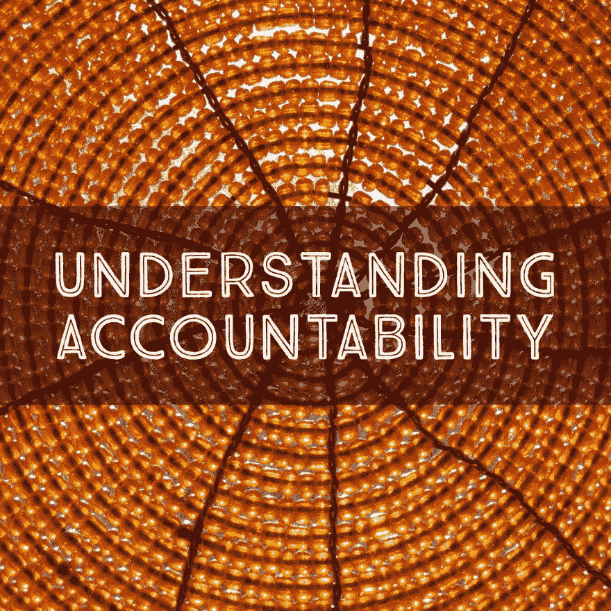

# 理解问责制

> 原文：<https://dev.to/lpasqualis/understanding-accountability>

这篇文章最初发表在 [CoderHood](https://coderhood.com) 上，名为[理解责任](https://www.coderhood.com/understanding-accountability/)。CoderHood 是一个致力于软件工程人类层面的博客。

[T2】](https://res.cloudinary.com/practicaldev/image/fetch/s--2lac7W0F--/c_limit%2Cf_auto%2Cfl_progressive%2Cq_auto%2Cw_880/https://thepracticaldev.s3.amazonaws.com/i/3m7ij2sm8eqlwgmnf5bm.jpg)

## 一句简单的话

一些声明经常被踢来踢去，就像青少年经常光顾的废弃停车场里的空可口可乐罐一样。它们变得如此普遍，以至于你甚至没有注意到它们的真正含义。你准备好面对似曾相识的感觉了吗？这是:

> 人们需要被追究责任。

在事后总结会或回顾会上，你听到过多少次？我数不清了！

你不会发现很多人不同意它。这是一个没有争议的声明。如果你在老板面前说，你可能会觉得你在赢得分数。这意味着，与“那些没有被追究责任的人”相比，你对自己的要求很高。

然而，我不喜欢仅仅因为听起来不错而发表的言论。词语必须有明确的、有意的含义。当你听到有人声称人们需要“承担责任”时，问问他们这是什么意思。

我发现，当我问那个问题的时候，说这个问题的人要么不能精确地定义它，要么有非常不切实际的想法，要么根本不知道。令我着迷的是，那些听起来不错、似乎正确的短语往往缺乏清晰的含义。同样令人费解的是，为什么很少有人质疑那些短语的含义，即使他们无法解释。缺乏实质的正义是一种错觉。

## 问责不是惩罚

当我问并得到答案时，通常听起来像是，“这意味着如果你搞砸了，你就会被解雇。”听起来很刺耳。还有，这是什么意思？是不是说当有人犯了错误，就应该马上开除？这是好事吗？我觉得不是。大多数人都认为冒险和犯错是成长、学习和成功的最佳途径。

我得到的另一个解释是，“这意味着如果你不做你的工作，你会被解雇。”被解雇是怎么回事？这是不是类似于一个电灯开关，如果有一天你“没有做好你的工作”，它会立即被打开？这是否意味着如果你有一天过得不好，你的老板会让你走？嘣！我不想在那种环境下工作。听起来像是一种恐惧文化，我从来没有见过恐惧文化产生可持续的结果。

将责任与惩罚混为一谈是领导力差的一个谬误。我相信，如果一个员工不能或不愿意履行他或她的职责，并且没有明确的成功之路，后果是必然的。然而，问责制有明确的含义，必须独立于惩罚。

问责制不是发生在某人身上的事情，也不是一件坏事。把它看作是一种责任，优秀的员工会用它来换取信任、独立性和报酬。它应该与明确的行动和行为相关联，而不仅仅是明确的后果。这是一份合同，不是威胁。

## 字典定义

这本字典更接近我心目中的“责任”的含义。下面是这个词的三种定义:

> *   The obligation of individuals or organizations to be responsible for their activities, take responsibility and disclose the results transparently.
>     
>     
> *   A guarantee to evaluate the performance or behavior of individuals or organizations in matters for which they are responsible.
>     
>     
> *   The quality or state of being responsible; Especially: the obligation or willingness to take responsibility or take responsibility for one's own actions.

## 如何转化为动作和行为？

问责制由三个主要因素组成。

### 成分 1:承诺

要负起责任，你必须公开承诺在规定的时间内取得明确且可衡量的结果。

如果没有承诺，就不可能有问责制。如前所述，负责任不是发生在你身上的事情。这是一个你必须接受的协议。拥抱它需要一个明确的承诺来实现一系列明确的目标，包括你要实现什么，以及你什么时候去实现它。

致力于目标意味着:

*   承诺你会尽最大努力实现一系列目标。
*   宣称，根据你所掌握的信息，这些目标是可以实现的。
*   完全掌控目标的完成，包括在出现问题或延迟时寻求帮助。

### 配料#2:透明度

透明度是问责制的重要组成部分。您应该关注两个主要方面:

*   **流程透明。**要负起责任，你需要对你正在做的事情、你为什么这样做以及每个人应该从中得到什么保持透明。这一点很重要，因为无论你对谁负责，比如你的老板，他也要对某个人负责。你所做的事情的透明度向你负责的人提供了他们履行承诺所需的信息。你不透明，他们也不可能透明。如果他们不能做到透明，高层的任何人都无法看到问题的出现，他们也无法采取行动来纠正这些问题。一切都分崩离析。
*   **进步透明度。**要负起责任，你必须完全公开你是如何追踪你承诺的目标的。如果事情发生了变化或偏离了轨道，你必须敞开心扉，立即分享这对实现你承诺的目标意味着什么。这又一次让链条上的人也能这么做。

### 成分#3:绩效评估

要负责任，您的绩效最终必须得到评估和衡量——在很大程度上——基于您致力于实现目标的能力和意愿，对过程和进展保持透明，以及您实现目标的成功程度。

### 绩效管理的几点注意事项

谈到业绩评估和问责制，我不能不提到业绩管理。

绩效管理是公司将要做的事情，以奖励或纠正根据责任目标衡量的绩效。其他因素，如增加到业务中的总价值和从业务中减去的总价值，都是绩效管理的一部分。

如果员工成功实现了他们负责的目标，他们很可能会在绩效评估中被视为贡献者，并作为绩效管理流程的一部分得到奖励。

也有例外。例如，一名员工可能在实现责任目标方面表现出色，但仍然表现不佳。怎么会？例如，如果一名员工与其他员工产生了足够多的不健康摩擦，导致他们的绩效下降。或者万一员工使用不道德的做法来实现他们的目标，等等。

业绩管理是一个单独的主题，只与问责制部分相关。

## 信任的作用

有时候，当提到透明度这个话题时，人们会下意识地做出这样的反应:

> 为什么我需要透明？领导层必须信任专业人士来完成他们的工作。透明度是一种控制形式，除了让管理层感觉更好之外，没有任何价值。

由于混淆了透明度和微观管理，这种思维方式(在大多数情况下)是一种谬误。也就是混淆因果。微观管理是糟糕的领导者对他们不喜欢的信息的一种影响；与透明性无关。

我举个例子来说明区别。假设一个开发人员找到他或她的老板说:

> 开发者:—“嘿，老板，我有个坏消息。我最初认为这个项目需要我两个星期才能完成。我知道我们向客户承诺了代码。然而，现在我已经一周了，我意识到我还需要三周的时间。”*

### 爱管闲事的人

下面是一个微观管理者如何应对的例子:

> **微观管理者**:“那是不可接受的。显然，你走错了路。为了按时完成工作，以下是你必须做的 5 件事。据我估计，每一步都要花你整整一天的时间。在接下来的五天里，我每天都会回来检查你，看看你是否在正轨上。”*

注意这位微观管理者是如何持怀疑态度和不灵活态度的。这个坏消息立即引起了不信任的反应。他或她规定了一组步骤，提供了他或她对工作的估计——没有询问开发人员是否同意——并建立了一个控制框架。

### 领导者

以下是领导者对开发商给出的坏消息的反应:

> 领导:—“谢谢你让我知道。让我们集思广益几分钟，看看我们能否一起找到一种方法，要么缩小项目范围，重新定义问题，要么请人帮忙。如果没有，我会重新设定客户的期望值。”*

请注意，领导不会质疑开发人员的评估。他或她会提供帮助，对问题进行头脑风暴，探索是否有办法缩小问题的范围。给出一个时间限制(几分钟)让它看起来像一个安全的对话，并防止开发人员感觉头脑风暴会变成一个高风险的讨论。

领导者的目标是利用开发人员的专业知识，在可用的时间内找到为客户带来价值的方法。在没有其他解决方案的情况下，领导还负责重新设定客户的期望。

承认可能没有其他解决方案进一步证明了领导者没有质疑开发人员的判断。因此，领导者提供他们的技能和影响力来解决问题，而不会让开发人员感到不安全、被评判或不被信任。

## 结论

透明不是信任的敌人。在两位专业人士相互尊重的关系中，透明度是信任的必要因素。真正的问责制需要透明度，而这与微观管理毫无关系。

* * *

### 如果你喜欢这篇文章，请保持联系！

*   在 CoderHood 上找到我所有的帖子。
*   在 LinkedIn 上加入我的职业网络。
*   在推特上关注我。
*   加入我的脸书主页。
*   最后，请在 dev.to 上关注我！