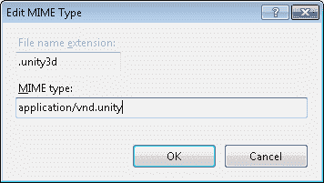

# Unity3d web 播放器 MIME 类型

> 原文：<https://dev.to/adamkdean/unity3d-web-player-mime-type-5e2m>

IIS 不喜欢提供未知的 MIME 类型，其中一个就是 Unity Web Player 的 *unity3d* 文件。如果你想让它服务于这个文件，你必须转到 IIS 下的 mime 类型，添加一个扩展为`.unity3d`的 MIME 并键入`application/vnd.unity`。

[T2】](https://res.cloudinary.com/practicaldev/image/fetch/s--IrOpAAm---/c_limit%2Cf_auto%2Cfl_progressive%2Cq_auto%2Cw_880/http://i.imgur.com/KdZJqIg.png)

呜。现在我实际上可以提供内容了。谢谢，过度保护的 IIS。