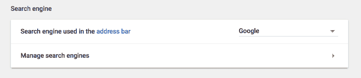
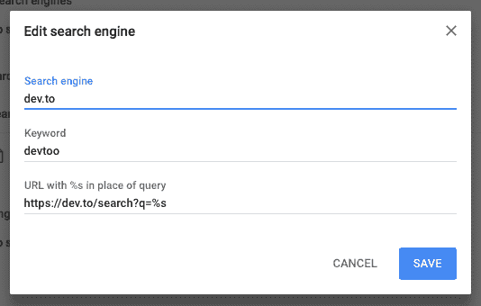

# 使用 dev.to 作为 Chrome 的搜索引擎

> 原文：<https://dev.to/rhymes/use-devto-as-a-search-engine-for-chrome-5fd>

昨天本写了关于 [dev.to 的搜索引擎](https://dev.to/ben/the-devto-search-engine-is-actually-pretty-damn-useful-1ic)和它在谷歌搜索引擎海洋中的价值。

我绝对赞同他的帖子。

所以我把 dev.to 作为我的浏览器 Chrome 的搜索引擎。

怎么会？

1.  打开设置并转到管理搜索引擎

[T2】](https://res.cloudinary.com/practicaldev/image/fetch/s--0S0LWJz3--/c_limit%2Cf_auto%2Cfl_progressive%2Cq_auto%2Cw_880/https://thepracticaldev.s3.amazonaws.com/i/kpv5jn2fintjdgpjcxpn.png)

1.  添加一个新的搜索引擎，如下所示:

[T2】](https://res.cloudinary.com/practicaldev/image/fetch/s--iEImv2HQ--/c_limit%2Cf_auto%2Cfl_progressive%2Cq_auto%2Cw_880/https://thepracticaldev.s3.amazonaws.com/i/e608qvvng0f27x9no08n.png)

(不幸的是关键字不能是“devto ”,因为它太短了)

1.  打开一个新标签，输入“devtoo”，点击空格键，搜索:-)

[T2】](https://res.cloudinary.com/practicaldev/image/fetch/s--nouWc9wC--/c_limit%2Cf_auto%2Cfl_progressive%2Cq_auto%2Cw_880/https://thepracticaldev.s3.amazonaws.com/i/y7pkcohrrwct832dccij.png)