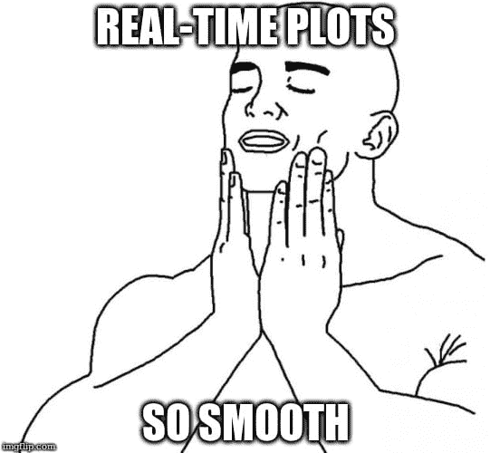
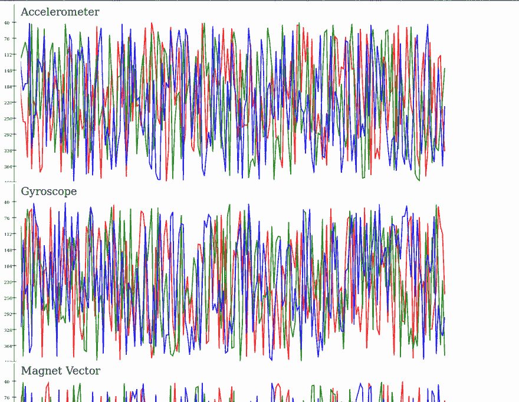

# 使用 Cycle.js 查看实时卫星测试数据

> 原文：<https://dev.to/jvanbruegge/using-cyclejs-to-view-real-time-satellite-test-data>

*本文最初作为客座博文发表在 [Futurice 博客](http://futurice.com/blog/using-cycle-dot-js-to-view-real-time-satellite-test-data)T3 上*

本文假设你熟悉 [Cycle.js](https://github.com/cyclejs/cyclejs) 。如果不是这样，如果你知道像 RxJS 这样的反应流，这可能是好的，否则先看看优秀的[文档](https://cycle.js.org/dialogue.html#dialogue-abstraction)。

## 目标

我目前在研究 [MOVE-II](http://www.move2space.de/MOVE-II/) CubeSat，更具体地说，我在研究 ADCS——姿态确定和控制系统。这意味着我们有一颗小型卫星，上面装有各种传感器，如磁力计、陀螺仪和太阳传感器。这些传感器用于驱动控制算法，控制算法驱动我们的线圈来驱动我们的卫星。

为了测试，我们将我们的 ADCS PCB 安装到 3D 打印结构上，并将它们连接到 beagle bone Black Wireless——一台类似 Raspberry PI 的小型计算机——它模拟了我们的主计算机(CDH 系统)。然后，我们将卫星悬挂在一个亥姆霍兹笼子里，在那里我们可以提供一个模拟地球磁场的任意磁场。然后，我们使用 BeagleBone 的 SPI 连接来轮询传感器，并控制来自硬件的数据。

我现在的目标是创建一个应用程序，在我们运行测试时，它可以用来显示我们卫星的实时数据。

## 第一步:评估

为什么要用 Cycle.js？我有多重原因。例如，我每天都在使用 Cycle.js，只是喜欢这个框架的概念和可读性。但主要原因是 Cycle.js 擅长建模复杂的、基于时间的异步行为，我们将利用这一点。

这个项目我需要的另一部分是数据的绘制。对于这个任务，我们将使用令人惊叹的 [d3.js 库](https://d3js.org/)，因为——正如您稍后将看到的——它是对 Cycle.js 的一个非常好的补充。

对于实时数据的传输，我们将使用由自定义驱动程序包装的普通 websockets。

## 第二步:开始吧

因此，第一步是搭建一个新的样板。幸运的是，多亏了 [create-cycle-app](https://github.com/cyclejs-community/create-cycle-app) ，这很容易。我还想使用 typescript，所以我们将使用`one-fits-all`风格(不要脸的插头)。

```
create-cycle-app adcs_plot --flavor cycle-scripts-one-fits-all 
```

## 第三步:首次实施

因为我们坚持优化的黄金法则——永远不要过早优化——我们将只写第一个版本。让我们来看看，我们有三个有趣的文件:

```
graph.tsx
graphs.tsx
websocketDriver.ts 
```

websocket 驱动程序非常简单:

```
import xs, { Stream } from 'xstream';

import { WebsocketData } from './interfaces';

export function makeWebsocketDriver(url : string) : () => Stream<WebsocketData>
{
    const websocket : WebSocket = new Websocket(url);

    return () => {
        return xs.create({
            start: listener => {
                websocket.onmessage = (msg : MessageEvent) => listener.next(msg);
            },
            stop: () => {}
        })
        .map(msg => JSON.parse(msg.data));
    };
} 
```

由于我们只是从服务器*获取*数据，而不是*设置*数据，我们只是将`onmessage`函数包装在一个新的流中。

graphs 文件只是将一些设置传递给 graph 文件，我们告诉它图形的名称、轴标签、传入数据的域(这里我们期望数据在 0 到 100 摄氏度之间)和一个过滤器，因此我们可以从全局状态对象中提取与该图形相关的数据。

```
import { Stream } from 'xstream';

import { Sources, Sinks, Component } from './interfaces';

import { createGraph } from './graph';

export function Graphs(sources : Sources) : Sinks
{
    const tempSinks : Sinks = createGraph({
        heading: 'Temperature',
        yScaleText: 't in °C',
        yDomain: [0, 100],
        dataFilter: data => Object.keys(data.temp).map(k => data.temp[k])
    })(sources);

    return tempSinks;
} 
```

所以神奇的事情都发生在图形文件中。我们来小步讨论一下。

```
export interface GraphInfo {
    heading : string;
    yScaleText : string;
    yDomain : [number, number];
    dataFilter : (d : WebsocketData) => number[];
}

export interface Scales {
    x : ScaleTime<number, number>;
    y : ScaleLinear<number, number>;
}

export type DataPoint = [number, number]; 
```

第一个定义应该看起来很熟悉。这只是我们使用`createGraph`的设置。第二个是我们的 d3 标度的定义(稍后会详细介绍)，最后一个只是一个`(x, y)`坐标的别名。

```
const scale$ : Stream<Scales> = xs.of({
    x: scaleTime()
        .domain([new Date(), hoursAgo(2)])
        .range([0, 500]),
    y: scaleLinear()
        .domain(info.yDomain)
        .range([0, 500])
}); 
```

这里是第一个需要实际解释的部分。你在这里看到的代码使用了 d3 的标度。在 d3 版本 4 中，整个库被分成了更小的子模块，比如我们在这里使用的`d3-path`、`d3-shape`或`d3-scale`。这有一个很大的优势，即计算和 DOM 操作现在是明确分开的。因为 Cycle.js 在幕后使用虚拟 DOM diffing，所以我们不需要外部 DOM 操作。

scale 只是一个普通的 Javascript 函数，它获取一些数据，只返回缩放后的数据，不做任何其他事情(纯函数——耶！).为了初始化函数，我们使用了`.domain()`和`.range()`函数。该域是**传入**数据的预期范围，该范围包含**传出**像素值。

这意味着我们在这里创建两个刻度，一个用于 x 轴，一个用于 y 轴。x 轴使用时间刻度，因为我们希望我们的数据与其生成的时间戳相关联。图表上最左边的值应该是当前时间，最右边的值应该是两小时前。我们希望将这些值映射到一个 500 像素宽的图形中。y 轴类似于 x 轴，唯一的区别是从设置中传递域。

```
const scaledData$ : Stream<DataPoint[][]> = xs.combine(scale$, state)
    .map(([scales, arr]) => arr.map(data => {
        const x : number = scales.x(data.time);
        return info.dataFilter(data).map(y => [x, y] as DataPoint);
    })); 
```

在这里，我们第一次使用我们新创造的规模。我们将我们的尺度与保存我们通过 websocket 获得的数据的当前状态相结合。由于每个图有多条线(向量的 x/y/z 部分或类似部分),并且它们的时间戳将是相同的，我们首先将该比例应用于时间戳，并将其保存在一个常数中。我们就不修改了。

对于 y 值，我们应用我们通过设置传入的数据过滤器，然后映射这些值(这里认为是`[x, y, z]`)以包含时间戳(`[[t, x], [t, y], [t, z]]`)。

现在我们有了屏幕上像素的值，我们想显示它们。一种选择是将缩放后的数据映射到 svg `<circle>`元素，但是我希望在点之间有线，这样您可以更容易地跟踪数据的变化。为此，我们将使用一个`<path>`。我们也可以使用一个`<polyline>`，但是 d3 使得处理路径变得非常容易。负责这个的模块是`d3-shape`。所以我们将`import { line } from 'd3-shape'`和调用它与我们的数据点。`lines`函数生成一个字符串，该字符串必须用作`<path>`的[神秘 d 属性](https://developer.mozilla.org/en-US/docs/Web/SVG/Attribute/d)。同样，由于每个图有多行，我们必须嵌套我们的`map`调用。

```
const path$ : Stream<VNode[]> = scaledData$
    .map<string[]>(data => data.map(arr => line<DataPoint>()(arr)))
    .map<VNode[]>(lines => lines.map(s => <path d={ s } />)); 
```

文件的最后一部分非常简单明了:

```
const vdom$ : Stream<VNode> = path$
    .map(paths =>
        
            { paths }
        
    ); 
```

我们将路径元素的数组嵌入到 SVG 元素中。如果你想知道 HTML 在 Typescript 文件中做什么，这是由 [React](https://facebook.github.io/react/) 流行的 JSX 语法。你可以在这里了解更多关于 JSX [。](https://facebook.github.io/react/docs/jsx-in-depth.html)

## 第四步:享受！...还是我们？

如果您现在运行代码，您会注意到性能不是很好。我说的不好是指可怕。在最初的几个数据点之后，浏览器变得越来越慢，最终完全没有反应。

## 第五步:做得更好

我们必须找出代码中的问题。为什么这么慢？一段特殊的代码出现了:

```
const scaledData$ : Stream<DataPoint[][]> = xs.combine(scale$, state)
    .map(([scales, arr]) => arr.map(data => {
        const x : number = scales.x(data.time);
        return info.dataFilter(data).map(y => [x, y] as DataPoint);
    })); 
```

让我们仔细看看我们的数据处理。我在下面概述了整个过程:

新数据来自服务器:

```
{
    accel: {
        x: somevalue,
        y: somevalue,
        z: somevalue
    },
    ... //Some other stuff
} 
```

websocket 服务器将其添加到状态数组:`[...oldState, newData]`
注意，我们在这里创建了一个新数组！

然后，我们对每个数据点运行数据过滤器，其定义如下:

```
// info.dataFiler: data => Object.keys(data.accel).map(k => data.accel[k])

const scaledData$ : Stream<DataPoint[][]> = xs.combine(scale$, state)
    .map(([scales, arr]) => arr.map(data => {
        const x : number = scales.x(data.time);
        return info.dataFilter(data).map(v => [x, scales.y(v)] as DataPoint);
    }));

const path$ : Stream<VNode[]> = scaledData$
    .map<DataPoint[][]>(data => data.reduce((acc, curr) => {
        return curr.map((p, i) => [...(acc[i] ? acc[i] : []), p]);
    }, []))
    .map<string[]>(data => data.map(arr => line<DataPoint>()(arr))) 
```

我们有再次创建一个新数组的`arr.map`(每次我们更新我们的数据)和`dataFilter`加上`map`创建 x 乘以两个新数组，其中 x 是数据点的数量。仅`reduce`一项就在这个过程中创建了数十亿个数组。

对于 Javascript 引擎来说，这是一个很大的分配。在进行性能分析时，您也可以看到这一点，堆正在快速建立，必须经常进行 GC。

那么我们怎样才能做得更好呢？我们写一个[新版本](https://github.com/jvanbruegge/adcs_plot/tree/1b8f124b2fc1cad86afb104ad54cb9a2de5b4004)。

让我们问一个简单的问题。为什么我们将状态存储为数据数组**切片**？如果每张图的每一行都需要一组数据**值**，为什么不这样存储它们呢？

```
function foldData(acc : State, curr : WebsocketData) : State
{
    const flatData : [Date, number][] = flattenData(curr)
        .map(d => [curr.time, d] as [Date, number]);

    const values : [Date, number][][] = acc.values.map((data, i) => [flatData[i], ...data]);
    return {
        values: values
    };
}

function flattenData(data : WebsocketData) : number[]
{
    return [
        data.accel.x, data.accel.y, data.accel.z,
        data.gyro.x, data.gyro.y, data.gyro.z,
        data.magVector.x, data.magVector.y, data.magVector.z,
        data.sunVector.x, data.sunVector.y, data.sunVector.z,
        data.temp.bmx, data.temp.t1, data.temp.t2, data.temp.t3,
        data.magRaw.x, data.magRaw.y, data.magRaw.z, data.magRaw.r,
        data.sunRaw.pad0, data.sunRaw.pad1, data.sunRaw.pad2, data.sunRaw.pad3
    ];
} 
```

新代码真正做了什么？首先，我们展平传入的数据，记住，我们仍将从服务器获取数据切片。`flattenData`函数只是将数据排列成一个平面数组。然后，为了方便起见，我们将当前时间添加到每个数据点。最后，我们简单地将新值逐个添加到正确的数组中。

现在，为了访问数据，我们不再使用`dataFilter`，而是只使用数组的索引。为了清晰，我可以(应该？)使用了一个对象作为`flattenData`的结果，但是这个数组会做得很好:

```
const accelSinks : Sinks = createGraph({
        heading: 'Accelerometer',
        yScaleText: '',
        dataIndex: [0, 1, 2]
})(sources); 
```

## 第六步:再次享受！...什么，还是不好吗？

如果您再次运行代码，只会稍微好一点。它运行大约 5 秒钟，然后开始抖动，最后浏览器将再次过载。肯定还有别的问题。

## 第七步:让它变得更好(再次)

如果我们再想一想，我们可以发现另一个问题。我们让渲染器窒息了！就在这里:

```
const path$ : Stream<VNode[]> = scaledData$
    .map<string[]>(data => data.map(arr => line<DataPoint>()(arr)))
    .map<VNode[]>(lines => lines.map((s, i) => {
        return <path
            d={ s }
            stroke={ colors[i] }
            class-path={ true }
        />;
    })); 
```

每次我们获得新数据(同样，每秒三次)时，我们都在改变 path 元素的`d`属性。这迫使浏览器重新计算元素的布局、位置、颜色和其他一些东西。再乘以我们拥有的行数(在我们的例子中是 21 行),我们的呈现器——最终是浏览器——崩溃的原因就很清楚了。

但是我们能做些什么呢？我不想少更新，因为那样的话图表也会抖动。这是不是意味着我必须忍受这一切？但是其他人也可以让它工作！

我们来做一个[新版本](https://github.com/jvanbruegge/adcs_plot/tree/e98723dbb4affc674d43fe7b3eed7a5cidfbf0b60c)。

这需要一招。当新数据从 websocket 到达时，我们仍然会更新状态。但是我们只会在固定的时间间隔内重新渲染 DOM。先说半秒。因为我们现在将使用基于时间的操作符，所以我们将引入为我们提供了[必要方法](https://github.com/cyclejs/time#api)的`@cycle/time`。

```
const updateDOM$ : Stream<undefined> = Time.periodic(500)
    .mapTo(undefined);

const scale$ : Stream<Scales> = updateDOM$
    .compose(sampleCombine(state))
    .map(([_, s]) => s)
    .map(s => ({
        x: scaleTime()
            .domain([secondsAgo(2), hoursAgo(0.04)])
            .range([0, 2000]),
        y: scaleLinear()
            .domain(getDomain(s.domains, info.dataIndex))
            .range([0, 400]),
        state: s
    }));

const scaledData$ : Stream<DataPoint[][]> = scale$
    .map(scales => [scales, selectData(scales.state.values, info.dataIndex)] as [Scales, [Date, number][][]])
    .map(([scales, arr]) => {
        return arr.map(data => data.map(d => [scales.x(d[0]), scales.y(d[1])] as [number, number]));
    }); 
```

到目前为止很容易。但是为什么我们要将最左边的值设置为过去的某个时间呢？为什么不再去最新的约会了？这样，最新的数据将被隐藏！

原因很简单，虽然我们不能**重新绘制**整个图形，但我们可以**移动**它。每个 SVG 元素都接受一个名为`transform`的属性。有了这个属性，我们可以旋转、缩放或平移元素。由于这是使用 GPU 加速，我们可以尽可能经常这样做！

```
const group$ : Stream<VNode> = Time.animationFrames()
    .mapTo(undefined)
    .compose(sampleCombine(scale$, path$))
    .map(([_, scales, paths]) => [scales.x(new Date) + 15, paths])
    .map(([v, paths]) => {
        return svg.g({
            attrs: {
                transform: 'translate(' + (-v) + ', 0)',
            }
        }, paths);
    }); 
```

我们用`@cycle/time`给我们一个`animationFrames`的流。这表明浏览器已经准备好接受新的绘制命令。然后，我们使用来自`xstream`额外操作符的`sampleCombine`将其与当前比例和当前路径相结合。`combine`和`sampleCombine`的主要区别在于，前者在**任一**流发出时发出，而阶梯只在主流发出时发出。

## 第八步:享受！终于！

如果你现在在浏览器中运行它，你会看到最新数据的平滑曲线。

[T2】](https://res.cloudinary.com/practicaldev/image/fetch/s--bu9AXoJB--/c_limit%2Cf_auto%2Cfl_progressive%2Cq_auto%2Cw_880/https://i.imgflip.com/1m4mtu.jpg)

最终结果看起来是这样的，记住这是随机生成的数据，而不是真实的测试数据:

[T2】](https://res.cloudinary.com/practicaldev/image/fetch/s--lG4F2lGO--/c_limit%2Cf_auto%2Cfl_progressive%2Cq_auto%2Cw_880/https://thepracticaldev.s3.amazonaws.com/i/5yhbt9mssrp2a3v3izzd.png)

## 第九步:还不够？

我们能做些什么来进一步提高我们的绩效？这些只是对未来的想法，我可能会实施其中的一些。

### 不可变. js

我们已经使用了不可变的数据结构。当 websocket 的数据被添加到状态时，我们总是创建新的数组。但是这是昂贵的，尤其是当阵列变得更大时。这里使用 [Immutable.js](https://facebook.github.io/immutable-js/) 可以帮助很大。我们将使用一个`List`来代替普通的数组。

优势是什么？考虑列表和数组的结构:

```
 List                     Array
a -> b -> c -> d           [a, b, c, d] 
```

当我们将一个新元素添加到前面(或者后面，取决于你如何看待它)时，我们只需要创建一个指向旧列表的第一个元素的元素(我们在`O(1)`中运行)。
如果我们向数组中添加一个元素，我们必须分配一个新数组，并将所有元素从旧数组复制到新数组中(我们运行`O(n)`加上我们有`n`新分配)。

这种技术叫做[结构共享](https://medium.com/@dtinth/immutable-js-persistent-data-structures-and-structural-sharing-6d163fbd73d2#.i53qyk7b3)。

### 暂停未使用的图形

我们目前有七张图。它们并不完全适合您的屏幕。因此，如果图表可见，我们可以使用定期检查或滚动检查。如果没有，我们可以暂停整个渲染过程。我们可以利用 jQuery 的`:visible`伪选择器。这个 jQuery 魔法的源代码是这里的。

这样，我们在任何时候都只有三到四个图形处于活动状态(根据屏幕大小加/减一个),所以我们减少了大约一半的渲染时间！

## 第十步:UI/UX 好东东

和前一点一样，这些是对未来的想法，我可能会实施其中的一些。

### 适当的音阶

当前版本中你能看到的 y 轴上的刻度是用 [d3-axis-hyperscript](https://github.com/jvanbruegge/d3-axis-hyperscript) 生成的，这个库是我一个小时一起黑出来的。这就是为什么它不能很好地工作，我不会太相信轴。我基本上是从 [d3-axis](https://github.com/d3/d3-axis) 那里获得了这个想法，并在没有直接 DOM 操作的情况下让它工作，而是用普通的 snabbdom vnodes 代替。

我们可以添加一些类似帮助行的东西来使图形更加清晰，并实现 API 与`d3-axis`的兼容性。当然还要修复剩余的错误。如果有人感兴趣，欢迎 pr:)

### 对图表进行排序

由于我们一次只能在流中看到一定数量的图，如果我们能对它们重新排序，那就太好了。这样，我们可以将感兴趣的图表拉近，让您可以同时看到它们。

这很容易实现。我创建了 [cyclejs-sortable](https://github.com/cyclejs-community/cyclejs-sortable) 正好符合这个用例(又是无耻的插头)。有了这个，我们就可以添加一个字体牛逼的符号到每个图形中，我们可以用它作为句柄。然后，我们可以使用这个句柄通过拖放对图形进行重新排序。

## 关闭它

所有源代码都在 [GitHub](https://github.com/jvanbruegge/adcs_plot) 上。这是原始回购的副本，因此您可以返回几个提交并查看原始历史。

出于本文的目的，我更新了 repo 以使用最新的 Cycle.js 版本- [Cycle.js Unified](https://github.com/cyclejs/cyclejs/releases/tag/unified-tag) -并且我移除了对我们用来从卫星硬件获取数据的其他程序的依赖。当前主机生成随机值并将其发送给客户端。你可以在这里看到所有的变化。

感谢您阅读到最后，希望我们能在 [Cycleconf](http://cycleconf.com/) 见面，在那里我将举办一个关于基于性能的测试的[讲座](http://cycleconf.com/#speakers)。