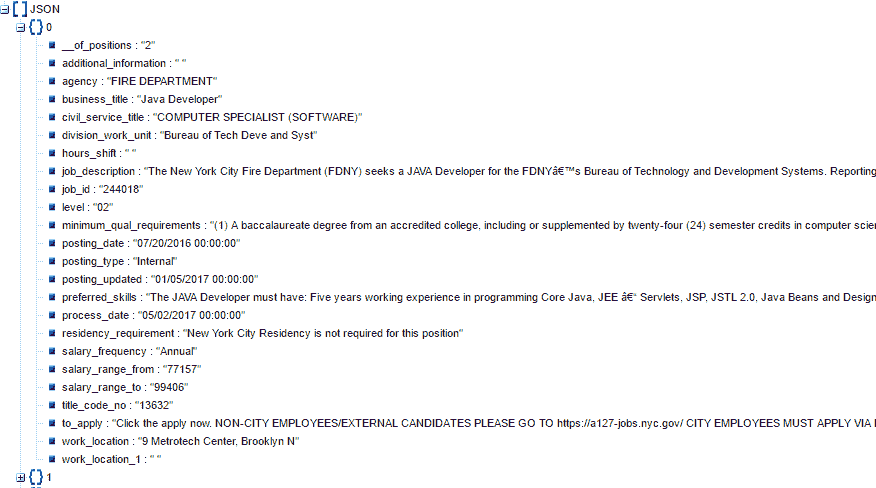

# 使用 fetch()和 reduce()从外部 API 获取和格式化数据——实用指南

> 原文：<https://dev.to/jspeda/using-fetch-and-reduce-to-grab-and-format-data-from-an-external-api---a-practical-guide>

今天我们将学习如何从外部 API 获取和操作数据。我们将使用我当前项目中的一个实际例子，希望您在开始自己的工作时能够以此为模板。在这个练习中，我们将查看纽约市机构当前的职位发布数据。纽约市在发布各种数据集(T2)方面做得很好，但我选择了这个特殊的数据集，因为它不需要处理 API 密钥——端点是一个可公开访问的 URL。

这是我们计划的快速路线图。我们将通过使用 JavaScript 的 Fetch API 从纽约市的服务器获取数据，这是开始处理[承诺](https://developer.mozilla.org/en-US/docs/Web/JavaScript/Reference/Global_Objects/Promise)的好方法。在这里，我将回顾非常简单的基础知识，但是我推荐真理子·小坂出色的图文并茂的博客 [*汉堡派对的承诺*](http://kosamari.com/notes/the-promise-of-a-burger-party) 作为更全面(也更美味)的入门

如果您曾经在 jQuery 中使用过`$.getJSON()`，那么您主要是在概念上。如果没有，那也没关系。看看下面的代码:

```
const cityJobsData = fetch("https://data.cityofnewyork.us/resource/swhp-yxa4.json"); 
```

Enter fullscreen mode Exit fullscreen mode

我们声明了一个变量`cityJobsData`，并将其值设置为`fetch(the URL that contains the data we want)`，返回一个叫做 promise 的东西。现在，只要把它想象成当请求完成时，我们最终将从 URL 得到的数据。一旦数据加载完毕，我们就可以通过在`cityJobsData`上调用`then()`来访问和操作这些数据。为了执行多个操作，我们可以将`then()`链接在一起，确保我们 1。总是将我们的数据作为参数传入回调，2。返回值. T7

```
const cityJobsData = fetch("https://data.cityofnewyork.us/resource/swhp- yxa4.json");
cityJobsData
  .then(data => data.json()) 
```

Enter fullscreen mode Exit fullscreen mode

在上面的代码片段中，我们告诉计算机，一旦从 URL 中检索到数据，就执行包含在`then()` *中的所有内容。这就是我们所说的“异步”代码。在这种情况下，`.then(data => data.json())`以 JSON 格式返回数据，这将允许我们对其进行操作。*

对于大量的 JSON 争论，先说一句:如果你在你的网络浏览器中找到包含我们想要的数据的 URL，你会看到一大块没有格式的文本，很难阅读。但是，您可以将该文本复制并粘贴到类似于 [jsonviewer](http://jsonviewer.stack.hu) 的内容中，这将为您提供一个有组织、有层次的内容概览。假设我们想要查看每个城市机构有多少个发布。我们如何做到这一点？如果我们在这个查看器中查看我们的 JSON 模式，我们可以看到它是一个对象数组，每个对象包含组成一个职位发布的所有数据

[T2】](https://res.cloudinary.com/practicaldev/image/fetch/s--CqYBKw7l--/c_limit%2Cf_auto%2Cfl_progressive%2Cq_auto%2Cw_880/https://puu.sh/vEskM/bfc135fe16.png)

注意，每个对象都包含一个键`agency`，其值是有工作机会的城市机构的名称

因此，如果我们能够以某种方式跟踪每个机构在这个对象数组中被提及的次数，我们就能够知道每个机构当前有多少工作机会

我们如何做到这一点？一种方法是使用`reduce()`。[来自 MDN](https://developer.mozilla.org/en-US/docs/Web/JavaScript/Reference/Global_Objects/Array/Reduce?v=example),`reduce()`方法对一个累加器和数组中的每个元素(从左到右)应用一个函数，将其减少到一个单一的值如果这对你来说听起来像一堆废话，不要担心！当我们有一些例子时，我们很快就会发现这并不坏。

大多数对`reduce()`的介绍都涉及简单的加法，这是一个很好的起点。让我们一起来看一下这个例子:T1

```
const arr = [1, 2, 4, 6];
const added = arr.reduce((accumulator, item) => {
 return accumulator + item;
}, 0);

console.log(added); // 13 
```

Enter fullscreen mode Exit fullscreen mode

它是这样工作的:`reduce()`函数遍历数组`arr`，并将每个`item`添加到一个累加器中，累加器的初始值为`0`(我们将这个值作为`reduce()`的第二个参数，在回调函数之后)。累加器的当前值在每次循环结束时返回，这就是加法是如何发生的。因此，`added`的最终值是 13

如果您在可视化这一点上有困难，请尝试在返回之前添加一个`console.log()`语句，输出累加器和项目的当前值——这样，您将能够看到幕后发生的循环。下面是上例的一组日志语句:

```
adding 1 to accumulator: 0
adding 2 to accumulator: 1
adding 4 to accumulator: 3
adding 6 to accumulator: 7 
```

Enter fullscreen mode Exit fullscreen mode

这一切都很好，用*~ *函数式编程* ~*做一些加法也很有趣，但是你知道`reduce()`可以做的不仅仅是简单的计数吗？累加器可以是除了数字以外的其他东西？这是真的！

在我们的例子中，我们将使用它来找出每个纽约市机构有多少个当前的职位发布。这似乎是简单地将数字相加的一大飞跃，但是循环和累加的核心概念是相同的

这一次，我们不是减少四个数字的数组，而是减少我们的 JSON blob 的工作发布数据。我们不是减少到一个数字，而是减少到一个物体。对，一个对象！一旦函数完成，累加器对象的关键字将是城市机构的名称，关键字的值将是它们拥有的发布数量，如下:`{"name of agency": number of job postings}`。下面是整个程序:

```
const cityJobsData = fetch("https://data.cityofnewyork.us/resource/swhp-yxa4.json");
cityJobsData
  .then(data => data.json())
  .then(data => {
    const agencyFrequency = data.reduce((agencies, value) => {
      agencies[value.agency] = agencies[value.agency] ? agencies[value.agency] + 1 : 1;
      return agencies;
    }, {});
    console.log(agencyFrequency);
  })
  .catch(err => console.log(err)); 
```

Enter fullscreen mode Exit fullscreen mode

这到底是怎么回事？我们来分解一下。每次循环时，我们都在看一个特定的`value`，也就是说，我们前面提到的对象数组`data`中的一个对象。我们正在检查累加器对象中是否已经存在一个名为当前机构(`value.agency`)的键。如果没有，我们将它添加到 accumulator 对象，并将其值设置为 1。如果在累加器对象中已经存在一个名为当前机构*的键，我们就在它的现有值上加 1。当我们完成时，我们返回累加器对象，并得到这个漂亮的数据集:* 

```
{ 
  'FIRE DEPARTMENT': 17,
  'DEPT OF ENVIRONMENT PROTECTION': 134,
  'DEPARTMENT OF INVESTIGATION': 22,
  'DEPARTMENT OF SANITATION': 14,
  'DEPT OF HEALTH/MENTAL HYGIENE': 247,
  'OFFICE OF THE COMPTROLLER': 14,
  'ADMIN FOR CHILDREN\'S SVCS': 43,
  'DEPT OF DESIGN & CONSTRUCTION': 48,
  'ADMIN TRIALS AND HEARINGS': 16,
  'DEPT OF PARKS & RECREATION': 34,
  'HUMAN RIGHTS COMMISSION': 4,
  'POLICE DEPARTMENT': 36,
  'DEPT OF INFO TECH & TELECOMM': 50,
  'DISTRICT ATTORNEY KINGS COUNTY': 4,
  'TAXI & LIMOUSINE COMMISSION': 11,
  'HOUSING PRESERVATION & DVLPMNT': 21,
  'DEPARTMENT OF BUSINESS SERV.': 18,
  'HRA/DEPT OF SOCIAL SERVICES': 31,
  'DEPARTMENT OF PROBATION': 3,
  'TAX COMMISSION': 4,
  'NYC EMPLOYEES RETIREMENT SYS': 6,
  'OFFICE OF COLLECTIVE BARGAININ': 2,
  'DEPARTMENT OF BUILDINGS': 9,
  'DEPARTMENT OF FINANCE': 29,
  'LAW DEPARTMENT': 21,
  'DEPARTMENT OF CORRECTION': 12,
  'DEPARTMENT OF TRANSPORTATION': 67,
  'DEPT OF YOUTH & COMM DEV SRVS': 5,
  'FINANCIAL INFO SVCS AGENCY': 7,
  'CULTURAL AFFAIRS': 1,
  'OFFICE OF EMERGENCY MANAGEMENT': 12,
  'DEPARTMENT OF CITY PLANNING': 5,
  'DEPT OF CITYWIDE ADMIN SVCS': 15,
  'DEPT. OF HOMELESS SERVICES': 3,
  'DEPARTMENT FOR THE AGING': 2,
  'CONSUMER AFFAIRS': 7,
  'MAYORS OFFICE OF CONTRACT SVCS': 7,
  'DISTRICT ATTORNEY RICHMOND COU': 3,
  'NYC HOUSING AUTHORITY': 9,
  'CIVILIAN COMPLAINT REVIEW BD': 5,
  'OFF OF PAYROLL ADMINISTRATION': 1,
  'EQUAL EMPLOY PRACTICES COMM': 1 
} 
```

Enter fullscreen mode Exit fullscreen mode

*瞧吧*！我们现在知道，如果我们想为市政府工作，我们应该看看健康和心理卫生部门的 247 个职位空缺！

我们可以利用这些数据做很多有用的事情——就我个人而言，我想尝试一下数据可视化，所以我将用它来制作一个简单的图表。我希望你能把这个例子作为你自己项目的起点。
如果你喜欢这篇文章，请在 [Twitter](https://twitter.com/j_speda) 上联系我！

感谢[吉姆·奥布莱恩](https://twitter.com/jimcodes)的编辑。