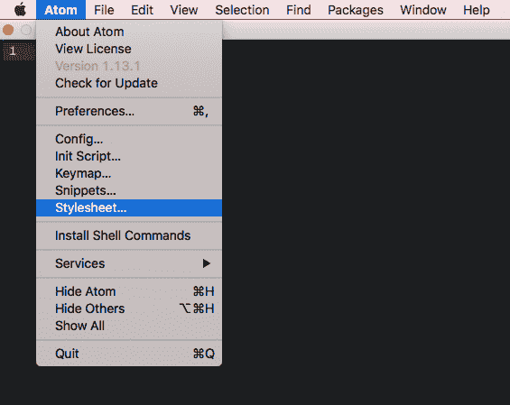
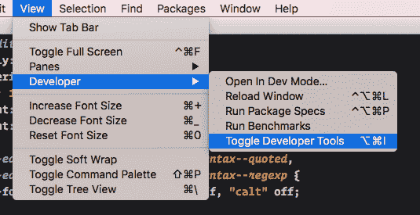

# 在 Atom 中安装自定义字体，以及我为什么选择 Operator Mono 和 Fira 代码

> 原文：<https://dev.to/kellyjandrews/using-operator-mono-and-fira-code-in-atom>

## 我再也受不了了。

我尝试过字体等脚本的其他变体，但没有一个看起来像操作符 Mono T1 一样清晰明了。最后，我崩溃了，给自己弄来了，我一直没有开心过。现在，我需要它和我使用的另一种字体- [Fira Code](https://github.com/tonsky/FiraCode) 。

如果您不熟悉 Atom，或者没有尝试过编辑样式表，这应该是一个有趣的概述。

### 获取字体

第一步是简单地下载和安装字体。我个人会把我想在任何地方使用的字体添加到我的 [`.dotfiles`](https://gitlab.com/kellyjandrews/dotfiles) 回购中，这样它们就会自动安装到任何地方。你可以使用任何字体管理软件，或者放入你本地的字体文件夹。

无论如何，运营商 Mono 都不是我用过的最便宜的字体。基本套餐大概要花掉你 199 美元。事实上，这是非常值得的。如果你不想花那么多钱买一种字体，你可以看看马修·麦克法兰的帖子。那篇文章里的`LESS`有点过时，但是在[评论里我们都得救了](https://medium.com/@billiams/atom-text-editor-shadow-is-being-deprecated-soon-this-is-updated-code-for-that-section-8fd865e988a4#.occ45rsvn)。

[Fira 码](https://github.com/tonsky/FiraCode)，另一方面是完全免费的。我的设置，说实话，只用 Fira 代码的连字。我两种方法都试过，发现保持字体系列一致更容易阅读，对操作符使用连字只是添加了我喜欢看到的修饰。

一旦安装了字体，下一步将是修改 Atom 的`styles.less`文件。

### 编辑样式表

为了编辑 Atom 的样式表——从 Atom 菜单中打开它，然后单击 style sheet。

[T2】](https://res.cloudinary.com/practicaldev/image/fetch/s--X60AaQyh--/c_limit%2Cf_auto%2Cfl_progressive%2Cq_auto%2Cw_880/https://d3uepj124s5rcx.cloudfront.net/items/222o0r2L3u2K0u2g2N14/Image%25202017-02-10%2520at%25203.02.37%2520PM.png%3Fv%3D89b74df7)

我创建了一个[要点，你可以用它来开始](https://gist.github.com/kellyjandrews/fea2c44b9b799385e95a561ebf02f9e5)。只需将代码复制并粘贴到您的文件中，然后保存，您就可以开始了。

有几个项目需要强调-

这种风格关闭了正则表达式和字符串变量中的连字。这帮助了我，直接来自于 [Atom 指令](https://github.com/tonsky/FiraCode/wiki/Atom-instructions)

```
atom-text-editor.editor .syntax--string.syntax--quoted,
atom-text-editor.editor .syntax--string.syntax--regexp {
  -webkit-font-feature-settings: "liga" off, "calt" off;
} 
```

该页面上另一个需要强调的重要事项是，您可能看不到所有的连字都起作用。

> 请注意，在某些语法中，所选的连字可能不起作用。这通常是一个语法解析器/标记化问题(例如->被 JS/Ruby syntax highlighter 分成两个符号)。

老实说，这对我来说不是什么大问题，所以对其他工作的人来说，使用它一点也不碍事。

### 环顾原子

如果你想添加/修改你自己的风格，你也可以这样做。最困难的部分是知道使用什么类——但这实际上比你想象的要容易。因为 Atom 是建立在 [Webkit](https://webkit.org/) 之上的，所以你可以使用开发者工具。你可以从`View`菜单打开然后，点击进入`Developer`，点击`Toggle Developer Tools`(Mac 上的 Option-Command-I)。

[T2】](https://res.cloudinary.com/practicaldev/image/fetch/s--zL6E-aSw--/c_limit%2Cf_auto%2Cfl_progressive%2Cq_auto%2Cw_880/https://d3uepj124s5rcx.cloudfront.net/items/382a0X3B0X0l1n2E0T0g/Image%25202017-02-10%2520at%25203.14.24%2520PM.png%3Fv%3D6cdebeb3)

现在，您可以探索 Atom 中所有可编辑的类。玩得开心！