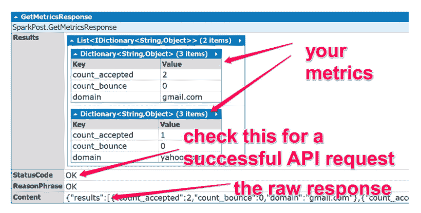

# 在 C#中使用 SparkPost Metrics API

> 原文：<https://dev.to/sparkpost/using-the-sparkpost-metrics-api-with-c-83f>

*今天的博客由[达伦·考顿](https://twitter.com/darrencauthon)撰写，他是社区成员和 [SparkPost C#库](https://github.com/SparkPost/csharp)的原始作者。谢谢你的帖子，达伦！我们希望你喜欢。

### 如何在 C 中使用 SparkPost Metrics API

在我们使用 C#的前两个教程中，我们学习了如何从 C#应用程序中发送电子邮件，以及如何使用 C#代码操作电子邮件模板。你会想从那里开始通过 NuGet 安装 SparkPost C#库，这都是好东西。

但大多数时候，当你从应用程序发送电子邮件时，你也会想知道那条消息发生了什么:它被发送了吗？你的用户是否打开了它，甚至点击了邮件正文中的链接？对许多应用程序来说，消息处理和性能的可见性至关重要。

这就是为什么 SparkPost C#库包含了获取有关您发送的电子邮件的重要指标的方法。今天，我们来看看它们是如何工作的。

获得这些分析有两种机制:推和拉。通过推送(通过 webhook ),当 SparkPost 将信息发布到您提供的 web 端点时，您可以获得近乎实时的指标流。未来的教程将提供一些关于在标准中设置 webhook 端点的帮助。Net MVC 应用程序。

然而，今天我们将关注通过 C#包装器对您的指标进行基于拉式 API 的查询。你可以向 SparkPost API 查询你想要的关于你在过去几周内发送的电子邮件的任何类型的信息，API 将返回你所请求的信息。

本教程还将对这个库的设计提供一些见解，以及如何将它用于您想要进行的其他 SparkPost API 调用。

### 一个 SparkPost 指标 API 快速启动

当使用 C# SparkPost 库时，首先要检查的是 [SparkPost API 文档](https://developers.sparkpost.com/api/)。C#库的编写尽可能地反映了 SparkPost web API。自然地， [API 文档包含了关于指标的具体信息](https://developers.sparkpost.com/api/metrics.html)。看看你想收集什么样的指标。

让我们试试文档中的第一种方法:按域收集指标。让我们构建一个示例请求，该请求将返回发送到 Gmail 或 Yahoo Mail 的被接受和被退回的电子邮件的数量。下面是返回结果的 C#代码。

```
var client = new Client("YOUR API KEY");
client.CustomSettings.SendingMode = SendingModes.Sync; 

var query = new MetricsQuery {
    From = DateTime.Now.AddDays(-7),
    Metrics = new[] { "count_accepted", "count_bounce" },
    Domains = new[] { "gmail.com", "yahoo.com" },
};

var response = await client.Metrics.GetDeliverabilityByDomain(query); 
```

Enter fullscreen mode Exit fullscreen mode

这是你的结果:

[T2】](https://res.cloudinary.com/practicaldev/image/fetch/s--yjw3q0AY--/c_limit%2Cf_auto%2Cfl_progressive%2Cq_auto%2Cw_880/https://media.sparkpost.com/uploads/2017/10/Screen-Shot-2017-10-13-at-2.31.52-PM.png)

真的就那么简单。您想要的所有度量数据，对于这个和任何其他 API 度量方法，都将以这个形式返回。唯一真正的问题是您想要什么数据，所以查看 SparkPost API 文档并进行您想要的查询！

### 如何保持 SparkPost C#库随着 API 的变化而更新

为 SparkPost 这样的服务使用库的困难之一是保持更新。SparkPost 总是在它的 API 中添加新特性，但是那些新特性在库中有反映吗？有时在 API 开发者添加特性和库作者添加支持之间会有一个时间差。

C#库试图通过允许您自己扩展库来缓解这些问题。上面的例子展示了如何使用 MetricsQuery，但是您可以传递任何对象来用作查询——只要它与 SparkPost 服务的样式和命名相匹配。

这里有一个具体的例子:SparkPost 开发人员添加了一个新的 API 特性，即通过“限制”来限制结果大小的能力。编写 MetricsQuery 类时，该特性不可用，因此它没有可用的限制。那么这是否意味着在 C#中不能使用 Limit 呢？不，你仍然可以使用它，只要你自己通过就行了。喜欢用匿名对象:

```
var client = new Client("YOUR API KEY");
client.CustomSettings.SendingMode = SendingModes.Sync; 

var response = client.Metrics.GetDeliverabilityByDomain(new {
  From = DateTime.Now.AddDays(-0),
  Metrics = "count_accepted,count_bounce",
  Domains = "gmail.com,yahoo.com",
  Limit = 10
}); 
```

Enter fullscreen mode Exit fullscreen mode

另一种方法是扩展 MetricsQuery 并添加一个“int Limit { get 设置；}财产。但是需要注意的主要一点是，只要你与 SparkPost 文档和命名保持一致，这个库就可以自我扩展。

### SparkPost c#库开源

我是 [SparkPost 库](https://github.com/SparkPost/csharp)的原始作者，但是有十几个开发者为这个库贡献了代码，比如这个度量库，是 Aaron Sherber 贡献的。这个库的每个开发者要么是 SparkPost 的员工，要么是 SparkPost 的客户，我们所有人都有兴趣让这个库工作得更好。

随着 SparkPost API 的扩展，这个库也将随之扩展。我们接受任何想帮忙的人的捐款！

用 C# 使用 SparkPost Metrics API 的帖子[首先出现在](https://www.sparkpost.com/blog/metrics-api-csharp/) [SparkPost](https://www.sparkpost.com) 上。