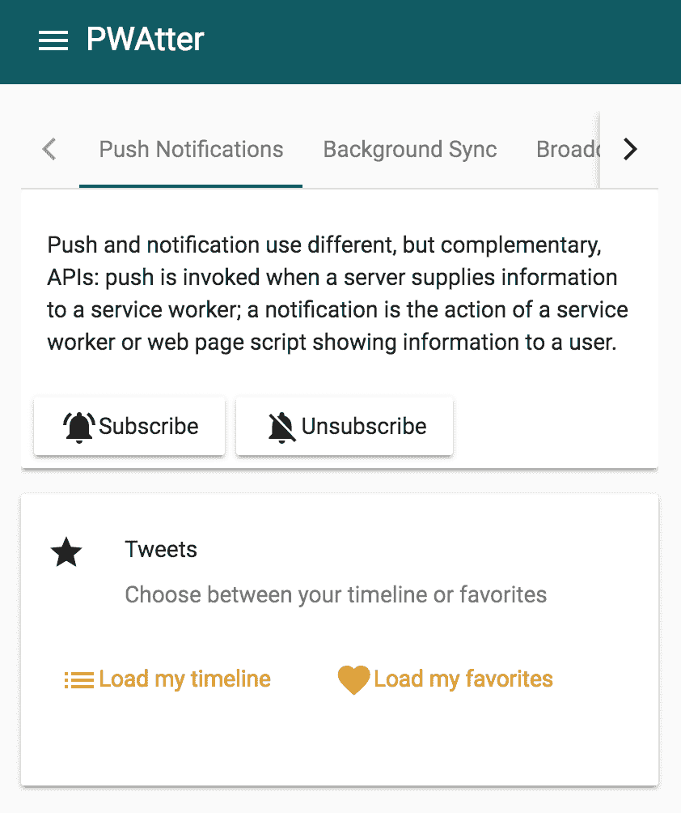
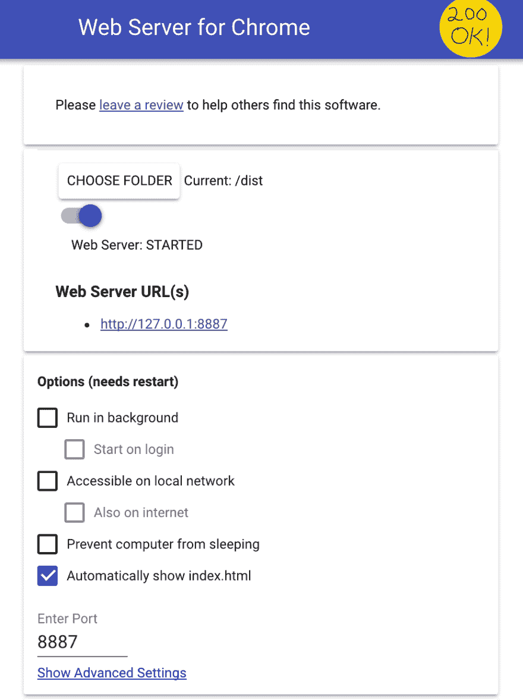
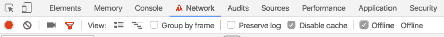
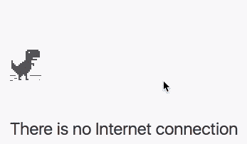

# 使用 Workbox 2 和 Angular 创建渐进式 Web 应用程序。第 1 部分:应用程序外壳

> 原文：<https://dev.to/webmaxru/using-workbox-2-and-angular-to-create-a-progressive-web-app-part-1-app-shell-1jnj>

> 这是一套 5 篇文章，致力于使用标题中提到的最新框架和库来创建 pwa。我们从 PWA 基本要素开始，然后转向更复杂的功能。所有 5 个部分的代码都准备好了，并被推送到我下面提到的回购，主分支)
> 
> 第一部分:应用外壳。该资源
> 
> 第 2 部分:运行时缓存。快
> 
> 第 3 部分:广播频道。快
> 
> 第 4 部分:后台同步。快
> 
> 第 5 部分:推送通知。快

我们今天称之为“进步”的网络应用在不久的将来会成为常规应用。Create React App [默认生成 PWA](https://facebook.github.io/react/blog/2017/05/18/whats-new-in-create-react-app.html#progressive-web-apps-by-default)，Angular CLI 很快也会这样做，其他框架都有相应的模板和生成器。

如果我们想以与框架无关的方式将 PWA 特性添加到我们的应用程序中，该怎么办？有一些对我们来说很棒的帮手！我相信，当前事实上的标准是 Google 的 sw-precache。它的继任者在 Google I/O 2017 上展示，被命名为 [Workbox](https://workboxjs.org/) 。这篇文章是关于我对最近发布的 2.0 版本的实验。

Workbox 将有助于使用任何前端框架(或无框架)创建渐进式 web 应用程序。对于我来说，这将是 [Angular 5](https://angular.io) (beta 5)，使用 [Angular Material](https://material.angular.io) (beta 10)构建 UI。

让我们追求经典，创建一个类似 Twitter 的演示应用程序:一些提要、发布消息、推送通知。既然这是一个 PWA Twitter，我们就叫它 PWAtter:)下面是托管的[演示](https://pwa-workshop-angular.firebaseapp.com/)。

[根据定义](https://en.wikipedia.org/wiki/Progressive_web_app)，渐进式网络应用是使用最新网络技术的应用(通过使用现代浏览器的 API)。对于 PWAtter，我们将采用以下特性子集:

*   Web 清单
*   优化网络的应用外壳和运行时缓存
*   温和的应用外壳更新流程
*   消息发布的离线回退(具有“在线时重放”功能)
*   推送通知

我们跳过关于 web manifest 的故事，对于我们的例子来说，它与编码无关。我只是使用[realfavicongenerator.net](http://realfavicongenerator.net)生成资产。我们直接跳到…

### 应用外壳

简而言之，这是您的应用程序启动并显示一些有意义的 UI 部分所需的最小文件集。例如，带有应用程序标题、菜单、加载指示器的标题。在最好的情况下，所有这些都应该是服务器渲染的，但是让我们把这个留到另一篇文章中——这不是对[应用外壳概念](https://developers.google.com/web/fundamentals/architecture/app-shell)的严格要求。我们能用这些文件做什么？对！将它们全部放入缓存(一个特殊的缓存，通过[缓存 API](https://developer.mozilla.org/en-US/docs/Web/API/Cache) 操作，不要与 HTTP 缓存混淆)，并从那里使用[服务工作器 API](https://developer.mozilla.org/en/docs/Web/API/Service_Worker_API) 提供服务，而不是访问网络。这样，我们可以让我们的应用程序在离线模式下运行，同时避免在线模式下的一些网络请求。

一些需要关注的事情:

*   文件的确切列表:我们不想手动管理它。如果我们要破坏缓存(这里我指的是 HTTP 缓存)，那么设置可能会因版本不同而不同，文件名也可能包含散列。
*   版本控制:我们不想永远显示应用外壳 v1。
*   缓存管理:在新版 app shell 登陆后，做一次春季大扫除是我们的职责。缓存不是无限的，有一些配额。

上面列出的所有问题都可以通过 Workbox CLI 的一个命令来解决。

#### Angular app 并测试离线模式

让我们暂时跳到我们的 Angular 应用程序。我为我们在[p 电池报告](https://github.com/webmaxru/pwatter/tree/step1)上的演示准备了一切(我们需要第一步分支)。克隆它，并安装 npm 软件包。

为了能够构建应用程序，我们需要安装 Angular CLI:

```
npm install [@angular/cli](http://twitter.com/angular/cli) --global 
```

现在我们可以开始了:

```
npm run build-prod 
```

这将在 dist 文件夹中生成 Angular app(该命令只是 Angular CLI 生产版本的一个快捷方式，禁用了文件名哈希，以获得更清晰的输出)。

让我们使用任何静态 web 服务器提供服务，并在 Chrome 中打开(我强烈建议您检查是否使用最新版本的浏览器)

[T2】](https://res.cloudinary.com/practicaldev/image/fetch/s--coz8kICZ--/c_limit%2Cf_auto%2Cfl_progressive%2Cq_auto%2Cw_880/https://cdn-images-1.medium.com/max/842/1%2AOpkIU4XyVPNukNX0Qx1z7w.png)

我使用 Chrome 扩展的[网络服务器。](https://chrome.google.com/webstore/detail/web-server-for-chrome/ofhbbkphhbklhfoeikjpcbhemlocgigb/)

<figure>[](https://res.cloudinary.com/practicaldev/image/fetch/s--ByAhY1yO--/c_limit%2Cf_auto%2Cfl_progressive%2Cq_auto%2Cw_880/https://cdn-images-1.medium.com/max/926/1%2AeHjQL1hfa2l3HbVle6tDMg.png) 

<figcaption>最简单的选择 webserve 一些静态文件</figcaption>

</figure>

显然，在我们切换到离线模式后(使用 Chrome DevTools):

[T2】](https://res.cloudinary.com/practicaldev/image/fetch/s--PFQbFvOv--/c_limit%2Cf_auto%2Cfl_progressive%2Cq_auto%2Cw_880/https://cdn-images-1.medium.com/max/1024/1%2Abkju1K6A0Plc0vE8mfmAqA.png)

我们会见到我们的老朋友——离线 dyno。

<figure>[](https://res.cloudinary.com/practicaldev/image/fetch/s--vEDWkerg--/c_limit%2Cf_auto%2Cfl_progressive%2Cq_66%2Cw_880/https://cdn-images-1.medium.com/max/347/1%2A8Ffjxrc09Qbj2OIcIGqnAg.gif) 

<figcaption>你了解这个 Chrome 的内置游戏吗？当看到一个有恐龙的页面时，点击你的浏览器中的空格！</figcaption>

</figure>

#### 工具箱设置

让我们告别这种动物吧！是时候安装工具箱了:

```
npm install workbox-cli --global 
```

现在我们可以跑了:

```
workbox generate:sw 
```

这个漂亮的 CLI 将询问一些关于文件类型和位置的问题(要获得此对话框，请先删除 workbox-cli-config.js 文件),并生成一个服务工作器。在我的例子中，我将其命名为 sw-default.js :

```
workbox generate:sw
? What is the root of your web app? dist
? Which file types would you like to cache? (Press <space> to select, <a> to toggle all, <i> to inverse selection)txt, png, ico, htm
l, js, json, css
? What should the path of your new service worker file be (i.e. './build/sw.js')? dist/sw-default.js
? Last Question - Would you like to save these settings to a config file? Yes 
```

这非常方便将设置保存在 workbox-cli-config.js 中，就像这个工具提供的一样，所以这个文件会再次出现。

让我们转到 dist 文件夹。出现了三个新文件:

*   SW-default . js-自动生成的服务工作者
*   Workbox-SW . prod . v 2 . 0 . 0 . js—Workbox 的高级库(+其映射文件)

第一个文件里面是什么？