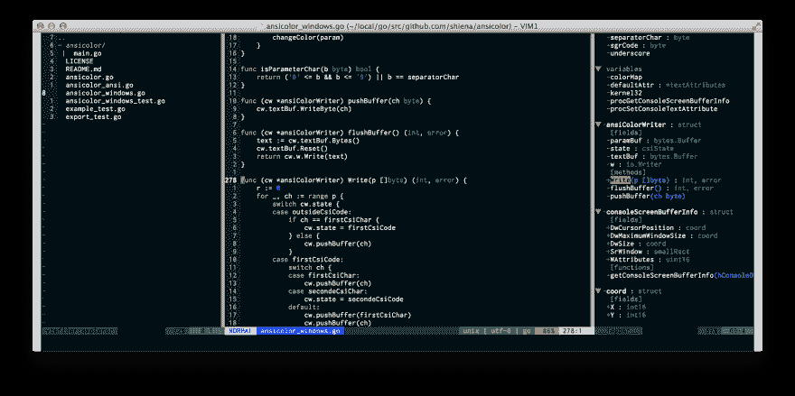
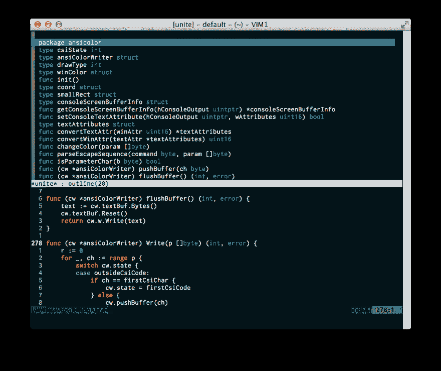
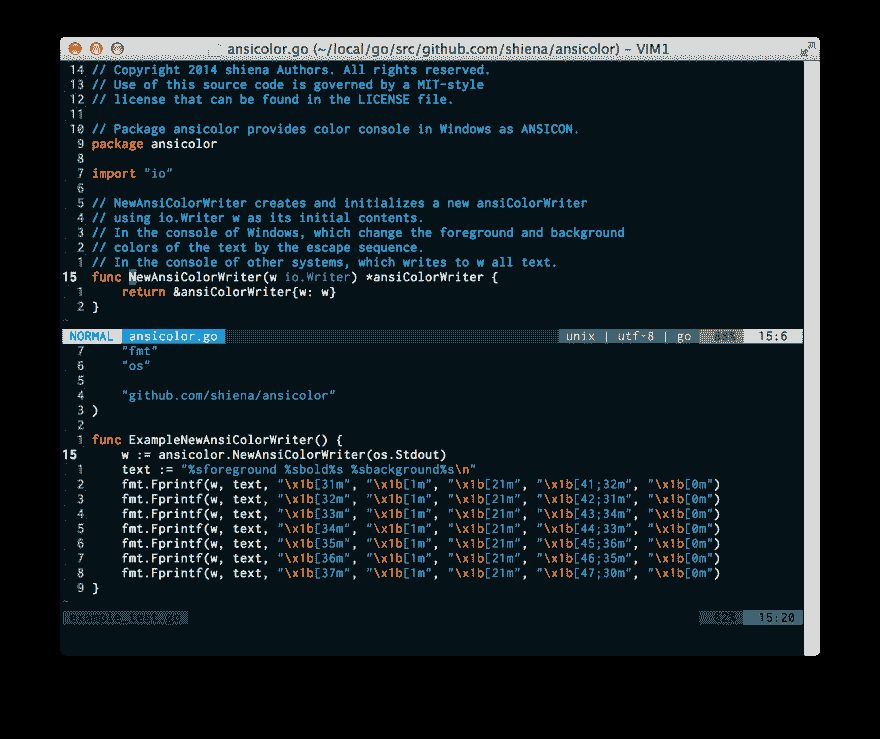
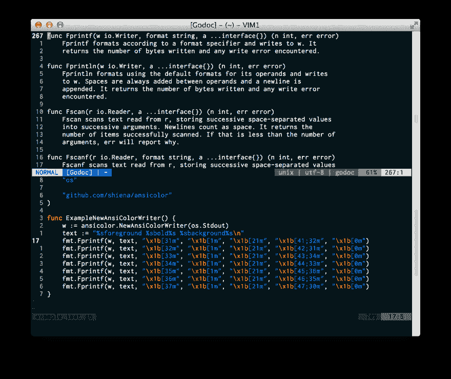

# vim 的 Go 支持很厚实，让人发抖

> 原文：<https://dev.to/shiena/vim-go-j8o>

# 前言

正如标题所示，用 vim 制作的 Go 的开发环境很方便，所以进行了总结。
介绍特别便于读码的设定。

# Reference

是写本稿时参考的报道。
因为日期是按照从小到大的顺序排列的，所以下面包含了旧的记述。

vim-go-extra を公開致 http://vim-jp.org/blog/2014/09/02/vim-go-extra.html
[します。](http://vim-jp.org/blog/2014/09/02/vim-go-extra.html)

去 1.2.1 の環境構築自制+ Vim 編(2014.03)
[http://qiita.com/methane/items/4905f40e4772afec3e60](http://qiita.com/methane/items/4905f40e4772afec3e60)

大天空::Vimを使ったGo 言語開発手法
[http://mattn.kaoriya.net/software/vim/20130531000559.htm](http://mattn.kaoriya.net/software/vim/20130531000559.htm)

go 的 vim 命令“Fmt”实际上注册 quickfix 是最棒的
[http://qi ita.com/umi sama/items/2e 38139 E0 d 3f 441046 e【](http://qiita.com/umisama/items/2e38139e0d3f4410446e)

去用のvim 設定
[http://qiita.com/hnakamur/items/f39fde28bcfe4beaaaba](http://qiita.com/hnakamur/items/f39fde28bcfe4beaaaba)

戈兰语 vim::metal 3d
[http://www.metal3d.org/ticket/2013/07/07/vim-for-golang](http://www.metal3d.org/ticket/2013/07/07/vim-for-golang)

Goの開発環境(Vim + Vundle 編)
[http://qiita.com/todogzm/items/3c281da10287f7383487](http://qiita.com/todogzm/items/3c281da10287f7383487)

Go 语言初学者看了会幸福的地方
[http://qi ita.com/Tenn Tenn/items/0e33a 4959250 d1a 55045](http://qiita.com/tenntenn/items/0e33a4959250d1a55045)

mattyw:利用 vim 的路径加速你的围棋项目
[http://mattyj Williams . blogspot . jp/2013/01/Using-vims-path-to-speed-up-your-Go . html](http://mattyjwilliams.blogspot.jp/2013/01/using-vims-path-to-speed-up-your-go.html)

用 Vim 写 Go 的代码时想做的事情
[http://qi ita.com/methane/items/d 82 B9 f 28 b 97 b5 c 3bd 08 a](http://qiita.com/methane/items/d82b9f28b97b5c3bd08a)

维姆福勒で纳特里のような探险家を快適に実現する方法——杉井< yabai < kimoi
[http://hrsh7th.hatenablog.com/entry/20120229/1330525683](http://hrsh7th.hatenablog.com/entry/20120229/1330525683)

# 学会

## VimFiler + Tagbar 中类似 IDE 的一览性

通过 VimFiler 后述的`:VimFilerTree`指令和 TagBar 插件执行的`:Tagbar`指令。
虽然树形显示的固定模式是 NERDTree，但是因为个人的喜好而使用了 VimFiler。
将光标对准各个文件名和函数名，按`Enter`键，则跳转。

[](https://res.cloudinary.com/practicaldev/image/fetch/s--HQrACuvc--/c_limit%2Cf_auto%2Cfl_progressive%2Cq_auto%2Cw_880/https://dev-to-uploads.s3.amazonaws.com/i/qjguzum3qtzo2fwrvrz6.png)
[只显示图像](https://dev-to-uploads.s3.amazonaws.com/i/qjguzum3qtzo2fwrvrz6.png)

## 有时也想使用 Unite-outline

也可以通过`:Unite outline`进行轮廓显示。

[](https://res.cloudinary.com/practicaldev/image/fetch/s--twZy4Jpe--/c_limit%2Cf_auto%2Cfl_progressive%2Cq_auto%2Cw_880/https://dev-to-uploads.s3.amazonaws.com/i/a9gtq2jcbtj9pyvqfdg1.png)
[只显示图像](https://dev-to-uploads.s3.amazonaws.com/i/a9gtq2jcbtj9pyvqfdg1.png)

## 跳至 gd 定义

将光标对准下方窗口第 15 行的`NewAnsiColorWriter`，输入`gd`。
画面被分割，打开上面窗口中有其定义的文件。

[](https://res.cloudinary.com/practicaldev/image/fetch/s--c5WBgUnC--/c_limit%2Cf_auto%2Cfl_progressive%2Cq_auto%2Cw_880/https://dev-to-uploads.s3.amazonaws.com/i/tt1w2o5zy0m9veo1idr0.png)
[只显示图像](https://dev-to-uploads.s3.amazonaws.com/i/tt1w2o5zy0m9veo1idr0.png)

## :用 Godoc 显示文档

将光标对准下方窗口第 17 行的`fmt.Println`，执行了`:Godoc`命令。
画面被分割，在上面的窗口中打开 Godoc。

[](https://res.cloudinary.com/practicaldev/image/fetch/s--9S5AKyiS--/c_limit%2Cf_auto%2Cfl_progressive%2Cq_auto%2Cw_880/https://dev-to-uploads.s3.amazonaws.com/i/kc2k0w90dgt4jbv4zmyc.png)
[只显示图像](https://dev-to-uploads.s3.amazonaws.com/i/kc2k0w90dgt4jbv4zmyc.png)

# Environment construction

## Environmental number

### macでhomebrewの場合

```
export GOROOT=/usr/local/opt/go/libexec
export GOPATH=$HOME/go
export PATH=$GOPATH/bin:$GOROOT/bin:$PATH 
```

### windowsの場合

```
GOROOT=C:\go
GOPATH=%USERPROFILE%\go
PATH=%GOPATH%\bin;%GOROOT%\bin;%PATH% 
```

## 工具

`$GOPATH/bin`中安装了命令。

```
go get -u golang.org/x/tools/cmd/goimports
go get -u golang.org/x/tools/cmd/godoc
go get -u golang.org/x/tools/cmd/vet
go get -u golang.org/x/tools/cmd/cover
go get -u github.com/nsf/gocode
go get -u github.com/golang/lint/golint
go get -u github.com/rogpeppe/godef
go get -u github.com/jstemmer/gotags 
```

在 Windows 上，如果使用 windows APP 构建，则从 vim 执行命令时将不会显示窗口，因此推荐使用。

```
go get -u -ldflags -H=windowsgui golang.org/x/tools/cmd/goimports
go get -u -ldflags -H=windowsgui golang.org/x/tools/cmd/godoc
go get -u -ldflags -H=windowsgui golang.org/x/tools/cmd/vet
go get -u -ldflags -H=windowsgui golang.org/x/tools/cmd/cover
go get -u -ldflags -H=windowsgui github.com/nsf/gocode
go get -u -ldflags -H=windowsgui github.com/golang/lint/golint
go get -u -ldflags -H=windowsgui github.com/rogpeppe/godef
go get -u -ldflags -H=windowsgui github.com/jstemmer/gotags 
```

## vimrc

各种 vim 插件、Go 的设定、用于在 VimFiler 中树形显示的设定。

```
" for Neobundle {{{
if has('win32')
    let s:vim_home=expand('~/vimfiles')
else
    let s:vim_home=expand('~/.vim')
endif
if has('vim_starting')
    let &runtimepath.=printf(',%s/bundle/neobundle.vim', s:vim_home)
endif

set nocompatible
call neobundle#begin(expand(s:vim_home.'/bundle/'))
NeoBundleFetch 'Shougo/neobundle.vim'
call neobundle#end()

NeoBundle 'majutsushi/tagbar'
NeoBundle 'Shougo/vimfiler'
NeoBundle 'Shougo/vimproc'
NeoBundle 'Shougo/unite.vim'
NeoBundle 'Shougo/unite-outline'
NeoBundle 'dgryski/vim-godef'
NeoBundle 'vim-jp/vim-go-extra'
" vim-ft-goは最新版のvimを使えない場合のみ
NeoBundle 'google/vim-ft-go'
set rtp^=$GOPATH/src/github.com/nsf/gocode/vim

filetype plugin indent on
syntax on
NeoBundleCheck
" }}}

" for golang {{{
set path+=$GOPATH/src/**
let g:gofmt_command = 'goimports'
au BufWritePre *.go Fmt
au BufNewFile,BufRead *.go set sw=4 noexpandtab ts=4 completeopt=menu,preview
au FileType go compiler go
" }}}

" VimFilerTree {{{
command! VimFilerTree call VimFilerTree(<f-args>)
function VimFilerTree(...)
    let l:h = expand(a:0 > 0 ? a:1 : '%:p:h')
    let l:path = isdirectory(l:h) ? l:h : ''
    exec ':VimFiler -buffer-name=explorer -split -simple -winwidth=45 -toggle -no-quit ' . l:path
    wincmd t
    setl winfixwidth
endfunction
autocmd! FileType vimfiler call g:my_vimfiler_settings()
function! g:my_vimfiler_settings()
    nmap     <buffer><expr><CR> vimfiler#smart_cursor_map("\<Plug>(vimfiler_expand_tree)", "\<Plug>(vimfiler_edit_file)")
    nnoremap <buffer>s          :call vimfiler#mappings#do_action('my_split')<CR>
    nnoremap <buffer>v          :call vimfiler#mappings#do_action('my_vsplit')<CR>
endfunction

let my_action = {'is_selectable' : 1}
function! my_action.func(candidates)
    wincmd p
    exec 'split '. a:candidates[0].action__path
endfunction
call unite#custom_action('file', 'my_split', my_action)

let my_action = {'is_selectable' : 1}
function! my_action.func(candidates)
    wincmd p
    exec 'vsplit '. a:candidates[0].action__path
endfunction
call unite#custom_action('file', 'my_vsplit', my_action)
" }}} 
```

```
" gotags {{{
let g:tagbar_type_go = {
    \ 'ctagstype' : 'go',
    \ 'kinds'     : [
        \ 'p:package',
        \ 'i:imports:1',
        \ 'c:constants',
        \ 'v:variables',
        \ 't:types',
        \ 'n:interfaces',
        \ 'w:fields',
        \ 'e:embedded',
        \ 'm:methods',
        \ 'r:constructor',
        \ 'f:functions'
    \ ],
    \ 'sro' : '.',
    \ 'kind2scope' : {
        \ 't' : 'ctype',
        \ 'n' : 'ntype'
    \ },
    \ 'scope2kind' : {
        \ 'ctype' : 't',
        \ 'ntype' : 'n'
    \ },
    \ 'ctagsbin'  : 'gotags',
    \ 'ctagsargs' : '-sort -silent'
\ }
" }}} 
```