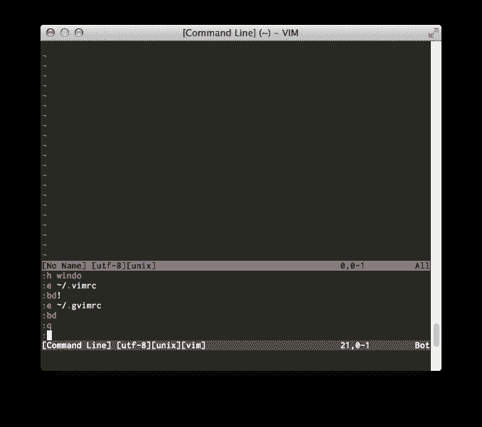

# 在 vim 上不使用命令行窗口太可惜了

> 原文：<https://dev.to/shiena/vim-pd0>

# 命令行窗口是什么？

可以在 vim 的窗口中显示和重新执行在`:`中执行的 Ex 命令以及在`/`和`?`中检索到的历史记录的功能。
因为命令模式只有一行，所以跟踪历史记录的识别性差，光标移动是箭头键，所以很麻烦，但是命令行窗口可以在窗口内显示几行的历史记录，还可以执行 vim 的光标移动和命令。

*※这里所说的窗口不是 Windows 或 Mac 的窗口，而是 vim 的窗口。*

# 怎么用？

## 显示并执行历史记录

使用 Ex 命令时，输入`q:`代替`:`后，vim 的窗口将被分割，命令记录将显示在下方。
输入错误为退出 vim 的`:q`的人不觉得眼熟吗？

[T2】](https://res.cloudinary.com/practicaldev/image/fetch/s--IawCLZh1--/c_limit%2Cf_auto%2Cfl_progressive%2Cq_auto%2Cw_880/https://dev-to-uploads.s3.amazonaws.com/i/est9rk2qz09roviw7rtd.png)

在此输入`Enter`后，将执行光标所在行的命令。 当然也可以编辑。

另外，想从历史记录中进行前方检索时，与输入`q/`代替`/`，进行后方检索时，输入`q?`代替`?`一样，命令行窗口打开。

## 关闭命令行窗口

因为是 vim 的窗口，所以用`:q`关闭。

# 其他功能

## 将履历发送到 vim 的命令行

在命令行窗口中输入`Ctrl-C`，光标所在行的历史记录将被发送到命令行。
移动到命令行后，如果按`Esc`或`Ctrl-C`取消执行，命令行窗口也会一起关闭。

## 打开命令行窗口的另一种方法

使用`:`、`/`、`?`移动到命令行后，输入`Ctrl-F`打开命令行窗口。

# 更详细

接下来是`:help cmdwin`