# 可视化公司文化和文化变革

> 原文：<https://dev.to/lpasqualis/visualizing-company-culture-and-cultural-change-407p>

这篇文章最初发表在 [CoderHood](https://coderhood.com) 上，名为[可视化公司文化和文化变革](https://www.coderhood.com/visualizing-company-culture-and-cultural-change/)。CoderHood 是一个致力于软件工程人类层面的博客。

点击这个链接可以找到我用来生成这篇文章的图片和动画的处理代码。

[T2】](https://www.coderhood.com/visualizing-company-culture-and-cultural-change/)

公司文化是企业成功的一个重要参数，尤其是在科技领域。它代表了员工产生想法和创造价值的环境和特征。这是一个公司的个性，它调节着一个正常运作的组织的心跳。

尽管我们渴望控制我们的环境，但我们经常做不到。许多事情都是自然发生的，是由无数复杂得难以研究、理解和预测的因素所决定的力量推动的。

举个例子，[我们并不完全理解重力](https://www.quora.com/Do-we-fully-understand-gravity)。我们学会了使用它，并开发了数学模型来描述重力的结果。然而，我们并不详细了解导致引力的机制。似乎很奇怪的是，让我们每天脚踏实地的力量仍然没有得到很好的理解。然而，这只是一个例子。

## 群体互动很复杂

另一个我们很难详细理解的现象是群体中人与人之间的互动。有太多的变数在起作用，很难有一个清晰的观点。我们在高层次上理解它，我们学会了识别共同的模式，但我们还远远没有达到牛顿定律在人与人之间互动的程度。我们只有观察和经验来指导我们的直觉。

例如，任何时候，一群人长时间互动，就会形成一种我们称之为“文化”的个性一个组织的文化是一个迷人的主题，深刻地影响着我们的生活。文化形成于各种群体:家庭、政府、国家、公司、机构、学校、网络社区等等。很难精确地重建导致一个群体文化的事件，但我们可以非常清楚地体验和描述它。

例如，人们倾向于在[脸书](http://www.facebook.com/)上吹嘘日常琐事，在[推特](http://www.twitter.com/)上抱怨，在 [Reddit](http://www.reddit.com/) 上表现得像令人讨厌的混蛋，在[开发到](http://www.dev.to/)上合作，在 [StackOverflow](http://www.stackoverflow.com/) 上抢先一步，在 [LinkedIn](http://www.linkedin.com/) 上展现专业的一面，在[耳语](http://whisper.sh/)和 [SnapChat](http://www.snapchat.com/) 上展现狂野的一面，以自我为中心每个群体都有独特的风格和行为，属于多个群体的人往往会根据他们在哪里互动来扮演角色。

## 文化是能量，就像水体中的波浪

一个群体中的每个人都通过向环境传播能量来改变这个群体。人们有不同的个性，转化成不同的能量信号。我们就像浸在能量池中的波浪发生器，既影响我们也受我们影响。

在这个波动模型中，公司文化可以被形象化为每个员工对环境的影响相互作用的结果。文化是一种能量模式，它穿越群体所沉浸的能量场。

因为“能量场”是一个难以想象的概念，听起来太抽象和“新时代”，把它想象成水。想象一下，一个群体中的每个人都漂浮在一片水域中。水中每个人的动作、行为和话语都以一种与众不同的模式传播，这是那个人独有的。

波有许多特征，但在这个简化的类比中，我只使用三个特征:振幅、间隔和速度。

## 定义和说明

我在本文中使用的一些术语类似于物理学中使用的术语。然而，我并不试图做一个精确的比较。在某些情况下，这些词可能有不同的含义。为了避免混淆，让我定义一下我在这个上下文中使用的术语，包括它们在与文化的类比中的含义。

[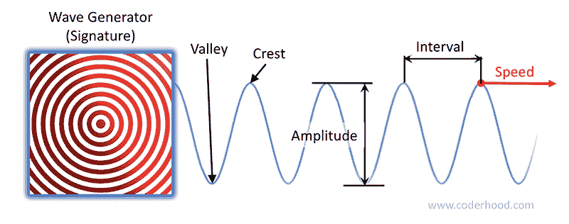T2】](https://res.cloudinary.com/practicaldev/image/fetch/s--V2Hnd2XC--/c_limit%2Cf_auto%2Cfl_progressive%2Cq_auto%2Cw_880/https://thepracticaldev.s3.amazonaws.com/i/2tpf874cyxj1p3nghqfp.png)

*   每个**波发生器**都是一种沉浸在能量场中的力量，它创造了一种独特的波。我也将使用术语**签名**作为波形发生器的同义词。一个信号由它的位置、振幅、间隔和速度来唯一地识别(见下面的定义)。*比喻:*
    *   每个签名代表一个组的成员。
    *   签名产生的波描述了所述签名对文化的影响。
*   波峰**是波浪的高点之一，波谷**是低点之一。
    *   *在类比中，*波峰和波谷代表由群体成员产生的影响力的波峰。
*   **振幅**是波峰和波谷之间的能量增量。振幅大的波比振幅小的波更强烈。
    *   *打个比方，*群体中一个成员产生的波的振幅，与这个人对组织文化的影响力强度成正比。幅度越大意味着重要性程度越高。
*   **速度**是波峰(或波谷)的行进速度。换句话说，它是单位时间内通过能量场的能量数量(速度)。
    *   *在类比中，*波的速度代表了产生它的信号的影响的独特特征。
*   **间隔**是指两个连续波峰之间的距离。较短的距离导致更多的湍流(不规则的变化和运动)。
    *   *打个比方，*间隔越短代表文化动荡程度越高。
*   波浪从波浪发生器径向扩展。当不同的波相互作用时，它们相加或相互抵消，形成一个**干涉图样**，或**图样**。
    *   *在我的类比中，*干扰模式代表了群体的文化。

[T2】](https://res.cloudinary.com/practicaldev/image/fetch/s--4y9CQXRA--/c_limit%2Cf_auto%2Cfl_progressive%2Cq_auto%2Cw_880/https://thepracticaldev.s3.amazonaws.com/i/wg5ghuhb6ewmef9nmb6r.jpg)

# 公司文化模式

用这个类比，公司文化取决于每个员工的独特签名。如果你在团队中引入一个新成员或者修改一个现有成员，模式就会改变。

为了创建本文中描述的概念的可视化表示，我编写了一个程序来制作波的干涉图案的 3D(或 2D)渲染动画。该程序允许放置签名，并以各种方式改变其特征。它还能够旋转视图，放大和缩小，改变颜色模式，保存和加载模式等。程序是用[加工编写的；](http://www.processing.org/)我称之为 [CultureWaves，并在麻省理工学院许可下发布在 GitHub 上](https://github.com/lpasqualis/CultureWaves)。在这一点上，它离完美还很远，并且它有几个已知的问题，但是它足以产生我所寻找的视觉效果。

在 CulturalWaves 创建的可视化中，每个签名被表示为一个球体，并标有一个人的名字，代表一个团体的成员。每个球体都有节奏地改变大小，以它产生的波的速度跳动。此外，它的最大尺寸与它产生的波的振幅成正比。签名产生的波相互作用，形成隐喻性地代表群体文化的干涉图案。

例如，如果领域是一家公司的雇员，干涉模式代表该组织的文化。每个球体的大小代表了每个员工的影响力水平。你可能会想象一个大的职位是首席执行官——对公司文化有很大影响——一个小的职位是影响有限的初级员工。

## 群之一

先来一组一个。比尔是一个企业家，他独自工作。他创造的文化波动模式代表了一种“一”的公司文化:可预测且有规律，只依赖于一种个性。这是比尔——白色球体——和他创造的文化的形象化展示:

[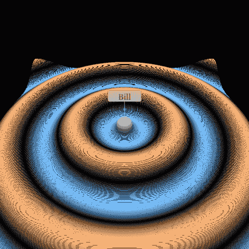T2】](https://res.cloudinary.com/practicaldev/image/fetch/s--YOf0OU-z--/c_limit%2Cf_auto%2Cfl_progressive%2Cq_auto%2Cw_880/https://thepracticaldev.s3.amazonaws.com/i/l2dzhpo0461ujooncpuf.png)

从更高的高度和不同的角度，你可以欣赏比尔产生的规律:

[T2】](https://res.cloudinary.com/practicaldev/image/fetch/s--YC3y43JY--/c_limit%2Cf_auto%2Cfl_progressive%2Cq_auto%2Cw_880/https://thepracticaldev.s3.amazonaws.com/i/hl9d02qih8pinopjmqmf.png)

## 两人一组

让我们想象一下，比尔创办的这个集团是一家公司，而且业务在某个时候会增长。比尔雇用朱莉。她加入了公司，对公司文化的影响是巨大的。常规模式变得更加复杂:

[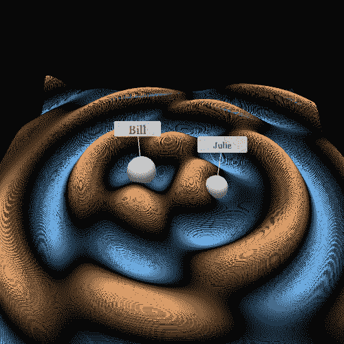T2】](https://res.cloudinary.com/practicaldev/image/fetch/s--jc3G-3Dt--/c_limit%2Cf_auto%2Cfl_progressive%2Cq_auto%2Cw_880/https://thepracticaldev.s3.amazonaws.com/i/29vu1nusxnki71dtq8nx.png)

比尔一个人的干扰模式与比尔和朱莉一起的干扰模式的差异，是一个人的文化与两个人的文化有多么不同的可视化。有了两个人，事情变得更加有趣和微妙。这种差异从远处看也是显而易见的，并显示了合作伙伴关系的深远影响:

[T2】](https://res.cloudinary.com/practicaldev/image/fetch/s--UhPskUTa--/c_limit%2Cf_auto%2Cfl_progressive%2Cq_auto%2Cw_880/https://thepracticaldev.s3.amazonaws.com/i/w439drkpfmzammkuby7g.png)

## 组三&组四

如果有第三个人——Maggie——加入公司，干扰会再次发生变化，变得更加混乱和不规则:

[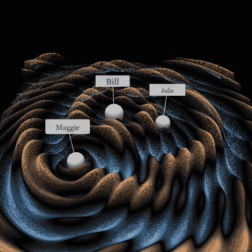T2】](https://res.cloudinary.com/practicaldev/image/fetch/s--ME6766Qc--/c_limit%2Cf_auto%2Cfl_progressive%2Cq_auto%2Cw_880/https://thepracticaldev.s3.amazonaws.com/i/pl9tsoj87884bj08hlqk.png)

在公司发展的早期阶段，一些有影响力的人的加入从根本上塑造了公司文化。在目前显示的可视化中，作为创始人的比尔的相对影响力为 200，朱莉为 130，玛吉为 120。这些值是由该组成员产生的波的振幅的可比较的量度。

添加相对影响力级别为 40 的新初级员工 Adam 会改变公司文化，但不会太大:

[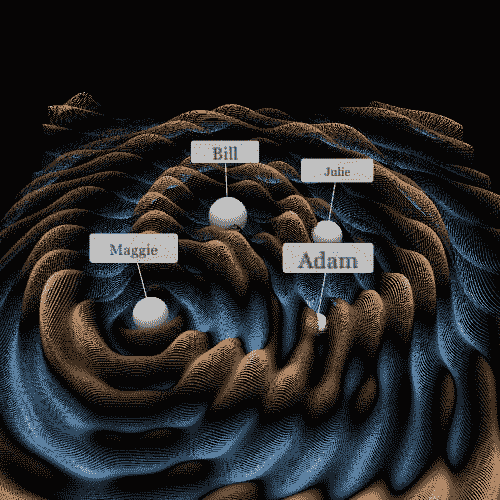T2】](https://res.cloudinary.com/practicaldev/image/fetch/s--nnTHJyiJ--/c_limit%2Cf_auto%2Cfl_progressive%2Cq_auto%2Cw_880/https://thepracticaldev.s3.amazonaws.com/i/1adtrsbr1qgop1qb59wp.png)

如图所示，公司文化更多是由最有影响力的人塑造的。此外，群体越大，每个人的影响力就越小。

## 占主导地位的影响者

一个非常有影响力的人可以戏剧性地塑造公司文化。例如，看看如果朱莉的相对影响力等级增长到 200，而比尔和玛吉下降到 30，亚当下降到 20，会发生什么。

[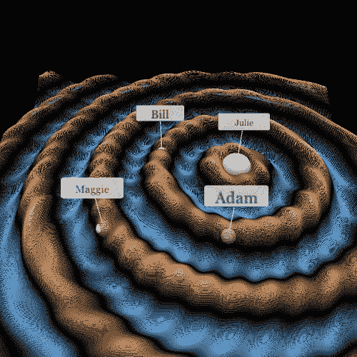T2】](https://res.cloudinary.com/practicaldev/image/fetch/s--KDHg0k_Q--/c_limit%2Cf_auto%2Cfl_progressive%2Cq_auto%2Cw_880/https://thepracticaldev.s3.amazonaws.com/i/9bjgmj9kwg7wwhrc0317.png)

从远处观察，这种影响更加明显。注意文化是如何以朱莉为中心的:

[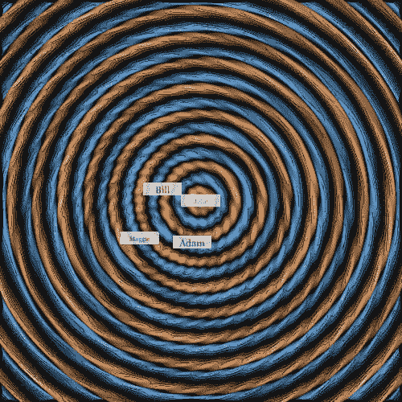T2】](https://res.cloudinary.com/practicaldev/image/fetch/s--lbqxkTzK--/c_limit%2Cf_auto%2Cfl_progressive%2Cq_auto%2Cw_880/https://thepracticaldev.s3.amazonaws.com/i/ne4ksfawxvg8koodtjtq.png)

## 成长

即使有一个占主导地位的朱莉和她 200 的影响力水平，当公司增长时，事情开始变得更加同质。例如，这是一个 50 人小组的可视化。朱莉被涂成红色，以显示她相对于其他人的位置。其他 49 名员工的影响力水平都在 40 左右。

[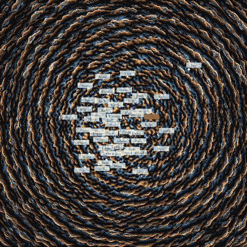T2】](https://res.cloudinary.com/practicaldev/image/fetch/s--GVbzWS4k--/c_limit%2Cf_auto%2Cfl_progressive%2Cq_auto%2Cw_880/https://thepracticaldev.s3.amazonaws.com/i/16x0agzozs5zxpron2ze.png)

注意这个模式不再以朱莉为中心了；她仍然有很大的影响力，但她周围的人产生了一种动荡而微妙的公司文化，这种文化不再以她为中心。为清楚起见，下面是同一组的视图，没有名称标签和球体:

[T2】](https://res.cloudinary.com/practicaldev/image/fetch/s--DzZPiUvc--/c_limit%2Cf_auto%2Cfl_progressive%2Cq_auto%2Cw_880/https://thepracticaldev.s3.amazonaws.com/i/kupuq2i5zhtpi906rl0o.png)

看看 Julie 离开团队后会发生什么:

[T2】](https://res.cloudinary.com/practicaldev/image/fetch/s--PDTuaztD--/c_limit%2Cf_auto%2Cfl_progressive%2Cq_auto%2Cw_880/https://thepracticaldev.s3.amazonaws.com/i/zf2kjvzoq0tg9eo7smm6.png)

这是有区别的，而且是显而易见的，但不是戏剧性的。公司文化似乎保持了朱莉被免职前的某种特质。留下来的人的个性和能量保持了组织的文化有点类似于原来的文化。

然而，如果我们将剩下的 49 个人中的一个人(April)的相对影响力增加到 600，这是 Julie 的 3 倍，普通员工的 15 倍，就会发生以下情况:

[T2】](https://res.cloudinary.com/practicaldev/image/fetch/s--GYT0WgKJ--/c_limit%2Cf_auto%2Cfl_progressive%2Cq_auto%2Cw_880/https://thepracticaldev.s3.amazonaws.com/i/kr67z0m45hxe5epktf91.png)

又一次，一个人对其他人有着不成比例的影响。从更近的角度来看，包括姓名标签:

[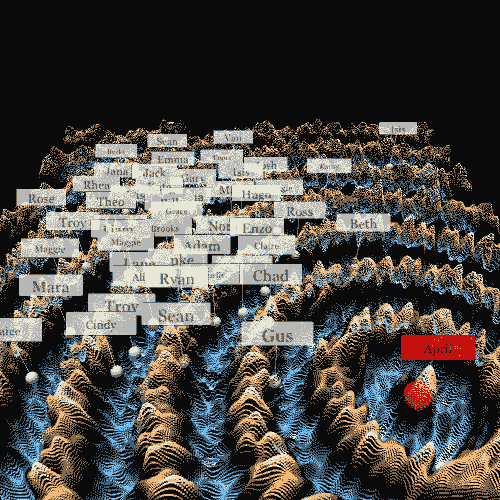T2】](https://res.cloudinary.com/practicaldev/image/fetch/s--_GQEsuEu--/c_limit%2Cf_auto%2Cfl_progressive%2Cq_auto%2Cw_880/https://thepracticaldev.s3.amazonaws.com/i/21izkrkd1bpqxib4xmwa.png)

## 文化变迁

### 顶端驱动

由于一个群体的所有成员都沉浸在文化中，他们的行为和个性也会随之改变。不管怎样，每个人都既修改文化又顺应文化，创造一个小的转变和一个更大的整合效应。人们带着特定的签名加入一个团体，过一段时间后，他们会改变以保持一致，加入他们的声音以加强现有的文化。

为了促成文化转变，你需要让最有影响力的人改变他们的签名，使公司朝着预定的方向前进。如果影响者继续传播一致的信息，最终每个人都会改变和适应，使由此产生的文化模式成为新常态。这就是为什么我坚信公司文化[形成于高层，形成于底层](https://www.coderhood.com/on-company-culture/)。

例如，使用我采用的图形可视化，让我们以三个人为一组，从他们的自然个性和对文化的影响开始:

[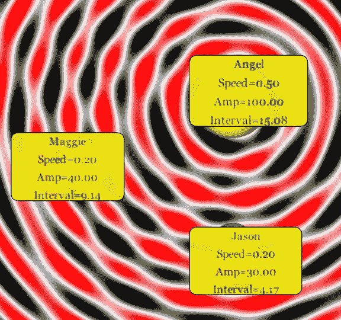T2】](https://res.cloudinary.com/practicaldev/image/fetch/s--fxeKiiBE--/c_limit%2Cf_auto%2Cfl_progressive%2Cq_auto%2Cw_880/https://thepracticaldev.s3.amazonaws.com/i/6fs9tkobr42q0g7f9b92.png)

该模式代表了这个群体的原始文化，其中还没有正常化的转变。天使是领袖。玛吉和杰森是初级员工。

如果安吉尔不努力推动文化向她的方向转变，团队可能会采用这种自然模式:

[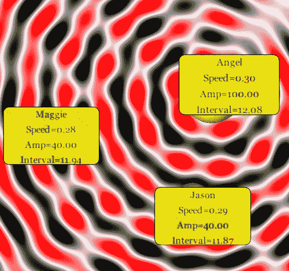T2】](https://res.cloudinary.com/practicaldev/image/fetch/s--hij9AjXI--/c_limit%2Cf_auto%2Cfl_progressive%2Cq_auto%2Cw_880/https://thepracticaldev.s3.amazonaws.com/i/vmmj5743m6i0si3dlmqs.png)

注意每个人的波动间隔和速度是如何在相似的值附近收敛的。由此产生的文化大多是“偶然的”，可能是也可能不是公司需要的。

然而，如果安吉尔倾向于推动文化向战略方向转变，那么团队可能会在这一点上达成一致:

[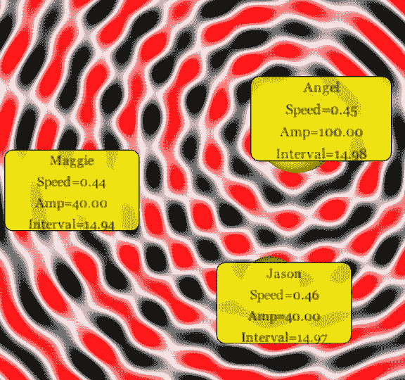T2】](https://res.cloudinary.com/practicaldev/image/fetch/s--5xgU1JxK--/c_limit%2Cf_auto%2Cfl_progressive%2Cq_auto%2Cw_880/https://thepracticaldev.s3.amazonaws.com/i/xkg6kxdy4ywbfqb1372h.png)

在这种情况下，三个成员的速度和间隔接近于 Angel 的起点，并且产生的图案具有不同的外观和感觉，更接近于 Angel 的自然偏好。在这个例子中，这种差别可能看起来很微妙，但是当你沉浸其中时，它是非常明显的。

### 招聘驱动的文化变革

实现文化转变的另一种方法是一次性雇佣大量不符合现有文化的人——或者几个有影响力的人；这通常会在小公司快速发展时期意外发生。由招聘驱动的文化变革可能如此引人注目，以至于除非最高领导层采取深思熟虑的行动加以引导，否则可能导致在很短的时间内创建一家完全不同的公司。我见过几次这种现象，并不总是好看。

另一方面，如果一家公司缺乏有意识地改变文化所需的强有力的领导，如果更多的多样性似乎是让公司摆脱墨守成规所必需的，那么雇佣新血可能会解决问题。战略性招聘来推动文化转变可能是一个昂贵的提议，但有时它可能是最有效的提议。

* * *

### 如果你喜欢这篇文章，请保持联系！

*   在 CoderHood 上找到我所有的帖子。
*   在 LinkedIn 上加入我的职业网络。
*   在推特上关注我。
*   加入我的脸书主页。
*   最后，请在 dev.to 上关注我！