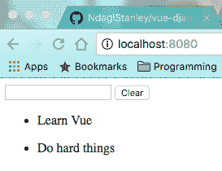

# 姜戈视图，第一部分

> 原文：<https://dev.to/rpalo/vue-on-django-part-1>

注意:本教程已经有几年的历史了，并且使用了 Django 和 Vue 的过时版本。我目前没有足够的时间来浏览和更新它，但如果有人想做繁重的工作，我很乐意合作。就目前而言，这些文章应该能够理解概念，但是代码不会与当前的 Vue 或 Django 文档相匹配。

我做到了。很吓人，很难，很棒，我做到了。我用 Django 开发服务器端 web 应用程序已经有一段时间了，但是我已经远远地看到了 shwoopy 前端的、基于 javascript 的、单页面的应用程序，我告诉自己有一天我会浏览一些教程。所以上周，我说“去他妈的噪音，我在造东西！”这不是我传统的学习方式，这是我第一次从零水平开始，在深水区学习。我认为它的效果出乎意料的好，我想分享一个教程——主要是帮助我把我学到的新思想巩固到更稳定的东西中。所以事不宜迟，下面是我的教程，制作一个由 Django REST 后端支持的 Vue 应用程序。在第一部分，我们将设置只是 Vue 方面。第 2 部分将是最难的部分，建立数据模型。最后，第 3 部分将是 Django 后端。本教程将假设 JavaScript 语法的工作知识，但我将尝试解释一些涉及的基础设施。我们开始吧。

## 1。overvue(超视图)

Vue.js 是一长串前端框架中的另一个，它围绕着更加实时和愉快的用户体验而设计，在后台实时更新 DOM 元素和异步服务器更新，无需一直重新加载整个页面。我个人认为他们从 React、Angular 和 Elm 等公司吸取了一些最好的东西，并以一种很好的方式将它们结合起来。至少，这是我的观点，我有整整一周的前端框架经验。

## 2。正在设置

我们要做的是，我们将使用 Webpack 来处理模块捆绑等等。因为对我来说，Webpack 本质上仍然是一种巫术，所以我将解释足够多的内容来完成这项工作。我们首先需要的是`vue-cli`工具。这将使我们的生活变得美好，主要是为我们设置 Webpack 和其他东西。你将需要节点和 NPM 虽然。

> 对于那些更习惯于 Python 和 Django 的人来说，NPM 有点像 pip，如果 pip 有一些标准 Django manage.py 的能力的话

```
$ npm install -g vue-cli
...
$ vue init NdagiStanley/vue-django todoapp
... 
```

Enter fullscreen mode Exit fullscreen mode

我们将使用 Github 的一个模板来完成我们的 vue 项目，你可以从命令中看出这一点。这里可以看到[。浏览提示，回答它提出的所有问题。完成后，您应该会有一个新的项目文件夹。我们稍后会检查里面的大部分东西，所以不要惊慌。](https://github.com/NdagiStanley/vue-django) 

```
$ cd todoapp
$ npm install 
```

Enter fullscreen mode Exit fullscreen mode

此时，也可以开始创建您的 git 存储库。我把那个留给你。一些重要的事情。`main.js`是实际实例化你的应用的文件。Vue 应用程序由组件组成，这些组件组合在一起可以简化复杂的事情。我们不会做复杂的事情，所以不用担心。我们想要的是一个待办事项列表，你可以输入项目并完全清除。两个动作。主组件已经创建，可以在`src/App.vue`中找到。我们将很快改变这种情况。首先在`src`目录中创建一个名为`components`的目录，如果它还不存在的话。如果它已经存在，可能有一个`Hello.vue`文件。你可以删除它。

## 3。组件

我们的应用程序将由三个主要部分组成。TodoList，显示每个待办事项。Todo，这将是显示的基本单位。UserInput，它包含输入框和清除按钮。有必要这么复杂吗？不会。但它将有助于展示 Vue 中的一些可用功能。让我们创建我们的第一个。创建`src/components/Todo.vue`。

```
// src/components/Todo.vue

<template>
  <p>
    {{ todo.text }}
  </p>
</template>

<script>
export default {
  props: ['todo']
}
</script> 
```

Enter fullscreen mode Exit fullscreen mode

就是这样。有两种主要的方法来实现 Vue 组件:在一个文件中，和用单组件模块。我们通过模块来实现这一点。每个组件都将包含一个布局组件 HTML 结构的模板、一个包含组件大脑的脚本标记，以及一个包含组件本地自定义样式的可选样式标记。这些组件以层次结构的形式排列，您将看到，父组件可以以 *props* 的形式将数据传递给它们的子组件，您必须声明这些组件才能使用它们。

> 这让我很沮丧。我希望我的父母能给我一些鼓励。开玩笑的。我的父母很棒。

你可以在上面的脚本标签中看到(道具)。不要太在意这些废话。这就是 Webpack 处理模块和导入的方式。当 Todo.vue 模块被导入时，它导出的对象将是被传递的对象(本质上是组件的“灵魂”)。随着我们继续前进，这一点有望变得更加清楚。让我们来做 TodoList 组件，这样您就可以看到`props`是如何被传递的。

```
// src/components/TodoList.vue

<template>
  <div id="todolist">
    <ul>
      <li v-for="todo in todos">
        <todo v-bind:todo="todo" v-bind:id="todo.id">
        </todo>
      </li>
    </ul>
  </div>
</template>

<script>
import Todo from './Todo.vue'

export default {
  components: {
    Todo
  },
  data: function () {
    return {
      todos: [
        { text: 'Learn Vue' },
        { text: 'Do hard things' }
      ]
    }
  }
}
</script> 
```

Enter fullscreen mode Exit fullscreen mode

这里有一些值得注意的事情。您可以看到在`li`元素中使用的`v-for`选项。这告诉 Vue 遍历 todos 变量中的每一项，并从中创建一个 li 元素。您可以看到我们正在创建第一个定制元素:`todo`。`v-bind`允许我们将数据作为道具发送到子组件中。当你制作一个物品清单时，Vue 会让你为每一个物品提供一个 id，这样它就可以保持清单的直线性并做出快速的改变。通过包含`components`键，您可以在`script`部分看到该组件将 Todo 声明为其子组件。最后，`data`键提供变量 todos 的初始化。一旦我们进入数据模型，我们就可以从实际数据初始化它，而不是硬编码值。

> 我们还在`import Todo from './Todo.vue`行中看到更多的“模块”语法。通过这样写，变量 Todo 被从 Todo.vue 文件中导出的对象填充。类似于 Python imports，但比 Python imports 更容易控制——尽管您可以通过显式设置`__all__`变量来实现类似的效果...但是我跑题了。

这是 UserInput 组件。

```
// src/components/UserInput.vue

<template>
  <div id="user-inputs">
    <input v-model="newTodoText" v-on:keyup.enter="createTodo">
    <button v-on:click="clearTodos">
      Clear
    </button>
  </div>
</template>

<script>
export default {
  data: function () {
    return { newTodoText: '' }
  },
  methods: {
    createTodo () {
      console.log(this.newTodoText, 'created!')
    },
    clearTodos () {
      console.log('Todos cleared!')
    }
  }
}
</script> 
```

Enter fullscreen mode Exit fullscreen mode

这里有什么新鲜事？您可以看到我们的第一个事件处理程序！输入响应一个`keyup.enter`事件，该事件做可预测的事情。您可以看到在`script`标签的方法部分中声明的`createTodo`方法。再次注意，我们在`data`部分定义了一个变量，但是这次我们使用了`v-model`，这是双向绑定的语法糖。每当您更改输入文本时，`newTodoText`就会更新，每当您以编程方式更改`newTodoText`时，输入框中的文本也会更改。

快好了。继续修改现有的`App.vue`。

```
// src/App.vue

<template>
  <div id="app">
    <user-input></user-input>
    <todo-list></todo-list>
  </div>
</template>

<script>
import TodoList from './components/TodoList.vue'
import UserInput from './components/UserInput.vue'

export default {
  components: {
    UserInput,
    TodoList
  }
}
</script> 
```

Enter fullscreen mode Exit fullscreen mode

这里没什么新东西可看。有一点我应该注意:看看`script`标签中的模块和对象是怎样的？看到模板自定义元素是如何 kabob-case 的了吗？Vue 自动管理翻译，因为 HTML 不区分大小写。

## 4。看看

我们开始了，关键时刻！

```
$ npm run dev # This will run the webpack build and development server 
```

Enter fullscreen mode Exit fullscreen mode

前往`localhost:8080`看看你的作品。你应该看到以下软件设计的杰作:

[T2】](https://res.cloudinary.com/practicaldev/image/fetch/s--HMdh0UZb--/c_limit%2Cf_auto%2Cfl_progressive%2Cq_auto%2Cw_880/http://assertnotmagic.com/img/todo-part1-final.png)

一些错误的可能性:如果你看到`COULD NOT GET /`，你应该检查你的终端。你可能激怒了埃斯林神。我第一次失败了大约 70 亿次。修复这些问题并刷新页面。如果您看到任何关于 npm 失败的警告，可能是您忘记安装 node_modules 了。运行`npm install`并重试。

一旦你让它工作了，打开你的浏览器的 devtools，输入并按下回车键。您应该看到它按照您的`createTodo`函数的命令记录下来。单击清除按钮。您应该会看到第二个适当的日志。教程的第一个旋风部分到此结束。下次我们将得到数据存储(想想 Flux/Redux——我们将使用 Vue 的版本:Vuex)设置。

注意，这是我第一次真正使用 ES6 类型的前端语法，第一次使用 Vue、Webpack、ESLint，第一次真正使用 npm 脚本和 node_modules。如果你看到我做错了什么，请告诉我(请委婉地告诉我，ðÿ˜)。

*最初发布于[我的博客](http://assertnotmagic.com)。封面图片鸣谢:[斯坦利·恩达吉](https://github.com/NdagiStanley)T5】*