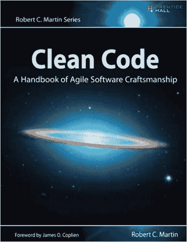
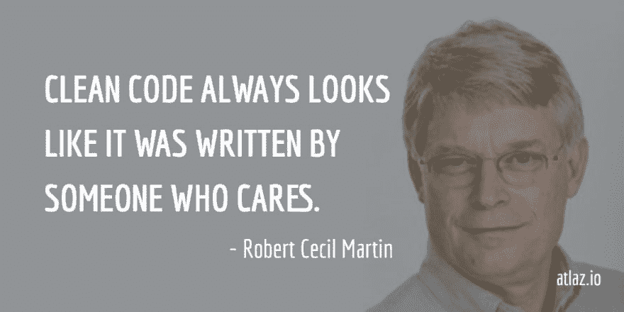

# 注意你的编码方式

> 原文：<https://dev.to/chrisvasqm/watch-your-coding-manners-5ep9>

如果我向任何想提高代码质量的人推荐一本书，我会毫不犹豫地选择:

[T2】](https://res.cloudinary.com/practicaldev/image/fetch/s--zO7rw0yo--/c_limit%2Cf_auto%2Cfl_progressive%2Cq_auto%2Cw_880/https://spin.atomicobject.com/wp-content/uploads/20161220111635/Clean-Code.jpg)

我绝不是一个书迷，见鬼，我在学校的时候还没有读完很多我布置的书呢！

(对不起妈妈，但你可能也没做过)。

但是有了[干净的代码](https://www.amazon.com/Clean-Code-Handbook-Software-Craftsmanship/dp/0132350882/ref=sr_1_1?ie=UTF8&qid=1515385670&sr=8-1&keywords=clean+code),我真的很慢，甚至通过选择引起我注意的标题从一章跳到另一章。这可能是我没有放弃它的首要原因。

当然，有些部分我还是不能 100%理解，但整体的阅读体验真的很愉快。

我最喜欢作者的一句话是:

[T2】](https://res.cloudinary.com/practicaldev/image/fetch/s--cxGweP8_--/c_limit%2Cf_auto%2Cfl_progressive%2Cq_auto%2Cw_880/https://hygger.io/blog/wp-content/uploads/2017/04/pablo-14.png)

每当一个同事/朋友向我寻求一段代码的帮助时，我首先注意到的是他们的代码结构，从远处看有多“好”。

几英尺之外就能注意到很多东西:

*   花括号位置。
*   线条长度和中断。
*   压痕等级。
*   差评。
*   参数数量。

由于[格式塔分组原则](http://graphicdesign.spokanefalls.edu/tutorials/process/gestaltprinciples/gestaltprinc.htm)，我们的眼睛能够察觉所有这些细节

[https://www.youtube.com/embed/yadmpXUQ68A](https://www.youtube.com/embed/yadmpXUQ68A)

现在，我希望大家跟着我，用更大的字体重复每一项内容:

## 花括号位置

根据你的背景，你可能习惯于做

```
// C#, C++, C...

public void CoolFunction()
{
    // Something cool
} 
```

Enter fullscreen mode Exit fullscreen mode

或者

```
// Java, Kotlin, JavaScript...

public void anotherCoolFunction() {
    // Something even cooler
} 
```

Enter fullscreen mode Exit fullscreen mode

每当我提起这个，通常的反应是

> “我只是更习惯 X 风格，克里斯！” -想象中的人

是的，我明白了。但是我认为这不是一个有效的理由/借口。每当你的代码被推到`master` **时，它就不再是你的了**。它属于团队。

所以，为了更大的利益，我们必须牺牲我们的习惯:

> 代码库应该看起来像是只由一个人编写的。

## 线条长度和断点

### 线条长度

thump 有一个通用规则，即每行不应该超过 80 个字符。这就把我们带到了...

### 换行

您可能见过类似这样的代码:

```
// Java

SomeBuilder builder = new SomeBuilder();
builder.doThis().doThat().andAlsoThis().butDontForgetThis().build(); 
```

Enter fullscreen mode Exit fullscreen mode

这很容易通过 80 个字符的长度，所以为了提高可读性，我们可以使用*换行符* :

```
// Java

SomeBuilder builder = new SomeBuilder();
builder
    .doThis()
    .doThat()
    .andAlsoThis()
    .butDontForgetThis()
    .build(); 
```

Enter fullscreen mode Exit fullscreen mode

[T2】](https://i.giphy.com/media/UOx8muoc7ptXq/giphy.gif)

是的，它会让你的代码总体上多几行，但是你的眼睛以后会感谢你的。现在我们可以像阅读一个列表一样阅读每个语句。

## 缩进层次

*这可能是最常见的场景之一。*

比方说，在你做某件事之前，你必须验证一些条件，比如:

```
// Java

Girl girl = new Girl("Carly Rae Jepsen");
if (girl.isPretty()) {
    if (girl.isTheFlashFan()) {
        if (girl.isGeek()) {
            if (girl.isGamer()) {
                callMeMaybe();
            }
        }
    }
} 
```

Enter fullscreen mode Exit fullscreen mode

我现在可能在听也可能不在听[给我打电话也许是](https://www.youtube.com/watch?v=fWNaR-rxAic)...

我们可以通过创建一个`boolean`变量来改变这一点，这个变量将包含一个可以替换所有`if` s:
的表达式

```
// Java

Girl girl = new Girl("Carly Rae Jepsen");
boolean isTheChosenOne = girl.isPretty() && girl.isTheFlashFan() 
                         && girl.isGeek() && girl.isGamer();
if (isTheChosenOne) {
    callMeMaybe();
} 
```

Enter fullscreen mode Exit fullscreen mode

[T2】](https://i.giphy.com/media/3ohhww44CSmkOA5tny/giphy.gif)

我们不仅能够使我们的代码更具表现力，而且还能通过这种类型的更改来最小化我们代码的读者的精神负担。

## 差评

### 等等！

在你去评论区用你无穷的智慧攻击我之前，你必须承认有些评论是不好的。

```
// Java

// Returns name
public String getName() {
        return name;
} 
```

Enter fullscreen mode Exit fullscreen mode

这个方法已经表达了它做什么(特别是当你从它的名字就可以看出它是一个 *Getter* 方法的时候)。

> `Getter` *的方法通常遵循* `get<Something>` *的命名惯例。*

好的注释应该说`why`事情是这样做的，或者至少是信息性的，而不是说`what`代码是这样做的。如果你能记住这一点，你的评论游戏将是🔥。

```
// Java

public void complicatedAlgorithm() {
    // This is our best attempt to solve ticket #12345,
    // for more information, please refer to www.somedomain.com/something

    // ...
} 
```

Enter fullscreen mode Exit fullscreen mode

## 参数个数

如果您发现自己编写的函数/方法/构造函数有 2-3 个甚至更多的参数，那么您很有可能能够用一个能够更好地表示它们的`class`将它们抽象出来。

```
// Java

public void moveTo(double x, double y) {
    // ...
} 
```

Enter fullscreen mode Exit fullscreen mode

我们可以从这两个参数中`extract`出一个`class`，称之为`Point`。

```
// Java

public class Point {
    private double axisX;
    private double axisY;

    public Point(double axisX, double axisY) {
        this.axisX = axisX;
        this.axisY = axisY;
    }

    public double getAxisX() {
        return axisX;
    }

    public double getAxisY() {
        return axisY;
    }
} 
```

Enter fullscreen mode Exit fullscreen mode

然后我们可以`refactor`我们的`moveTo()`方法到此:

```
// Java

public void moveTo(Point point) {
    // ...
} 
```

Enter fullscreen mode Exit fullscreen mode

[T2】](https://i.giphy.com/media/3o7TKRSGkMqOXdSU7K/giphy.gif)

我们只是触及了表面，还有很多方法可以改进你的代码库。但是这是我鼓励你阅读 [Clean Code](https://www.amazon.com/Clean-Code-Handbook-Software-Craftsmanship/dp/0132350882/ref=sr_1_1?ie=UTF8&qid=1515385670&sr=8-1&keywords=clean+code) 来自己发现的部分🤓。