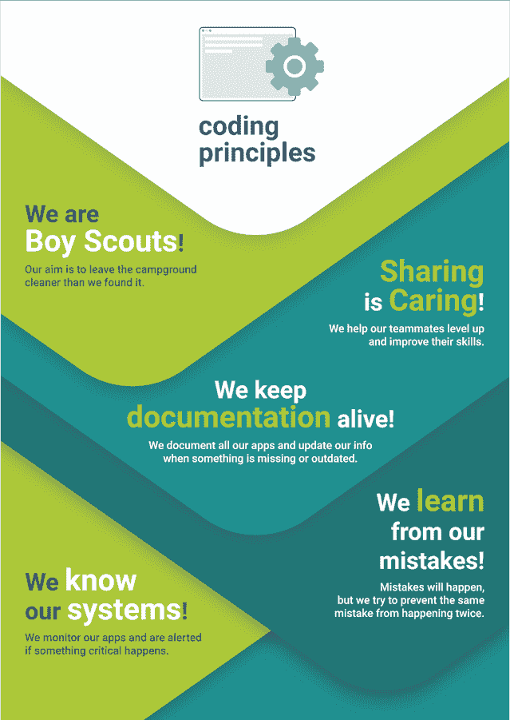

# 我们明确了我们的编码指南，这有助于我们成为一个团队

> 原文：<https://dev.to/mlammers/we-made-our-coding-guidelines-explicit-and-its-helping-us-as-a-team-20>

# 

* * *

TLDR:讨论编码指导方针并使之明确，可以给你的开发团队提供一个良好的工作基础，并且可以显著提高你的代码质量、系统性能和稳定性、个人发展以及最终开发人员的幸福感。

我们作为一个团队提出的编码准则是:

1.  我们是童子军
2.  分享是关怀
3.  我们保持文档的活力
4.  我们从错误中学习
5.  我们了解我们的系统

* * *

如果你从事软件工程已经有一段时间了，你很可能会遇到以下一种或多种情况:

*   你工作的环境已经堆积了技术债务，拖慢了你的日常工作，却没有一个如何摆脱它的清晰过程。

*   您每天使用的系统会因为不完整的警报和/或系统向您发送无意义的错误而出现您完全忽略的错误或中断。

*   你正在开始一个项目，这个项目非常需要文档，并且让你猜测一些基本的主题。

*   某些应用程序只有一个知识载体，没有它就不能进行任何更改或修复。

*   不同的团队或多或少是相互隔离的，没有大量的知识交流，导致某些学习在每个团队中(至少)进行了多次。

...当然，这个清单还可以继续列下去。

一年前，我的团队检查了所有这些盒子。有充分的理由。多年来，它一直人手不足，但仍然设法编写了一个相当复杂的应用程序，具有大量产生相当高吞吐量的特性。同时为公司创造价值。

然而，局势已经变得不可维持。

## 那么，我们来谈谈吧！

当两个临时项目团队加入我们的设置时，我们已经开始在团队中松散地讨论我们看到的问题，以及我们可以在过程中改变什么来改善这种情况。对我们来说，这是一个开始合作和融合新想法的好机会。我们引入了一个与我们部门所有后端开发人员的周会，作为一个展示想法、交流经验和讨论的平台。

话题可以是任何事情，从“嘿，我有一个很难的问题，我需要一些建议。”，超过“看看这段可怕的代码，以及我是如何重构它的！”或者“上周我们经历了一场灾难性的崩溃，这是我们的收获”，到“我们都同意哪些指导方针，以使我们作为开发人员的体验更好？”。任何人都可以投稿，任何主题及其结果都有记录。

在过去半年的过程中，我们已经从这次会议中的知识交流中受益匪浅，轻松节省了比会议花费更多的开发时间。我们花了很多时间积极讨论我们在日常工作中应该遵循的准则。

## 编码指南

我们审视了一下我们目前面临的问题。我们希望通过定义每个开发人员都应该遵循的一些指导方针，为不断改善这种情况铺平道路。这张海报是我们想出来的:

[T2】](https://res.cloudinary.com/practicaldev/image/fetch/s--uHO1ZrOD--/c_limit%2Cf_auto%2Cfl_progressive%2Cq_auto%2Cw_880/https://thepracticaldev.s3.amazonaws.com/i/kltn932rsk9m9ymo0qgp.png)

### 我们是童子军

“让露营地比你发现时更干净！”

在过去，去除技术债务总是被严格地从建筑特征中分离出来，并随后被去优先化。这最终大大减慢了我们的速度，因为积累的技术债务使得任何改变都变得更加困难。这也让开发人员感到沮丧，并让与产品负责人的讨论变得不必要的情绪化。
在我们的共同讨论中，我们决定，任何达到一定复杂性的重构，即消除技术债务，都可以在现有标签的范围内完成，不管它是否是功能标签。
我们决定将这些重构限制在最多一天的开发时间内。超过这个范围的任何东西都必须是自己的票。
我们同意产品负责人尝试这样做。事实很快证明，我们的系统从中受益匪浅，因为我们也解决了许多性能问题，所以我们从不回头。
恰恰相反:作为后续实验，我们决定将特性开发从我们的技术待办事项中分离出来，放在看板上的独立泳道中。维护积压的优先级现在由工程师接管。这允许产品所有者关注产品视图，并允许开发人员决定在他们认为相关的主题上投入一部分时间，同时在 backlog 中记录问题。

**结果:**

*   持续改进的共同心态。
*   测试覆盖率从 34%翻倍到 68%。
*   我们的代码质量指数从 64 提高到 75。
*   由工程师以自我组织的方式维护的技术债务的文档积压。
*   无需讨论，即可清楚地了解在票证范围内可以完成多少清理工作。

### 分享是关怀

“如果你不帮助队友提升水平，你就不是一个开发主管。”

成为(并保持)一名成功的软件开发人员的先决条件之一是不断学习和提高。在我们的讨论中，我们一致认为最简单的学习方法是从其他开发人员那里获得反馈。幸运的是，我们小组的每个人都非常乐意给予和接受建设性的反馈。然而，在一个知识孤岛的环境中，每个开发人员只开发一个应用程序，会适得其反。

为了打破这些孤岛，我们决定为每个变更创建一个 pull 请求，并让两个评审者评审它——一个来自团队内部，另一个是跨团队的评审者。我们使用 [Danger](http://danger.systems/) 来支持我们的公关流程，例如随机选择评审员。
这看起来像是一个小的脚注，但事实证明自动建立过程要比依赖开发人员手动完成容易得多。
为了防止出现障碍，只有第一次审查是强制性的，第二次审查是可选的。

我们也想做更多的结对编程，并鼓励人们这样做。我们决定不使用严格的配对时间表来强制执行这一点。相反，我们试图减少正在进行的开发的 WIP 限制，并因此“强迫”人们要求其他人配对。虽然这肯定会导致更多的对话和配对，但有时会被认为限制太多。因此，我们仍在努力寻找一种可行的方法来激励我们结对，而不会实际上损害我们的生产力(如果有建议，我将不胜感激)。

此外，为了减少应用之间的差异，我们最近推出了一个共享库，包括所有代码质量工具。我们的目标是最高标准。当包含新库时，每个应用程序都必须排除一些质量检查，这样持续集成就不会失败。排除在文件中是明确的，所以我们现在可以努力消除排除，设定一个明确的共同目标。

**结果:**

*   知识仓库越来越少，知识在团队中广泛传播。
*   加速职业成长。
*   每个应用都接近了共享库设定的通用质量基准，但并不是所有的应用都完全达到了这个标准(到目前为止)。

### 我们保持文档的活力

“数周的编程可以为你节省数小时的文档时间！”

像许多公司一样，我们使用全公司范围的维基来记录所有的事情。不幸的是，我们遇到了众所周知的问题，比如过时的条目，重复的主题和不同的信息，或者搜索时没有显示的条目，不管是什么原因。最终，这使得文档维基变得没那么有用了。

我们对此进行了讨论，得出了我们缺少的三个主要信息点:

1.  提交的上下文。
2.  特定于应用程序的信息，例如关于设置。
3.  公司范围的信息，例如关于基础设施的信息。

为了解决这些问题，我们同意关注提交历史和拉请求中的信息的质量。我们决定总是在拉请求中添加对票务系统中票据的引用，在提交中添加对拉请求的引用。每次提交应该只做一件事。带有无意义消息的提交，例如“WIP”或“小修复”,应该在合并前以交互方式转换为有意义的提交。

现在，当查看代码库中的特定更改时，很容易找出哪个拉请求和哪个票据对该更改负责。作为一个额外的好处，git 日志是干净的，读起来很有趣！

此外，我们花了一些时间向每个项目的自述文件中添加信息，并同意在我们注意到缺少某些东西时随时更新它。

到目前为止，我们还没有真正想出如何解决全公司信息“自下而上”的问题。

**结果:**

*   清除 git 历史记录
*   活文档

### 我们从错误中学习

*“精神错乱就是一遍又一遍地犯同样的错误，却期待不同的结果”*

我们有一个相当复杂的系统，当我们遇到严重问题时，我们通常会立即采取行动，专注于使系统重新运行，而不会深入研究停机的原因或影响。

我们决定改变这一点，并引入了我们在每个影响用户的事件后创建的事后检验。

我们使用包含四个部分的模板:

*   对 KPI 有影响的顶层总结“对产品有什么影响？”
*   问题原因的详细分析
*   相关分析数据的文档(截图、讨论等)。)
*   后续任务/结论

我们把这些验尸报告存放在各自的仓库里。我们会像审查任何拉动请求一样审查它们，并邀请受影响的股东提供反馈。随后，我们在技术更新会议上分享它们。

然后，我们为后续任务创建工单，并对其进行优先级排序。

**结果:**

*   更好地了解我们对公司 KPI 的影响。
*   我们可以在其他团队和部门注意到我们造成的问题之前通知他们。
*   具体的跟进任务导致流程、绩效、警报和报告方面的多项改进。

### 我们了解我们的系统

“我们淹没在信息中，却渴望知识。”

我们公司有很多工具，可以为我们提供系统运行情况、机器负载处理情况以及 KPI 表现等信息。
不幸的是，我们觉得我们仍然遗漏了很多信息:

1.  由于我们系统的复杂性，我们对它的表现没有一个好的感觉。
2.  我们总是不得不从工具中主动获取信息。当出现问题时，很少有警报到位。
3.  我们看到了每个应用程序中当前出现的错误。不幸的是，在高峰时期，有许多非关键的错误噪声，模糊了我们对真正关键错误的认识。
4.  我们缺少处理错误的流程。

作为一项实验，我们设置了一个错误报告和处理工具 [Sentry](https://sentry.io/welcome/) ，它允许我们方便地监控错误，并建立一个关于如何处理新的和/或再次出现的错误的流程。此外，它有一个非常方便的提醒电子邮件逻辑。
这在以上多个方面帮助了我们，主要是让我们对发生的错误有一个更好的组织视图，并在出错时提醒我们。

我们的技术体系建立在面向服务的架构之上。为了更好地了解消息通过这些系统的延迟，我们编写了一个库，允许我们跟踪从触发到完成处理的特定路径的延迟。我们将这些数据发送到 Grafana 仪表板，为我们提供一天中不同时间的详细信息。此外，我们在这些仪表板上定义了警报，因此当数字异常时，我们会收到警告。

**结果:**

*   对新出现的错误或性能下降的反应时间大大改进了。到现在为止，我们觉得我们已经有了大部分需要的数字和警报。
*   新的仪表板指出了我们设法解决的性能瓶颈，从而大大提高了性能。

## 摘要

正如已经说过的，自从我们讨论了我们的编码指南并使它们变得清晰，我们已经在许多方面有了改进。我坚信，是关于他们的讨论让他们坚持了下来。我不认为这些指导方针可以在自上而下的决策中被有效地引入。
此外，它对尽可能自动化决策也有很大帮助。这不仅支持团队中的开发人员，使他们不会忘记这一点，而且还使过程的变更成为讨论的主题。
当你面临一个或多个开头描述的问题时，我强烈建议在你的团队中尝试一下！

感谢您的阅读:)