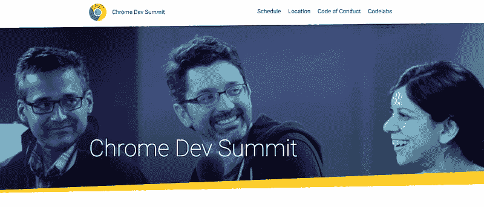

# web 开发者能从移动原生用户身上学到什么？

> 原文：<https://dev.to/dalmaer/what-can-web-developers-learn-from-mobile-natives>

这是个大日子。当我想到网络社区和生态系统时，我经常想到向民主的跨越。今年实际上发生了重叠，因为选举与周四开幕的 Chrome Dev 峰会在同一周举行(如果你不来，请查看直播！).

我一直很喜欢登顶，因为它给我家的感觉。它是用户空间与内核空间相遇的地方。浏览器供应商与 web 开发人员和框架作者会面，都是为了追求更美好的未来。因此:# StrongerTogether。

我不禁反思过去的一年。去年的这个时候，[我在参加山景城的峰会，观看进步网络应用的发布会时，正处于隐身状态](https://medium.com/ben-and-dion/heading-to-google-take-2-0-153841c6e1ae)。 [Alex 和 Frances 在](https://infrequently.org/2015/06/progressive-apps-escaping-tabs-without-losing-our-soul/)的前一年夏天创造了这个术语，但在这里我们看到了[第一次真正大规模的展示:Flipkart](https://www.youtube.com/watch?v=StdKz32M1RM) 。

乍一看，这是一个令人惊讶的旗手。印度电子商务公司[关闭了他们的网站](http://www.hindustantimes.com/tech/flipkart-will-kill-its-website-and-go-app-only-from-september/story-YBarENKzXWGG4EvbV8i0HJ.html)以支持 native。然而它们就在这里，向我们展示了它们返程的起点。具有讽刺意味的是，网站的烧毁腾出了空间，就像一场森林大火，快进到今天，我们似乎他们继续推进边界。

我们已经看到了来自新兴市场的一系列伟大的 pwa。有人对此提出质疑，但我觉得这很有趣。Ajax 的例子有谷歌地图、Gmail 和谷歌建议。诞生于网络的公司没有原生桌面的包袱。

第一批艾滋病人来自世界上真正流动的地方，如印度、印度尼西亚和尼日利亚，这难道不合适吗？许多用户通过移动设备上网的领域，以及没有传统桌面网站包袱的领域？这些领域的限制，加上没有包袱，可以成为强有力的推动者，其中一些因素已经为变革创造了合适的环境。

* * *

*构建移动原生意味着什么？*对我来说，它始于你正在构建的核心体验。很长一段时间，网络上的移动体验被捆绑在桌面网站的核心上。最初的版本甚至使用了抓取代理技术，如 UsableNet 或 MoovWeb。作为一个社区，我们设计出了响应式设计，并设法融合到一个在很大程度上支持两者的代码库中。

然而这并不总是足够的。我们[最近才获得能力](https://medium.com/ben-and-dion/the-web-has-evolved-for-mobile-39753f3bb86e#.ezf6gdq8y)真正构建一个伟大的移动解决方案作为核心产品，然后扩展到支持桌面。在一个移动设备发展速度远远超过桌面设备的世界里，以这种方式进行构建非常重要。

但是不要误解我，这并不意味着我们应该忽视桌面世界。远非如此。我甚至为桌面写了一首颂歌，我是认真的。网络最大的好处之一就是，如果你愿意付出努力，你可以鱼与熊掌兼得。

我不知道你怎么想，但我有时发现自己在使用一个桌面 web 应用程序，并希望它背后的团队没有重新关注本地应用程序。你知道那些你仍然主要在桌面上使用的生产力应用程序，但是感觉它们已经有一段时间没有被使用过了。然后你进入移动版本，看到大量的新功能，但你不想在一个小设备上做创造性的工作。

我不能完全责怪公司或团队。我们在淘金热土上，我们不知道山里有多少金子。在这一点上，虽然我们有足够的数据知道，虽然移动正在快速增长，但桌面应用仍然有大量的使用，是时候再投资于网络(包括移动网络)了。

[T2】](https://res.cloudinary.com/practicaldev/image/fetch/s--jBGFWZES--/c_limit%2Cf_auto%2Cfl_progressive%2Cq_auto%2Cw_880/https://cdn-images-1.medium.com/max/800/1%2A_3Lh_6_U05UkVfa3bylCHw.png)

这让我们回到了 2016 年底。“Flipkart CDS 一年后，我们将重返 2017 年 Chrome Dev 峰会。今年你打算去看什么？有什么新鲜事？今年，我们将看到形势的好转，以及人们重新投资的领域。有些公司你永远也不会想到会探索网络。开发需要设备功能的应用程序的公司:定位、地图、离线、卓越体验…他们发现他们可以通过网络传递这些信息，让他们接触到。

这张 CD 向我们展示了世界范围内艾滋病毒/艾滋病的大规模增长，包括西方。事实证明，新兴市场的限制，如网络性能和低端设备的使用是很大的限制。LiFi 无处不在，即使是我们最好的设备也因热量和电池容量而受损。

我迫不及待地想看到部落亲自出现，这次是在旧金山，以及在线直播和视频。社区有许多值得骄傲的地方，但仍有许多工作要做。

今天我们在美国投票，本周晚些时候我希望能在 Chrome Dev 峰会上见到你，如果你能抓住我的话！:)

[T2】](https://res.cloudinary.com/practicaldev/image/fetch/s--kb4AG2ok--/c_limit%2Cf_auto%2Cfl_progressive%2Cq_auto%2Cw_880/https://cdn-images-1.medium.com/max/800/1%2A9OwZiirQzgM5Qah5k0Ov7g.jpeg)