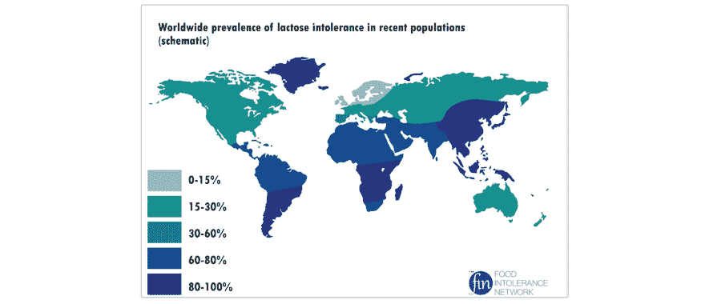
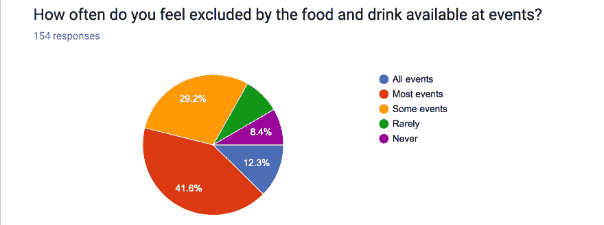

# 还有什么比披萨和啤酒更好的呢？为什么你需要在你的科技活动中提供更具包容性的食物。

> 原文：<https://dev.to/joelarson4/what-could-be-better-than-pizza-and-beer--why-you-need-to-provide-more-inclusive-food-at-your-tech-event>

如果你不注意你在科技活动(嗯，实际上是任何活动)上提供的食物和饮料，你可能会让人们感到饥饿和被排斥，甚至需要紧急医疗护理。

[T2】](https://res.cloudinary.com/practicaldev/image/fetch/s--66M6NBPV--/c_limit%2Cf_auto%2Cfl_progressive%2Cq_auto%2Cw_880/https://thepracticaldev.s3.amazonaws.com/i/sd8t6t3m92kfnrrtn10x.png)

在我 30 岁之前，我可以吃任何东西，而且我吃得津津有味！然后我开始注意到大多数乳制品让我肚子很痛，所以我停止食用它们，感觉好点了。在接下来的几年里，似乎每六个月就有一些新的食物以这样或那样的方式给我带来麻烦，从不适到直接的过敏反应。我看了各种医生，但唯一真正的解决办法是不吃这些食物。这是一条漫长的适应和悲伤之路，因为我告别了我曾经热爱的食物和饮料(我仍然非常想念啤酒！)，并且找到了替代品。

在这一点上，我要避免的食物清单很长，包括乳制品、小麦制品、牛肉、洋葱和大豆。这会让和别人一起吃饭成为一种挑战。我的家人和朋友都非常乐于助人。大多数餐馆(虽然不是全部)都有沙拉，能让我吃饱，不会给我添麻烦——只要他们能做一些修改。

但在一些工作会议、会议和技术会议上，这可能更具挑战性。选择通常是以小麦和奶制品为中心的——百吉饼、糕点、三明治，当然还有披萨。比萨饼和啤酒一直是人们的最爱，可能是因为它们相对便宜，易于订购，而且大多数人都喜欢吃。对于这种活动，我必须确保带点别的吃的，或者提前吃。这很好，除了这样一个事实，那就是我每次都要说——“哦，你不想吃披萨吗？其他时候，活动会说“将提供午餐/晚餐，但没有具体说明是什么——所以我是否应该自带食物？

我绝对不是要你同情我——作为一个几乎在各方面都享有特权的人，这是我生活中唯一感到被排斥的部分。我通常能够在社交上处理这些情况，而不会让它毁了我的一天，特别是在多年的实践之后。我很幸运，能够轻松负担替代食物的费用。

但并不是每个人都这么幸运，我并不是唯一一个无法消费披萨和啤酒的人。乳糜泻和其他小麦问题可能会影响多达 5%的人口(无论你个人是否认为麸质不耐受是一个潮人的阴谋)。与此同时，多达 65%的人口都面临乳制品的问题。

查看这张全球乳糖不耐受率地图:

 *通过[食物不耐受网络](https://www.food-intolerance-network.com/food-intolerances/lactose-intolerance/ethnic-distribution-and-prevalence.html)显示乳糖不耐受在北欧血统的国家最为普遍。*

毫不夸张地说，乳制品菜单偏爱欧洲血统的人。此外，这样的菜单不包括纯素食者。根据具体情况，它也可能排除遵循犹太或清真饮食的人。

当然，还有许多其他类型的饮食限制，从医疗需要到基于个人信仰或宗教实践的限制。为了了解这些限制的种类和影响，我做了一个小调查:

> 乔·拉森[@乔·拉森 4](https://dev.to/joelarson4)你有饮食限制吗&发现科技活动上的食物让你置身事外？请参加我的调查！[goo.gl/forms/htZWq07n…](https://t.co/SYqaJcOnnH)2017 年 6 月 07 日下午 15:36

在撰写本文时，我已经收到了 154 份回复。这些结果一点也不科学，因为大多数受访者都是自己选择的，但它们仍然有助于了解你在活动中提供的食物和饮料的影响。让我们来看看一些结果。

在接受调查的人中，16.2%的人每周至少参加一次科技行业活动(聚会、会议、工作会议)，另有 40.3%的人每月至少参加一次，另有 30.5%的人每年参加一次。

 
*在接受调查的人当中，29.2%的人说他们在一些活动中被排斥，41.6%的人觉得在大多数活动中被排斥，12.3%的人觉得在所有活动中都被排斥。*

当被问及“你的饮食限制的最佳标签是什么？”我得到了这样的回应:

*   20.9%的人选择了“纯素食”
*   17.7%的人选择了“无酒精”(或者我最初拼错的“无酒精ðÿ˜†”)
*   17.6%的人选择“素食”
*   17.6%的人选择了“其他过敏或不耐受”
*   14.4%检查“乳制品过敏”
*   13.7%检查出“麸质过敏”
*   11.1%的人选择了“没有限制——我可以吃任何东西”
*   更多结果可在此处找到——“你知道一个人会对生菜过敏吗？另一名受访者报告说，他们有“玉米过敏+ 30 种其他食物，即使我不吃玉米，靠近玉米也会有反应”。

我得到了很多关于这个问题的有趣回答:“你有没有一个简短的个人轶事，关于你感觉被提供的食物选择排斥或包含的时候？”

*   “只是在一些会议上挨饿，因为组织者是业余的，没有为饮食限制订购任何东西，甚至在注册时没有考虑到这一点。”
*   “我的过敏很严重。谢天谢地，我的公司在确保我有食物方面做得越来越好。我们每年都举办黑客马拉松。因为我，他们早餐吃了水果。他们还买了一个大的素食披萨，放在另一个房间，这样交叉感染的风险就小了。我和素食主义者在一起，他们很高兴有披萨和早餐可供选择。”
*   “我甚至不记得最后的细节，但我清楚地记得感觉 AlterConf 真的很感兴趣，想确保我不仅能吃到*某种东西*，还能感觉到我吃了一顿饭，和其他饮食的人吃的一样。麦迪逊·鲁比也做了一些了不起的事情。他们没有提供食物，而是提供代金券，在距离场地 5-10 分钟步行路程内的至少 12 家不同的餐馆都可以使用，所以我们可以吃我们想吃的东西，还可以一睹美丽的麦迪逊市中心。”
*   “我不知道这是关于感情还是食物，但对我来说，这很简单:我只想吃些健康的东西！对我来说，这与限制、宗教要求或“感觉受欢迎”无关，我只想看到新鲜、健康的选择……除了披萨/汽水/啤酒之外的任何东西。”
*   “管理员试图帮助我治疗过敏，但完全没有希望——他们总是为我点无谷蛋白的东西，但忘记了我基本上是无谷物的，然后我不得不拒绝，他们感觉很糟糕。别麻烦为我点餐了，它超级棒！”
*   “我的情况很有挑战性，因为我是一个对鳄梨过敏的素食者。许多三明治都没有标签(或者只说“火鸡或素食”，而没有具体说明它们含有鳄梨)。这就是为什么我喜欢看到完整的成分表。”

正如你所看到的，无论是午餐会议还是会议，你提供的食物对人们在你的活动中的受欢迎程度有很大的影响。

* * *

所以，如果你正在组织一个活动，你想确保你没有排除所有有饮食限制的人，你能做什么呢？我也问过这个问题。

*   66.9%的人选择了“清楚标明所有提供的食品和饮料”。这让我们能够做出明智的选择。
*   59.6%的人选择了“分享活动将提供的确切食物和饮料菜单”。这让我们能够提前计划，如果需要的话，带来一些不同的东西。
*   57.0%的人选择“提供有多种选择的‘食物吧’”。这使得我们这些过敏和限制不太严重的人可以选择对我们有用的东西。
*   37.1%勾选了“邀请与会者提前定制订单”。这可能是最好的选择，因为它将控制权交给了与会者。
*   15.2%的人选择了“如果没有适合我的食物，报销我所有与食物相关的费用”。这可能是最后的手段，但对有些人来说，这是唯一可行的选择。

还有一些其他有趣的报道:

*   “不吃自助餐。这使得交叉污染很有可能发生；我从未成功吃过不是 100%无麸质的自助餐。”
*   “沙拉是很棒的选择——只要里面没有熏肉、碎奶酪和/或油炸面包丁。保持素食和 GF pleez！”
*   “很明显，围绕酒精的活动越来越少(顺便说一句，值得阅读《酒精和包容性》,以了解为什么在科技活动中酒精可能是一种有毒的选择)
*   "赛前调查，找出需要适应的饮食限制."

* * *

无论如何，如果你是一个有饮食限制的人，我希望你从这篇文章中感受到一些团结——我们有很多人！与此同时，当您要求住宿时，请认识到为活动安排食物的人通常会受到时间和预算的压力，并且可能以前没有提出过这些问题。大多数时候，组织者都渴望让你在他们的活动中感到受欢迎。请随意将这篇文章转发给他们，以便他们能够更多地了解这些问题。如果你想在关于你经历的评论中留下个人轶事，那也很好！

与此同时，如果你计划在科技行业(或任何地方)举办活动，请在点食物和饮料时考虑有饮食限制的人。当你发出邀请或制作广告时，试着分享活动将提供的确切的食物和饮料菜单(如果可能的话，包括餐饮服务商或餐厅)。也要确保所有提供的食物和饮料都有明确的标签，或者餐饮服务商或餐厅可以询问有关成分的问题。如果有人要求住宿，请尽量满足。我保证我们会非常感激。

最后——如果只提供“披萨和啤酒”,请三思！

*原[贴在](https://medium.com/@joelarson4/what-could-be-better-than-pizza-and-beer-aa06e3f97147)媒体上。*