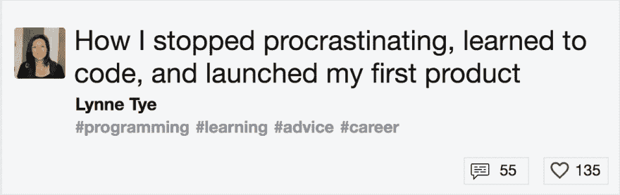
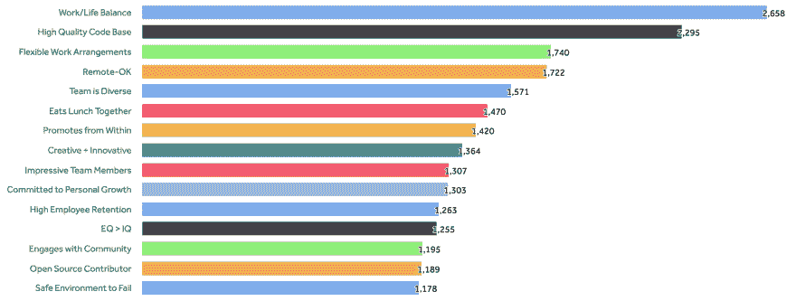
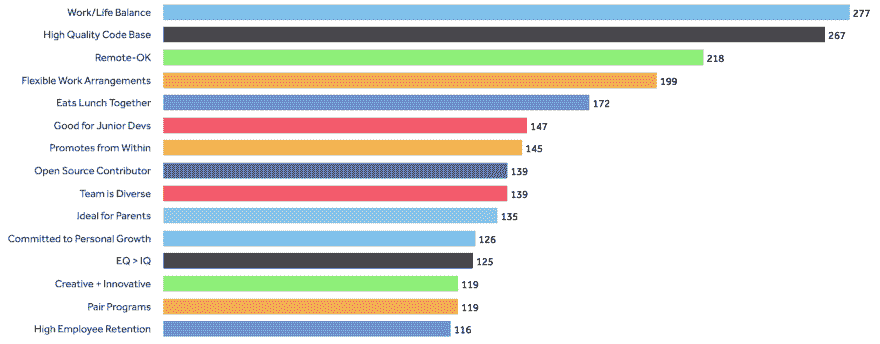
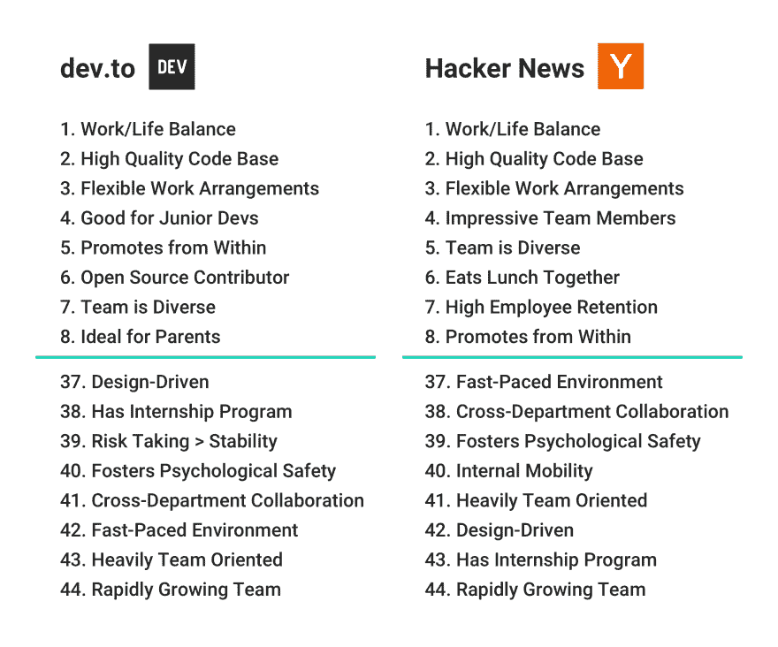

# 开发人员对工作的要求

> 原文：<https://dev.to/lynnetye/what-developers-want-in-a-job-7hg>

六周前，我推出了我的第一个产品:[关键价值观](https://www.keyvalues.com)。

三周前，我在 dev.to 写了一篇关于我的(漫长)旅程的文章。

[T2】](https://res.cloudinary.com/practicaldev/image/fetch/s--M6Dyczs7--/c_limit%2Cf_auto%2Cfl_progressive%2Cq_auto%2Cw_880/https://thepracticaldev.s3.amazonaws.com/i/hdm08tv7b0jla2t0ap3v.png)

今天，我想分享一些我从 21，000 多名用户那里收集的数据，这些用户自从我发布以来已经访问了[关键值](https://www.keyvalues.com)。

[关键价值观](https://www.keyvalues.com)帮助工程师找到基于共同价值观的工作，并让他们在申请前更多地了解团队文化。求职者可以访问该网站，从 44 个价值标签列表中进行选择，包括“团队是多样化的”、“轻量级会议”和“开源贡献者”(见完整列表[这里](https://www.keyvalues.com))，然后筛选出具有匹配价值的团队。

在采访了几十名自称是传教士而非雇佣兵的工程师后，我策划了这份价值观清单。他们认为团队文化和共事的人与薪酬或公司声誉一样重要(如果不是更重要的话)。

然后，我要求团队从这个预设列表中选择最能描述他们的工程文化的 8 个值，并在他们的个人资料中限定他们的选择。

无论人们是否在积极地找工作，当他们访问[关键值](//https:/www.keyvalues.com)时，这些是他们选择的前 15 个标签:

<figure>

[T2】](https://res.cloudinary.com/practicaldev/image/fetch/s--Q6ScuFG_--/c_limit%2Cf_auto%2Cfl_progressive%2Cq_auto%2Cw_880/https://thepracticaldev.s3.amazonaws.com/i/pqv9tiaoomi1zfcy3w2i.jpg)

<figcaption>Values selected between September 5th and October 15th, 2017.</figcaption>

</figure>

## 读者最看重什么

Dev.to readers，和其他开发人员一样，认为“工作/生活平衡”和“高质量代码库”比其他关键价值更重要。事实上，无论在哪个社区或国家，这两种价值观都一直排在第一和第二的位置上(参见更多数据[这里](https://hackernoon.com/what-does-hacker-news-care-about-e364fb87431c))。

关于前 15 个价值观有很多有趣的讨论，但我发现最有趣的是开发与社区价值观的不同之处。

<figure>

[T2】](https://res.cloudinary.com/practicaldev/image/fetch/s--WO5tNEi_--/c_limit%2Cf_auto%2Cfl_progressive%2Cq_auto%2Cw_880/https://thepracticaldev.s3.amazonaws.com/i/d5cb74nhpz6vdwvrixld.jpg)

<figcaption>Values selected by dev.to readers between September 5th and October 5th, 2017.</figcaption>

</figure>

在[关键值](https://www.keyvalues.com)方面，与所有访问者相比，从开发到优先考虑“对初级开发人员有益”、“对父母理想”和“结对项目”的用户更高。与“令人印象深刻的团队成员”、“参与社区”和“安全的失败环境”相比，社区开发者更看重这些东西

## 开发者对黑客新闻

Dev.to 向[键值](https://www.keyvalues.com)发送了 2933 个读者，但有趣的地方就在这里。

我的文章([我是如何停止拖延、学会编码并推出我的第一个产品](https://dev.to/lynnetye/how-i-stopped-procrastinating-learned-to-code-and-launched-my-first-product-2i1))被发布在《黑客新闻》上，很可能会带来巨大的流量，因为它上了头版！(感谢 [@rbanffy](https://dev.to/rbanffy) 为[发帖](https://news.ycombinator.com/item?id=15338059)吧！)因此，很难知道有多少读者实际上是被《黑客新闻》推荐的。

尽管 dev.to 和 Hacker News readers 之间有明显的重叠，但每个社区的价值选择之间仍然存在差异。值得注意的是，“适合初级开发人员”和“适合父母”在 dev.to 的列表中名列前茅，但在 Hacker News 的列表中却没有。

<figure>

[T2】](https://res.cloudinary.com/practicaldev/image/fetch/s--nmhVs8xI--/c_limit%2Cf_auto%2Cfl_progressive%2Cq_auto%2Cw_880/https://thepracticaldev.s3.amazonaws.com/i/vik38w7yw5grmz249wka.jpg)

<figcaption>Comparing the most and least selected values from users referred by dev.to vs. Hacker News.</figcaption>

</figure>

是的，关于学习编码和首次推出产品的帖子吸引了绿色开发者，但不太清楚为什么这些读者会寻找适合父母的工作场所。或许在 dev.to 的读者群中，初级开发人员和家长都有更好的代表。

## 更多数据和额外见解

到目前为止， [Key Values](https://www.keyvalues.com) 从黑客新闻中获得了最多的流量，这就是为什么我专门为 HN 读者发布了一个故事，题目很恰当:[黑客新闻读者想要的工作](https://hackernoon.com/what-does-hacker-news-care-about-e364fb87431c)。你可以阅读更多关于黑客新闻、产品搜索和开发社区的成员最重视什么，以及他们如何相互比较。我还讨论了不同国家的价值选择如何不同，以及我们可以从国家层面的工程文化中学到什么。

* * *

感谢 dev.to 社区的大力支持——谢谢！

如果你想联系，可以发邮件给我([lynne@keyvalues.com](mailto:lynne@keyvalues.com))或者在推特上找我( [@lynnetye](https://twitter.com/lynnetye?lang=en) 、 [@keyvaluesio](https://twitter.com/keyvaluesio?lang=en) )。最后，我还没有决定下一步该写什么...所以如果你有什么想法或者要求，就在下面评论吧！🠗