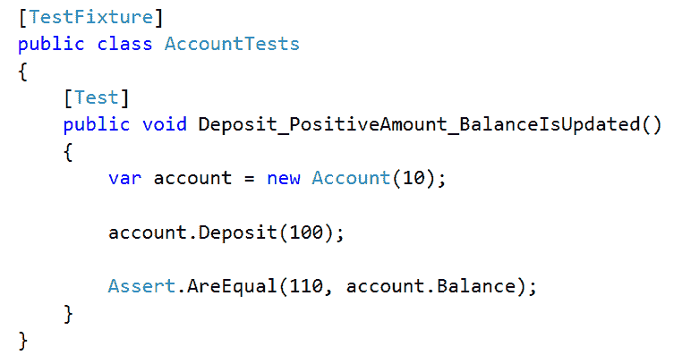
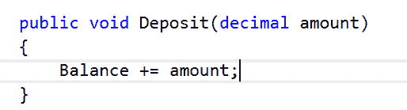
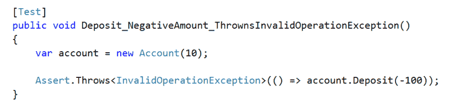
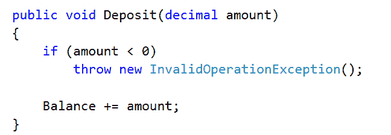
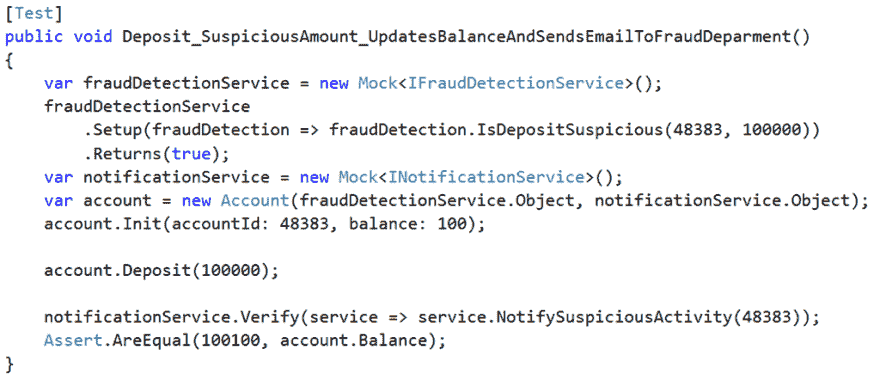
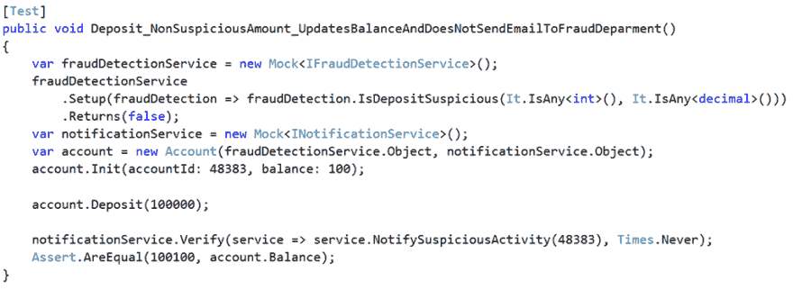
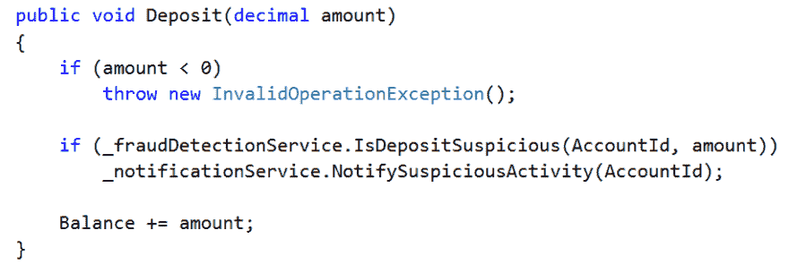
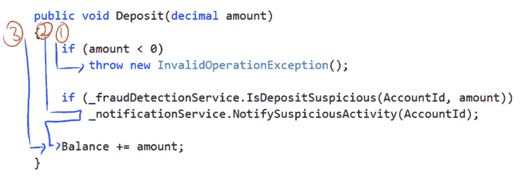

# 单元测试中的“单元”到底是什么？

> 原文：<https://dev.to/ruidfigueiredo/what-exactly-is-a-unit-in-unit-testing>

这应该是个很容易回答的问题吧？事实证明，单元测试有几种定义，尽管它们很相似，但它们也有足够的不同，以至于回答这个问题很困难。

让我们看一些例子。表单[维基百科](https://en.wikipedia.org/wiki/Unit_testing):

> 在计算机程序设计中，单元测试是一种软件测试方法，通过这种方法测试源代码的各个单元、一个或多个计算机程序模块的集合以及相关的控制数据、使用过程和操作过程，以确定它们是否适合使用。直观上，人们可以把一个单元看作是应用程序的最小可测试部分。在过程式编程中，一个单元可以是一个完整的模块，但更常见的是一个单独的函数或过程。在面向对象编程中，一个单元通常是一个完整的接口，比如一个类，但也可以是一个单独的方法。

因此，根据维基百科，一个单元可以是“一个完整的模块”、“一个单独的函数”、“一个完整的接口/类”，也可以是“一个单独的方法”。

从 [MSDN](https://msdn.microsoft.com/en-us/library/aa292197(v=vs.71).aspx) :

> 单元测试的主要目标是获取应用程序中最小的可测试软件，将它与代码的其余部分隔离开来，并确定它的行为是否完全符合您的预期...

更确切地说，这里的单元被描述为“应用程序中最小的可测试软件”。这仍然有争论的余地。

Martin Fowler 承认[单元测试(以及一个单元)没有严格的定义](http://martinfowler.com/bliki/UnitTest.html)，但是在定义中找到了这些共同的元素:

> ...首先，有一种观念认为单元测试是低级的，集中于软件系统的一小部分。其次，如今单元测试通常是由程序员自己使用他们的常规工具编写的——唯一的区别是使用了某种单元测试框架。第三，单元测试比其他类型的测试要快得多。

我最喜欢的一个定义来自罗伊·奥舍洛夫的《单元测试的艺术》一书，该书由 T2 出版，其中单元测试被定义为:

> 单元测试是一段自动化的代码，它调用被测试的工作单元，然后检查关于该单元的单个最终结果的一些假设。单元测试几乎总是使用单元测试框架编写的。它可以很容易地编写和运行速度很快。它是可信的、可读的和可维护的。只要产品代码没有改变，它的结果就是一致的。

还有“工作单元”的定义:

> 一个工作单元是在系统中调用一个公共方法和系统测试的一个明显的最终结果之间发生的动作的总和。

最终结果是方法返回值，类的一些公共状态改变，或者被测试的公共方法调用依赖关系中的另一个方法。

我真的很喜欢这个定义，但是，我发现选择使用术语“工作单元”是不必要的，特别是因为它是一个有内涵的术语。例如，当讨论对象关系映射器(ORM)时，术语[“工作单元”](http://martinfowler.com/eaaCatalog/unitOfWork.html)有一个完全不同的(并且已经确定的)含义，这在上下文中是误导的。

### “单位”

当我们写单元测试时，我们能同意在我们测试的类上调用单个方法吗？如果是这样的话，那么在给定测试的初始设置的情况下，我们为什么不能将一个单元视为通过该方法的*逻辑路径*(代码执行所采用的路径)。

测试需要确定性，因此对于给定的设置，逻辑路径总是相同的。

让我展示一个使用`Account`类和`Withdraw`方法的例子。如果有足够的资金，提取的金额将从账户余额中扣除，如果没有，将抛出一个`InsuficientFundsException`。

[T2】](https://res.cloudinary.com/practicaldev/image/fetch/s--bDC1LWqd--/c_limit%2Cf_auto%2Cfl_progressive%2Cq_auto%2Cw_880/https://www.blinkingcaret.com/wp-content/uploads/2016/04/Withdraw-annotated.png)

通过`Withdraw`方法有两种可能的逻辑路径，一种是资金充足，另一种是资金不足。如果我们想要彻底，我们应该为每一个写一个测试。

### 有点先试验后开发的味道

在为我们的帐户编写`Deposit`方法时，让我们看看这个定义是如何工作的。让我们先测试一下。

对于第一个测试，我们希望确保在存款为正值时余额得到更新，下面是测试(我使用的是 [NUnit](http://nunit.org/) ):

[T2】](https://res.cloudinary.com/practicaldev/image/fetch/s--Mu1ze0p2--/c_limit%2Cf_auto%2Cfl_progressive%2Cq_auto%2Cw_880/https://www.blinkingcaret.com/wp-content/uploads/2016/04/Deposit_PositiveAmount_Test.png)

实现如下:

[T2】](https://res.cloudinary.com/practicaldev/image/fetch/s--jyLhTSf6--/c_limit%2Cf_auto%2Cfl_progressive%2Cq_auto%2Cw_880/https://www.blinkingcaret.com/wp-content/uploads/2016/04/Deposit_PositiveAmount.png)

如果调用者指定了一个负数，我们将抛出一个`InvalidOperationException`。这是一个测试:

[T2】](https://res.cloudinary.com/practicaldev/image/fetch/s--IBf9nZgX--/c_limit%2Cf_auto%2Cfl_progressive%2Cq_auto%2Cw_880/https://www.blinkingcaret.com/wp-content/uploads/2016/04/Deposit_NegativeAmount_Test.png)

下面是`Deposit`方法的新实现:

[T2】](https://res.cloudinary.com/practicaldev/image/fetch/s--vxscrc1b--/c_limit%2Cf_auto%2Cfl_progressive%2Cq_auto%2Cw_880/https://www.blinkingcaret.com/wp-content/uploads/2016/04/Deposit_NegativeAmount.png)

我们可以看到，到目前为止，每个逻辑路径都有一个测试。我们可以添加一个额外的测试来涵盖金额为零的情况。然而，我认为该测试在代码(单元)中使用的逻辑路径与正数量测试相同(然而，进行额外的测试没有坏处)。

如果我们希望该方法在金额为零时表现不同，那么我们必须添加另一个 If 语句，这将产生通过该方法的另一个可能的逻辑路径，为此我们可以编写另一个单元测试。

你可能认为这些例子非常简单。更复杂的事情，如果涉及到其他类/依赖关系，又如何公平呢？单元是通过代码的逻辑路径这一概念成立吗？

假设我们的`Deposit`方法要求在存款可疑时向欺诈部门发出警报。让我们为此编写测试，从“可疑”存款开始(我使用 [moq](https://github.com/Moq/moq4) 作为我的[隔离框架](http://www.blinkingcaret.com/2012/11/20/interaction-testing-fakes-mocks-and-stubs/)):

[T2】](https://res.cloudinary.com/practicaldev/image/fetch/s--BZJh8WSN--/c_limit%2Cf_auto%2Cfl_progressive%2Cq_auto%2Cw_880/https://www.blinkingcaret.com/wp-content/uploads/2016/04/Deposit_SuspiciousAmountTest.png)

现在测试一下存款是否可疑:

[T2】](https://res.cloudinary.com/practicaldev/image/fetch/s---gjzzhzV--/c_limit%2Cf_auto%2Cfl_progressive%2Cq_auto%2Cw_880/https://www.blinkingcaret.com/wp-content/uploads/2016/04/Deposit_NonSuspiciousAmountTest.png)

和`Deposit`方法的新实现:

[T2】](https://res.cloudinary.com/practicaldev/image/fetch/s--dAxvSGCn--/c_limit%2Cf_auto%2Cfl_progressive%2Cq_auto%2Cw_880/https://www.blinkingcaret.com/wp-content/uploads/2016/04/Deposit_FraudDetection_Code.png)

您可能已经注意到我添加了一些依赖项(`IFraudDetectionService`和`INotificationService`)。我们会谈到这一点。但是首先，我们之前的测试发生了什么？

我们必须调整它们，以便它们考虑新的依赖项，但是我们应该保留所有的依赖项吗？也许我们可以放弃测试。

如果我们通过`Deposit`方法查看所有可能的逻辑路径，我们可以看到该测试不可能孤立地失败(路径 2)。如果天平没有正确更新，`Deposit_SuspiciousAmount_UpdatesBalanceAndSendsEmailToFraudDeparment`和`Deposit_NonSuspiciousAmount_UpdatesBalanceAndDoesNotSendsEmailToFraudDeparment`都会失效。

[T2】](https://res.cloudinary.com/practicaldev/image/fetch/s--BkRZRCna--/c_limit%2Cf_auto%2Cfl_progressive%2Cq_auto%2Cw_880/https://www.blinkingcaret.com/wp-content/uploads/2016/04/Deposit_FraudDetection_Code_annotated.png)

另一方面，我们可以主张我们应该进行所有的测试，一个用于当金额为负时，一个仅断言余额被正确更新，另一个验证当存款可疑时通知服务被调用，另一个验证当存款不可疑时通知服务不被调用。

如果我们希望我们的单元定义考虑到这一点，我们可以说单元是通过方法在逻辑路径中发生的**可验证的变化。这可以是外部可见的内部状态的改变(例如，帐户的余额)、依赖关系中的方法调用(例如，验证通知服务被调用)或方法的返回值。**

这样做的好处是，只需查看失败测试的名称，就可以更容易地找出问题所在。

你可能已经注意到的一件事是，逻辑路径的概念非常类似于名为[圈复杂度](https://en.wikipedia.org/wiki/Cyclomatic_complexity)的软件度量标准。方法的圈复杂度是“通过代码的线性独立路径的数量”。事实上，现在，当我阅读 Wikipedia 条目时，我刚刚注意到圈复杂度度量的作者(Thomas McCabe)在 1996 年(在单元测试流行之前)有与测试策略完全相同的想法(每个逻辑路径一个测试)。它被命名为[基本路径测试](http://www.mccabe.com/pdf/mccabe-nist235r.pdf)。

### 从属关系

这有点题外话，但是您应该已经注意到我使用了接口，这样我就不必指定一个特定的标准来确定何时存款被认为是可疑的，或者如何通知“欺诈部门”。

这不仅使代码更容易测试，还具有将`Account`类与用于确定存款是否可疑或如何执行通知的标准的变化隔离开来的优势。

我提到这一点只是为了说明，如果你首先编写测试，你会在头脑中有这些问题，你会想写你的代码，以便易于测试。你会觉得有必要写一些小的专注的方法，并且非常注意什么属于类，什么不属于类，应该被认为是一种依赖。

此外，您应该完全控制通过您正在测试的逻辑路径执行的代码。例如，在`Deposit_SuspiciousAmount_UpdatesBalanceAndSendsEmailToFraudDeparment`中，我使用 [moq](https://github.com/Moq/moq4) 创建了一个`IFraudDetectionService`接口的[存根](http://www.blinkingcaret.com/2012/11/20/interaction-testing-fakes-mocks-and-stubs/)，当`IsDepositSuspicious`被调用时，它总是返回 true。

假设依赖关系的实现通过网络调用数据库或其他服务。这将使该测试被视为一个**集成**测试。然而，我认为即使没有进行数据库调用，也没有调用任何服务，您仍然应该使用隔离框架并创建存根。它消除了不确定性。当测试失败时，您可以完全控制执行了什么，您不必去猜测哪里出错了。