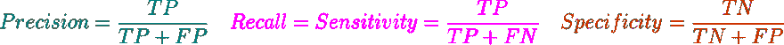
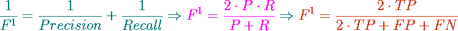

# 什么是图像分割的“骰子丢失”？

> 原文：<https://dev.to/andys0975/what-is-dice-loss-for-image-segmentation-3p85>

## *1。骰子损失是什麼？*

骰子损失是福斯托·米莱塔里等人在 [V 网](https://arxiv.org/abs/1606.04797)中提出的损失函数，其源於索伦森-骰子系数，是*托瓦尔·索伦森*和*李雷蒙德骰子*於 1945 年發展出的統計學指標。這種系数有很多別名,最響亮的就是 f 检验的 F1 分数**.在了解骰子损失之前我們先談談索伦森-骰子系数是什麼。**

 **Looking back at [T0】 F1 score 【T1] which is often heard, there are so-called [T2】 Sensitivity 【T3] and [T4】 Specificity 【T5] in statistics, while machine learning (pattern recognition) has [T6】 Precision 【T7] and [T8】 Recall 【T9]. Their relationship is as follows:

| 真相\机密 | 积极的 | 否定的；消极的；负面的；负的 |
| --- | --- | --- |
| 积极的 | 正确肯定 | 假阴性 |
| 否定的；消极的；负面的；负的 | 假阳性 | 正确否定 |

[T2】](https://res.cloudinary.com/practicaldev/image/fetch/s--yheN3ytc--/c_limit%2Cf_auto%2Cfl_progressive%2Cq_auto%2Cw_880/https://goo.gl/fChxAU)

It can be seen that the protagonists of Precision and Recall are the correct ones, and the correct proportion is evaluated by **total number of selections (TP+FP)** and **correct total number (TP+FN)** respectively. F1 score means to integrate these two indicators with the same weight (β=1) [T4】 Harmonic mean :

[T2】](https://res.cloudinary.com/practicaldev/image/fetch/s--I-RO-dnQ--/c_limit%2Cf_auto%2Cfl_progressive%2Cq_auto%2Cw_880/https://goo.gl/ujUjny)

Now back to the common expression of Sørensen-Dice coefficient:

[T2】](https://res.cloudinary.com/practicaldev/image/fetch/s--4Q4hLNss--/c_limit%2Cf_auto%2Cfl_progressive%2Cq_auto%2Cw_880/https://goo.gl/vKGyzj)

[T0】 QS 【T1] is [T2】 Quotient of Similarity 【T3], that is, the value of coefficient, which can only be between **0 and 1** . In Image segmentation, the mask segmented by the model is the total number **of images** , and the mask marked by experts is the correct total number of **. According to the corresponding formula, we can know that **selected total number (TP+FP)** and **correct total number (TP+FN)** are [T14】 X 【T15] and [T16】 Y 【T17] respectively, and the intersection is TP, which shows that Dice coefficient is equivalent to [T18】 F1 score 【T19**

After talking about coefficient, [T0】 Dice loss 【T1] is actually its inversion. The higher the coefficient is, the higher the similarity between the segmentation result and the standard answer is, while the model hopes that it is feasible to train with the thinking of **seeking the minimum value** , so the commonly used Loss function is **"1-coefficient"** or **"-coefficient"** .

## *2。骰子损失實作*

**Implementation environment:**

*   Windows 10
*   Python 3.6.4
    *   MXNet 1.0.1

Because it's a small test, you don't need GPU. The intersection of formulas is well realized in image segmentation, because the masks of standard answers are usually composed of **0 and 1** , so it is only necessary to make the two masks a point-by-point product (Hadamard product), that is, to multiply the corresponding points without vector inner product, and then add them up. True in the case of positive and Negative, one of the mask values is 0, so it will be excluded in the subsequent summation.

Another interesting point is that I added [T0】 Laplace smoothing 【T1] to the formula, that is, the numerator and denominator of **were added with 1** at the same time, which was inspired by a pytorch's [T4】 issue comment 【T5]. According to him, [T6】 Laplace smoothing 【T7] can reduce Overfitting. I think it's because by making the whole coefficient value larger and loss smaller, the convergence can be achieved faster and too many training iterations can be avoided.

```
from mxnet import nd
smooth = 1.
def dice_loss(y_pred, y_true):
    product = nd.multiply(y_pred, y_true)
    intersection = nd.sum(product)
    coefficient = (2.*intersection +smooth) / (nd.sum(y_pred)+nd.sum(y_true) +smooth)
    loss = 1. - coefficient
    # or "-coefficient"
    return(loss) 
```

Then randomly generate two matrix tests:

```
y_pred = nd.random.uniform(0, 1, (3,3))
y_true = nd.random.uniform(0, 2, (3,3)).astype('int8').astype('float32')
dice_loss(y_pred, y_true)
---------------------------------------------------------

y_pred = [[0.38574776 0.08795848 0.83927506]
          [0.21592768 0.44453627 0.10463644]
          [0.8793516  0.65118235 0.5184219 ]]
         <NDArray 3x3 @cpu(0)>

y_true = [[1. 0. 0.]
          [0. 0. 0.]
          [1. 1. 1.]]
         <NDArray 3x3 @cpu(0)>

product = [[0.38574776 0.         0.        ]
           [0.         0.         0.        ]
           [0.8793516  0.65118235 0.5184219 ]]
          <NDArray 3x3 @cpu(0)>

intersection = [2.4347036] <NDArray 1 @cpu(0)>

coefficient = [0.64307916] <NDArray 1 @cpu(0)>
# no smooth : [0.59916145] <NDArray 1 @cpu(0)> 
loss = [0.35692084] <NDArray 1 @cpu(0)>
# no smooth : [0.40083855] <NDArray 1 @cpu(0)> 
```

The above results can be verified by a computer knock. It can be seen that the coefficient increases and the loss decreases in the case of smooth, so the neural network can converge faster.

# *3\. Postscript*

After the use of V-net in 2016, Dice loss got some evolution in 2017\. One of the literature experiments compared the performance of Dice loss and **cross-entropy** commonly used in image deep learning, and found that Dice loss really performed well in image segmentation, so let's talk about the latest progress of Dice loss afterwards!**