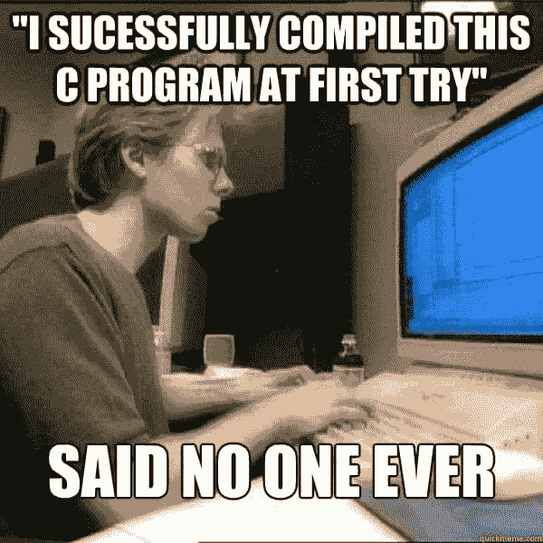

# 新程序员应该预料到哪些问题？

> 原文：<https://dev.to/hbibzdeploy/what-problems-new-programmers-should-expect-8p3>

[T2】](https://res.cloudinary.com/practicaldev/image/fetch/s--t4gIQoeJ--/c_limit%2Cf_auto%2Cfl_progressive%2Cq_auto%2Cw_880/https://cdn-images-1.medium.com/max/800/0%2AEJ1RriyjYAESxPBb.jpg)

#### 每个程序员的奋斗

你的第一个程序开始令人兴奋。但是经过几个月的编码，缺点开始困扰你。迟早，你会遇到让你困惑的问题，在你开始管理他们之前，人们到底是怎么做的。好消息是你不是唯一有同样感觉的人！

事实上，你遇到的所有问题和错误也是和你一样刚刚起步的其他人造成的。实际上，编程不就是为了克服问题而知道如何处理问题吗？

我将向您介绍新程序员可能面临的一些最常见的问题，以及我认为为了减少时间和精力损失而应该处理这些问题的一套解决方案。请注意，这是受我个人喜好的影响，毕竟这只是我的个人观点。

#### 设置:

[T2】](https://res.cloudinary.com/practicaldev/image/fetch/s--fMvf1j4u--/c_limit%2Cf_auto%2Cfl_progressive%2Cq_auto%2Cw_880/https://cdn-images-1.medium.com/max/800/0%2ADAnGO3gQsiYXXXeQ.jpg)

学习编程本身肯定是费力的，不穿鞋容易绊倒。因此，拴住你的马，理解所有的东西是如何结合在一起的，是非常重要的。出于这个原因，我建议在继续下一步之前观看这个视频。
[T3】](https://youtu.be/QXjU9qTsYCc)

如果你仍然在安排你的开发环境时遇到困难，我建议你使用 Visual Studio，因为它包含了你开始开发所需要的几乎所有东西。

* * *

#### 调试:

走出“你好，世界！”地带，程序变得越来越曲折。直到你在 GitHub 上收到你的第一期，你才意识到这一点；语法问题，不可点击的按钮...在你意识到之前，你正在做的完美项目变成了过多的错误...

[T2】](https://res.cloudinary.com/practicaldev/image/fetch/s--Xc0u6MD_--/c_limit%2Cf_auto%2Cfl_progressive%2Cq_auto%2Cw_880/https://cdn-images-1.medium.com/max/800/0%2AJFpDr_OjHWP-V_0c.jpg)

放心吧！尽管调试看起来势不可挡，是一项需要掌握的关键技能，但有些 bug 还是很容易发现和修复的。好消息是，它们比你知道的更常见，即使是好的软件也可能包含它们(这就是为什么通常在网上的大多数支持/联系我们页面中有一个 bug 字段)，并且它们可以被修复。然而，坏消息是，我们都同意调试不仅令人沮丧，而且单调乏味。在一个你确定它应该工作的长代码中缩小问题范围是非常困难的！相信我，在这种情况下，有些调试员不是你的朋友...

一个好的实践是精心设计最佳的调试策略。如果一开始不尝试重现相同的错误，成功的调试过程是不可能的。事实上，了解问题产生的方式是解决问题的一半。[关于调试策略的更多信息](https://web.stanford.edu/class/archive/cs/cs106a/cs106a.1134/handouts/250%20Debugging%20Strategies.pdf)

* * *

#### 像程序员一样思考:

[T2】](https://res.cloudinary.com/practicaldev/image/fetch/s--ifm4JyF4--/c_limit%2Cf_auto%2Cfl_progressive%2Cq_auto%2Cw_880/https://cdn-images-1.medium.com/max/800/0%2Ae5xi7TA71wOrefKT.png)

你们中的一些人可能会发现这是显而易见的，但是给定任务的 50%(就重要性而言)是在你的贝恩中解决的。写下代码，对抗解释器/编译器错误，阅读文档，代码片段...就是另外的 50%。

如今智能设备的速度是无可争议的。尽管如此，他们是难以置信的愚蠢！他们完全按照你告诉他们的去做，这使得思考每一步并将其转换成代码中的命令/指令变得很无聊。实际上，这不再是一个问题，因为数以百万计的程序员正在构建提供许多预先存在的功能的库。然而，通过自我训练来提高你的算法、数据结构技能是必须的，这将帮助你更系统地计划。

我建议首先学习 python 的友好语法(或 JS ),然后解决一些 tasks @ HackerRank，以熟悉现实生活中的任务以及如何以最有效的方式修复它们。

* * *

如果您是编程新手或者希望尽快尝试一下，我希望这篇文章对您有所帮助。如果你想问问题，请在下面留言。愿力量与你同在！保持乐观。