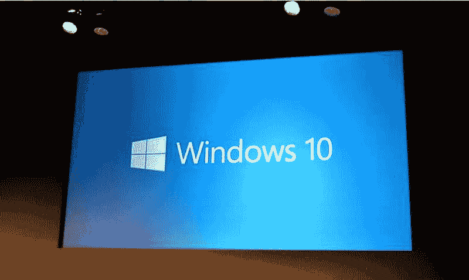

# Windows 9 还是我指的是 10

> 原文：<https://dev.to/funkysi1701/windows-9-or-do-i-mean-10-241n>

像许多系统管理员一样，我昨天看到了关于 windows 最新版本的新闻。会是什么样子？它会被称为什么？它会比以前的版本更好还是更差？

当新操作系统的名称被透露为 Windows 10 时，我感到震惊。什么真的！？起初，我以为有人在推特上发布了一张新闻发布会的 photoshopped 图像，但不是，它真的会被称为 Windows 10。

[T2】](https://res.cloudinary.com/practicaldev/image/fetch/s--U4DQ9sx8--/c_limit%2Cf_auto%2Cfl_progressive%2Cq_auto%2Cw_880/https://storageaccountblog9f5d.blob.core.windows.net/blazor/wp-content/uploads/2014/10/windows_10_fullwidth.jpg%3Fw%3D800%26ssl%3D1)

Windows 10 是继 windows 8 之后发布的下一个操作系统，许多人曾将其称为 windows 9 或 windows Threshold。

微软从来没有固定的操作系统命名惯例，所以我们真的应该对它的新名字感到惊讶吗？

*   视窗 1.0 (1985 年)
*   视窗 2.0 (1987 年)
*   视窗 3.0 (1990 年)
*   视窗 95 (1995 年)
*   视窗 98 (1998 年)
*   Windows ME (2000)
*   Windows XP (2001 年)
*   Windows Vista (2007)
*   Windows 7 (2009)
*   Windows 8 (2012)
*   Windows 10 (2015)

微软采用 Windows 10 的一个原因可能是因为他们想表明即将到来的 Windows 版本将是最后一次“重大”Windows 更新。作为最后一次重大更新意味着什么？

如果你看看上面的操作系统列表，你会发现 XP 和 Vista 之间的差距是巨大的 6 年，这个差距已经引起了 IT 专业人士(包括我)的巨大头痛。软件是为 XP 编写的，因为这是所有可用的，当 XP 在今年早些时候停止支持时，它引起了很多问题，因为人们试图让这个软件在更现代的操作系统上工作。

如果 windows 10 存在了很长时间，我们可能会面临与 XP 类似的情况，因为如果你试图将其移植到下一个版本，软件负载将只能在其上运行，并会导致问题。我只是一个实习开发人员，所以我不知道构建一个操作系统涉及到什么，但我可以想象，如果不把它们拆下来重新开始，肯定会有非常困难或几乎不可能修复的东西，这就是编写新版本操作系统时会发生的情况。

只有时间才能证明 Windows 10 是否真的是 Windows 的最后一个版本，以及这个操作系统在未来会发生什么。无论如何，我正在下载一个预览，这样我就可以看看(我想要回我的开始菜单！)