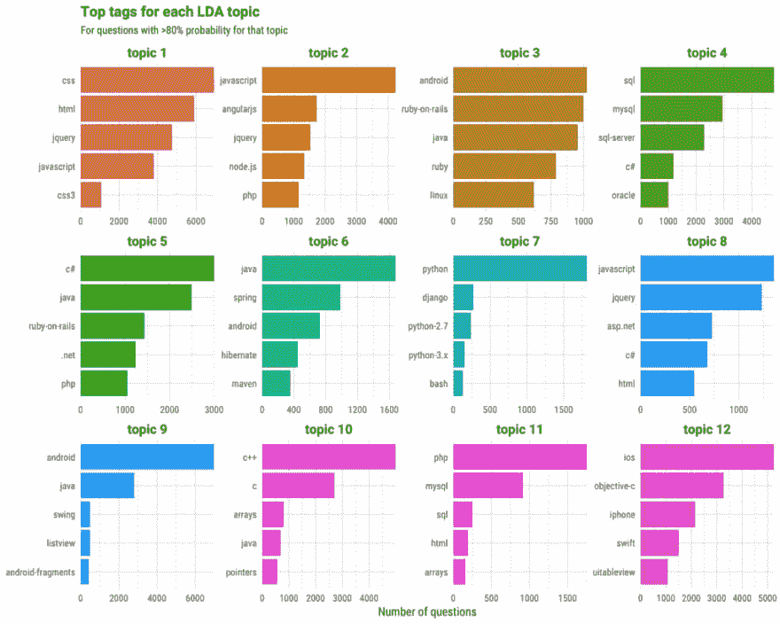
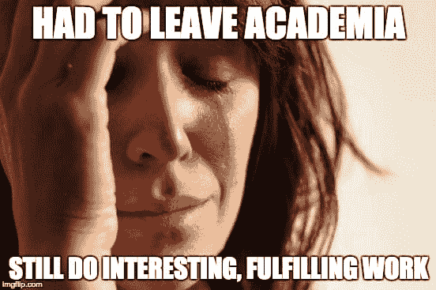

# 作为 Stack Overflow 的数据科学家，与 Julia Silge 一起工作

> 原文：<https://dev.to/walker/working-as-a-data-scientist-at-stack-overflow-with-julia-silge>

Julia Silge 是 Stack Overflow 的数据科学家。她学习物理和天文学，2005 年获得博士学位。在进入数据科学并发现 R 之前，她曾在学术界(教学和做研究)和教育技术部门工作。她与大卫·罗宾逊合著的奥莱利的书 [*与 R*](http://tidytextmining.com/) 的文本挖掘现已出版。

### **栈溢出时你会遇到什么样的数据问题？**

我在栈溢出时得到的数据是惊人的！栈溢出是编码人员来学习、相互分享知识和建立职业生涯的地方，所以我们的数据都是关于这方面的。它是关于谁是开发者，他们如何一起构建社区，技术如何交互和改变，以及技术如何影响我们生活的世界的数据。

在堆栈溢出时，我们以许多不同的方式使用这些丰富的数据。我的团队致力于机器学习，以将开发人员与相关工作匹配起来，通过文本挖掘来了解是什么让开发人员更有可能对一家公司做出回应，当然还有了解技术生态系统本身。

[T2】](https://stackoverflow.blog/2017/07/06/text-mining-stack-overflow-questions/)

我一直致力于了解的一个具体问题是我们全球用户的地理分布，并将其与 Stack Overflow 上可用工作的地理分布进行比较。这个项目并不涉及特别花哨的人工智能或任何东西，但它确实涉及到整合各种各样的、杂乱的数据集，并建立一个面向内部的工具，从高管到销售人员的股东都可以参与并使用它来做决定。

### **数据科学家能从数据新闻中吸取什么教训？**

作为一名数据科学家，我的工作受到了数据记者、沟通和故事讲述的影响。这并不意味着我不太懂技术，但这确实意味着我很在乎别人从我所做的分析或我建立的模型中得到什么。

Andrew Flowers 去年在 [`rstudio::conf`](https://www.rstudio.com/resources/videos/finding-and-telling-stories-with-r/) 做了一个关于如何寻找和讲述故事的演讲，它与我如何对待我的工作产生了很大的共鸣。我关注数据新闻中正在发生的事情，我发现当一些事情确实令人信服时，无论是[布丁对嘻哈音乐的研究](https://pudding.cool/2017/02/vocabulary/)还是[畅销书](https://pudding.cool/2017/06/best-sellers/)或[结果的“你画出来”图](https://www.nytimes.com/interactive/2015/05/28/upshot/you-draw-it-how-family-income-affects-childrens-college-chances.html)，我都会考虑为什么以及如何将这些原则融入我自己的工作中。我在工作中与软件开发人员、产品经理和销售人员等人员交流，我希望他们理解我的工作，并为之感到高兴。

### **你是如何从学术界过渡到数据科学的？**

我在研究期间写了很多代码，将编程作为科学计算和分析真实世界复杂数据的工具。研究生毕业后，我作为博士后从事研究工作，然后作为教授从事教育工作。在那之后，当我的孩子们还很小的时候，我离开了有薪工作岗位好几年，全职在家陪他们。

2012 年，我重返职场，在一家教育科技初创公司工作，为高等教育 STEM 课程开发互动内容，但经历了一系列情况(包括裁员)后，我认为从职业和个人角度来说，是时候让我转向一个更具技术性和分析性的角色了。从博士后时代开始，我就没有全职编写过代码，所以我跳进了一大堆学习的机会中，从 MOOCs 到书籍，到最终参与开源。

我发现了统计编程语言 R，我已经喜欢上了这种语言，并努力更新和发展我的技能。开源的 R 社区为我提供了一个绝佳的机会来提高自己作为一名 R 开发人员的水平，并与曾经帮助过我的人建立关系。我最终开始申请数据科学的工作，在我的博客上展示了我的技能。作为一名数据科学家，我的第一份工作是在一家名为 Datassist 的令人惊叹的统计/数据科学咨询公司，该公司从事重要而有趣的工作。我现在是 Stack Overflow 的数据科学家；这是我的第二份工作，我的头衔是数据科学家。

### **通向数据科学的常见职业道路有哪些？**

我通常看到来自两种背景的人对进入数据科学感兴趣。第一组是来自真正学术背景的人，他们来自物理学、生态学或社会科学的代码密集型领域，有像我这样的博士，他们有很强的定量技能。通常这些人需要进入数据科学领域的是采用软件工程中的一些重要实践，如版本控制、单元测试和持续集成。基本上，他们需要成为更流利的程序员。

[T2】](https://juliasilge.com/blog/non-academic-careers/)

第二类是软件工程师，他们已经很擅长写代码，有面向数据的思维方式，但统计培训较少。通常这个群体需要进入数据科学的是磨练他们的建模和机器学习能力。

我非常有兴趣关注的另一群人是现在正在新的学术项目中培训数据科学人才的学生。这些是获得硕士或学士学位的学生，他们的主修或辅修专业是数据科学。我在盐湖城的一些项目上做过演讲，我非常想知道这个领域在不久的将来会如何发展。

我预测，在 5 或 7 年内，将会有更多的数据科学家，他们教育程度更低(博士更少，学士更多)，但教育程度更专业(天文学家和生物统计学家更少，拥有数据科学硕士学位的人更多)。我觉得领域不会差，但是会不一样！