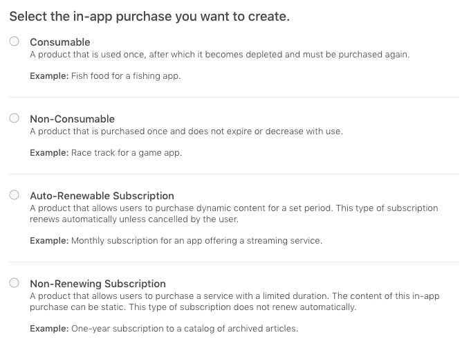
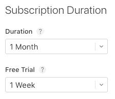
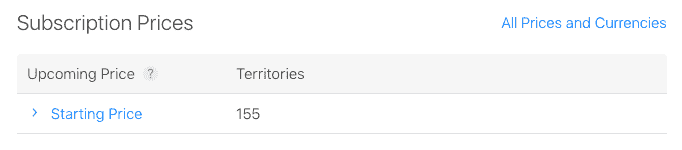
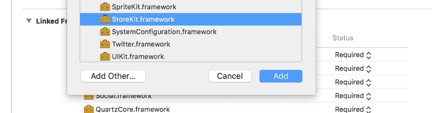
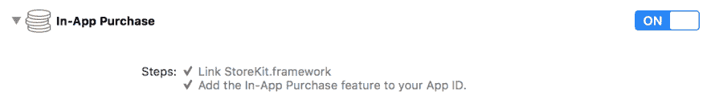
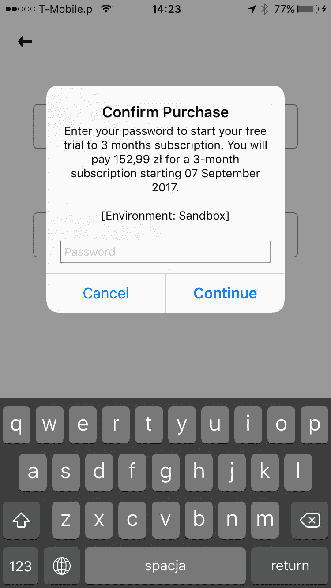
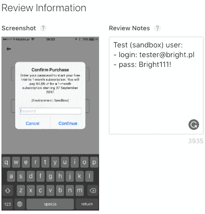
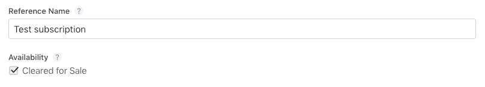

# 使用 iOS 应用内购买

> 原文：<https://dev.to/brightdevs/working-with-ios-in-app-purchases-50np>

在 iOS 开发中，有比设置和测试应用内购买更令人愉快的事情要做。这个过程很费力，需要彻底的测试，特别是从商业角度来看，应用内购买是至关重要的。

## iTunes Connect 配置-第 1 部分

本教程以自动续费订阅为基础，但你可以用非常相似的方式配置任何其他应用内购买。

要设置应用内购买，请按照以下步骤操作:

1.  登录 [iTunes Connect](https://itunesconnect.apple.com) 。

2.  打开**我的应用**并选择您要配置的应用。

3.  打开**功能**标题，在左侧窗格选择**应用内购买**。

4.  点击 **+** 图标，选择应用内购买类型。您可以使用 4 种类型的应用内购买:

    [T2】](https://res.cloudinary.com/practicaldev/image/fetch/s--Rpkdy6gL--/c_limit%2Cf_auto%2Cfl_progressive%2Cq_auto%2Cw_880/https://thepracticaldev.s3.amazonaws.com/i/1ge1lzhqrap1bkcxgpbp.png)

    每种类型都有特定的用例，所以请务必先阅读描述。

    如果您看不到自动续费订阅，说明您没有接受更新的`Apple Developer Program License Agreement`或者您没有完成在 iTunes Connect 上填写协议、税务和银行信息。

5.  **假设您选择了自动续费订阅**，请提供**参考名称**和**产品 ID** 。

    a)参考名称仅用于 iTunes Connect 以及销售和趋势报告。不会在 App Store 显示，所以可以是你喜欢的任何东西。

    b)产品 ID 必须唯一，因此建议使用带有订阅名称的应用反向域，例如:`com.reversed.domain.onemonth`。

6.  选择**创建新的订阅组**或选择现有的组(如果有)。

    所有自动续订的订阅都必须是组的一部分。用户一次只能订阅一个组中的一个订阅，但他们可以更改同一组中的另一个订阅。这允许用户升级或降级订阅，而无需为相同的服务支付两次费用。

    **订阅组参考名称**，与参考名称相同，仅在 iTunes Connect 和销售与趋势报告中使用。

7.  应出现自动续订订购详情页面。选择**订阅期限**(1 周至 1 年)**可选免费试用**期限(3 天至 1 年)。

    [T2】](https://res.cloudinary.com/practicaldev/image/fetch/s--Y27mB-YB--/c_limit%2Cf_auto%2Cfl_progressive%2Cq_auto%2Cw_880/https://thepracticaldev.s3.amazonaws.com/i/tg8g3m3nz94c3vhl47n0.png)

8.  点击**设置起始价格**选择默认货币和价格(您必须从定价等级中选择)，其他国家的价格将自动计算。

9.  现在，您可以为各个地区选择不同的价格。保存更改后，您会注意到您的价格被保留为定价层:

    [T2】](https://res.cloudinary.com/practicaldev/image/fetch/s--cOF4-QSf--/c_limit%2Cf_auto%2Cfl_progressive%2Cq_auto%2Cw_880/https://thepracticaldev.s3.amazonaws.com/i/mo0thjzk482c6n98hdy4.png)

10.  添加至少一个包括**订阅显示名称**和**描述**的**本地化**，最好是您支持的所有语言。这些值对用户来说是可见的，所以要确保它们听起来可信。

11.  现在，您需要将至少一个**本地化**添加到您的订阅组。保存更改，并在左侧窗格中选择您在步骤 6 中创建的组。填写**订阅组显示名称**，如果您的应用名称不同于您的服务或出版物名称，可选择设置**自定义名称**。请记住，这些值将对用户可见。

您可能已经注意到，我们已经跳过了产品详情页面上的**评论信息**部分。为了完成这一部分，我们首先需要从我们的应用程序调用 App Store，以完成配置阶段。

记得在 iTunes Connect 上填写您的协议、税收和银行信息。您可以在 iTunes Connect 主页或页面左上角的下拉列表中找到它。

## 设置测试账户

为了测试应用内购买，您需要创建一个沙盒测试帐户。

1.  登录 [iTunes Connect](https://itunesconnect.apple.com) 。

2.  打开**用户和角色**。

3.  打开**沙盒测试器**头。

    [T2】](https://res.cloudinary.com/practicaldev/image/fetch/s--xHd3s090--/c_limit%2Cf_auto%2Cfl_progressive%2Cq_auto%2Cw_880/https://thepracticaldev.s3.amazonaws.com/i/zrpy7y4on3chk5qj8k2s.png)

4.  点击 **+** 图标，填写测试账号详情。保留凭证。

    你可以使用一个假的电子邮件地址进行测试(一个简单的方法)，但是**苹果可能会给你发送一封电子邮件来验证测试帐户**，使用假帐户你将无法做到这一点，所以你需要创建另一个帐户，因为从未经验证的帐户购买总是会失败。

## 项目配置

现在您需要对您的 **Xcode 项目**进行一些更改。

1.  打开项目设置(单击项目文件树的根目录)。

2.  在**常规**标题中，向下滚动到**链接的框架和库**。

3.  点击 **+** 图标，找到 **StoreKit.framework** ，点击**添加**。

    [T2】](https://res.cloudinary.com/practicaldev/image/fetch/s--6YqHLm5U--/c_limit%2Cf_auto%2Cfl_progressive%2Cq_auto%2Cw_880/https://thepracticaldev.s3.amazonaws.com/i/p72ehhnetxeqlv71wwyt.png)

4.  打开**功能**标题，打开**应用内购买**。

    [T2】](https://res.cloudinary.com/practicaldev/image/fetch/s--m4i0aTIB--/c_limit%2Cf_auto%2Cfl_progressive%2Cq_auto%2Cw_880/https://thepracticaldev.s3.amazonaws.com/i/o8v0pnxs3zzyfdi35gfs.png)

终于到了编码的时候了！

## 代码

首先，您需要导入您的类中的`StoreKit`:

```
import StoreKit 
```

Enter fullscreen mode Exit fullscreen mode

在进行任何其他操作之前，您应该检查用户是否可以付款。如果他不能，家长控制可能已打开。

```
SKPaymentQueue.canMakePayments() 
```

Enter fullscreen mode Exit fullscreen mode

为了进行购买，您需要先下载可购买的产品:

```
private let kOneMonthSubscriptionId = "com.reversed.domain.onemonth"

func loadProducts() {
    let identifiers = Set([kOneMonthSubscriptionId])
    let request = SKProductsRequest(productIdentifiers: identifiers)
    request.delegate = self
    request.start()
} 
```

Enter fullscreen mode Exit fullscreen mode

加载的产品将在`SKProductsRequestDelegate`委托的`productsRequest`方法中可用。为了处理存储委托方法，你的类需要实现`SKProductsRequestDelegate`。你可以用一个扩展来包装它:

```
extension SubscriptionService: SKProductsRequestDelegate {

  func productsRequest(_ request: SKProductsRequest, didReceive response: SKProductsResponse) {
    if response.products.count > 0 {
      print("Purchasable products available!")
      // 1\. Save the SKProduct's so you could let user make a purchase
      // 2\. Update the UI - it lets you change the product prices without updating the app
    } else {
      print("No purchasable products available.")
      // This might happen when your product identifiers are incorrect or your in-app purchases products weren't processed on iTunes Connect yet
    }
  }

} 
```

Enter fullscreen mode Exit fullscreen mode

如果您无法获取您已配置的可购买产品，请注意**您的产品可能需要几个小时**才能在 iTunes Connect 上注册。

现在你可以让用户进行购买。记住在进程完成之前用加载器锁定用户界面，以避免重复调用，并确保用户知道正在发生的事情。

```
func purchase(product : SKProduct) {
    let payment = SKPayment(product: product)
    SKPaymentQueue.defaultQueue().addTransactionObserver(self)
    SKPaymentQueue.defaultQueue().addPayment(payment)
} 
```

Enter fullscreen mode Exit fullscreen mode

事务的结果在`SKProductsRequestDelegate`委托的`paymentQueue`方法中处理。让我们扩展:

```
extension SubscriptionService: SKProductsRequestDelegate {
  // (...)

  func paymentQueue(queue: SKPaymentQueue, updatedTransactions transactions: [SKPaymentTransaction]) {
        for transaction in transactions {
            switch transaction.transactionState {
            case .Purchasing:
                print("The payment is being processed.")
            case .Purchased:
                print("Payment processed successfully.")
                // Add your logic
            case .Restored:
                print("Payment restored successfully.")
                // Add your logic - it'll happen when your products could be restored (e.g. non-consumable products)
            case .Failed:
                if transaction.error?.code == SKErrorPaymentCancelled {
                    print("User cancelled the payment.")
                    break;
                }
                print("Payment failed with error: \(transaction.error ?? "")")
                // Handle the error
            case .Deferred:
                print("Payment is waiting for outside action.")
            }
        }
    }

} 
```

Enter fullscreen mode Exit fullscreen mode

请记住，在让用户打购买电话之前，先恢复可以恢复的可购买产品，因为无论如何他们都无法再次购买。

## 测试

要完成配置过程，您需要确保您的支付正在进行，并为 App Store 审核过程截图。这既简单又棘手，所以让我们按照以下步骤操作:

1.  注销您当前的 Apple ID:

    a)打开你 iPhone 的**设置**。

    b)进入 **iTunes &应用商店**。

    c)选择您的电子邮件地址，然后选择**退出**。

    不要使用沙盒帐户登录-你将无法这样做。

2.  运行你的应用并触发应用内购买。

3.  系统会提示您提供 Apple ID。使用**沙盒帐户**凭证并继续。

4.  将出现付款信息对话框。拍摄屏幕截图(同时按住电源/睡眠和 home 键)。

[T2】](https://res.cloudinary.com/practicaldev/image/fetch/s--K8bzkksP--/c_limit%2Cf_auto%2Cfl_progressive%2Cq_auto%2Cw_880/https://thepracticaldev.s3.amazonaws.com/i/jfzm7h4i4dortd0901vk.jpg)

你必须在真实设备上测试应用内购买。在 iOS 模拟器上购买总是会失败。

## iTunes Connect 配置-第 2 部分

由于您已经实现了应用内购买，并在连接到 App Store API 时拍摄了系统对话框的屏幕截图，因此您可以最终完成 iTunes Connect 配置。

在 **iTunes Connect** 上返回你的应用内购买详情页面(我的应用- >你的应用- >功能- >应用内购买- >你的购买)，向下滚动到**评论信息**。

上传截图，并输入您在**复习笔记**中使用的沙盒帐户的凭证。

[T2】](https://res.cloudinary.com/practicaldev/image/fetch/s--ohjLIctD--/c_limit%2Cf_auto%2Cfl_progressive%2Cq_auto%2Cw_880/https://thepracticaldev.s3.amazonaws.com/i/9uie15hqemu8uxxqjk6f.png)

保存更改，并确保您的应用内购买的**可用性**设置为**待售**(在页面顶部)。

[T2】](https://res.cloudinary.com/practicaldev/image/fetch/s--Sx1PbIEI--/c_limit%2Cf_auto%2Cfl_progressive%2Cq_auto%2Cw_880/https://thepracticaldev.s3.amazonaws.com/i/dlhxf3oiisd76iv8wyt7.png)

请记住，您的第一次**应用内购买必须提交新的应用版本**。上传您的二进制文件并提交您的首次应用内购买进行审核后，您可以在应用内购买部分提交其他应用内购买。

## 服务器端订阅验证

您可以在应用程序外验证用户的订阅是否仍然有效。当您的应用程序在其他平台(如 Android)上也有单独的商店可用，并且您决定让您的用户只为每个帐户而不是每个平台支付一次费用时，这尤其有用。

为了验证用户的订阅服务器端，你需要一个**共享秘密**。你可以在你的应用的应用内购买列表中找到它(我的应用- >你的应用- >功能- >应用内购买)，点击**应用专用共享秘密**打开一个有秘密的对话框。如有必要，点击**生成共享密钥**。

[T2】](https://res.cloudinary.com/practicaldev/image/fetch/s--TeaE-_6y--/c_limit%2Cf_auto%2Cfl_progressive%2Cq_auto%2Cw_880/https://thepracticaldev.s3.amazonaws.com/i/5qwbxcegwot2fcvla928.png)

共享密码，以及您在完成应用内购买后收到的收据详情，将允许后端应用程序验证用户的订阅是否仍然有效。

## 一丝不苟

你可能已经注意到了，**设置应用内购买是一项艰巨的任务**。然而，值得花时间进行细致的逐步配置，以避免过程中不必要的不愉快。

顺便说一句，你知道吗，即使你遵循了这些指示，你的 iOS 应用程序也可能会被拒绝？ [看看这篇博文，找出为什么](https://brightinventions.pl/blog/dont-let-your-ios-app-be-rejected/)。

最初发布于 [brightinventions.pl](https://brightinventions.pl/blog/)

作者 Mateusz Klimczak,《推动事物前进》@光明的发明

[推特](https://twitter.com/Klimczak_M)，[邮件](//mateusz.klimczak@brightinventions.pl)