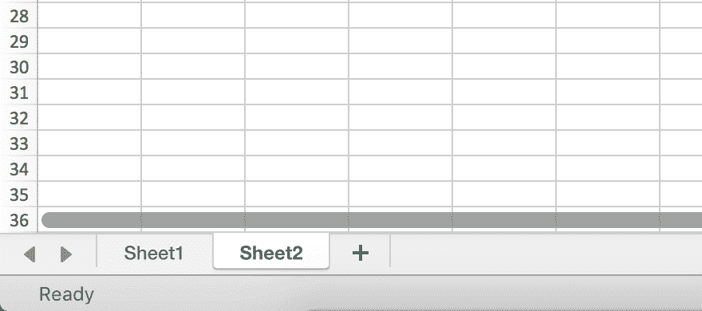
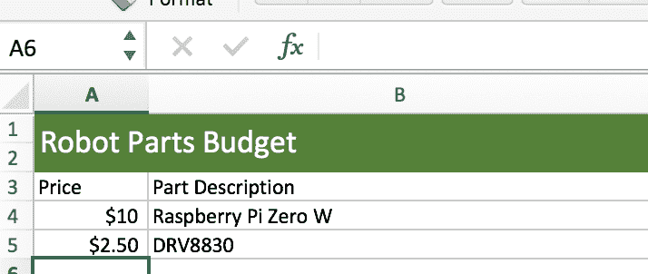
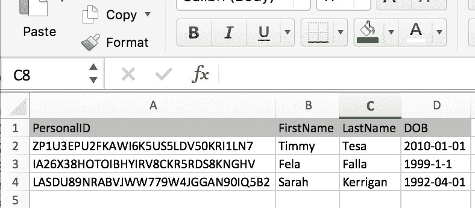

# 使用 R Excel 库

> 原文：<https://dev.to/ladvien/working-with-r-excel-libraries-110k>

我们对逗号分隔值(`.csv`)文件做了一些工作，但是它们不是存储数据的唯一方式。数据存储格式有很多种，各有优缺点。`CSV`格式的缺陷之一是它不能存储格式或图形。这就是 Excel 格式(`.xls`或`.xlsx`)成为另一个行业标准的原因。

Excel 是微软开发的一个程序，可以让人们轻松处理电子表格。有了它，他们创造了一种存储数据的方式，允许格式化和其他信息被包括在内。事实上，Excel 文档已经变得非常复杂，程序员可以在文档中包含整个程序。这就是为什么你在打开 Excel 文档时会经常看到“启用内容”按钮。这意味着 Excel 文档中嵌入了一些代码，如果你说“Enable ”,这些代码就会运行。(小心，恶意的程序员可能会插入代码，这些代码可能会让你的计算机死机。)

使用 HMIS 数据时，必须能够加载和写入 Excel 文档。不幸的是，它增加了很多复杂性。

有几个 R 库可以让我们在 R 中处理 Excel 文档。它们有不同的优势，因此，我将把重点放在两个库上，而不是一个。

*   xlconnect
*   [openxlsx](https://cran.r-project.org/web/packages/openxlsx/openxlsx.pdf)

## 为 Excel 安装 R 库

安装这些库应该像运行下面的代码一样简单:

```
install.packages("XLConnect",  dependencies=TRUE)  install.packages("openxlsx") 
```

Enter fullscreen mode Exit fullscreen mode

然而，有很多的如果 T2。这两个库都依赖于`rJava`库。不幸的是，经常会出现一些计算机架构的不匹配。那是什么意思？嗯，通常你会为 amd64 安装 R，但是 rJava 是最容易与 i386 的 R 一起工作的。

只需知道，RStudio 有一种方法可以设置您正在使用的 R 的版本，方法是转到`Tools`然后转到`Global Options`。如果你使用的是 Windows，在`R General`部分的顶部你会看到改变 R 版本的选项。如果您在运行上述 Excel 文档时遇到困难，请尝试将 R 版本切换到 i386。(切换后别忘了重启 RStudio。)

除此之外，我很乐意帮你解决问题。请在下面留言或给我发邮件。然而，它可能会变得非常棘手——尤其是在 Mac 上。

## 使用 XLConnect

现在，我只使用 XLConnect 从 Excel 表中加载数据。我只是太懒了，没有重写我所有的代码来使用一个库(也就是`openxlsx`)。我认为使用 XLConnect 的原因是更容易理解它是如何加载数据的。它的缺点是在将 Excel 文档格式化保存到你的电脑上时没有那么大的灵活性。而且保存 Excel 表格可能会很混乱。

### 从 Xlsx 文档中加载数据

使用 XLConnect 加载数据与使用`read.csv`函数略有不同。正如我前面提到的，Xlsx 文档除了数据还包含其他信息。一个重要的信息是纸张编号。

与`CSVs`不同，一个 Excel 文档可以包含多个电子表格。当您打开一个 Excel 文档时，这些表中的每一个都将被分解成选项卡

[T2】](https://res.cloudinary.com/practicaldev/image/fetch/s--vJEplXoB--/c_limit%2Cf_auto%2Cfl_progressive%2Cq_auto%2Cw_880/https://ladvien.cimg/excel_sheets.png)

XLConnect 不做任何假设，它想让你告诉它你想加载哪一个工作表。

下面是如何在 XLConnect 中加载一个 Excel 文档，即第一张工作表:

```
library(XLConnect)  excelDf  <-  readWorksheetFromFile("/Users/user/Data/VI-SPDAT v2.0.xlsx",  sheet  =  1,  startRow  =  1) 
```

Enter fullscreen mode Exit fullscreen mode

它类似于`read.csv()`函数，但是注意路径中的文件指的是`VI-SPDAT v2.0.xlsx`？您需要确保您的文件格式是`.xlsx`或`.xls`，因为`readWorkSheetFromFile()`功能只适用于 Excel 文档。

此外，还有两个其他参数。第一个，`sheet = 1`告诉 XLConnect 只读入第一张工作表。要知道，你可以把它设置成你喜欢的任何页码。作为参考，这些表是 1，2，3，5...等等。，在 Excel 中打开时从左到右。因此，即使您的工作表有不同的名称，XLConnect 仍然会按照它们的数字顺序加载数据。

第二个参数是`startRow = 1`。这允许你告诉 R 从哪里开始数据帧。例如，如果您的 Excel 文档中有一个不包含数据的标题。

[T2】](https://res.cloudinary.com/practicaldev/image/fetch/s--L37xcRfj--/c_limit%2Cf_auto%2Cfl_progressive%2Cq_auto%2Cw_880/https://ladvien.cimg/excel_robot_budget.png)

我们可以通过告诉 XLConnect `startRow = 3`跳到列标题所在的第三行。

### 将数据帧写入 Excel 文档

编写 Excel 文档稍微复杂一点——这也是我不太喜欢 XLConnect 的一个原因。

下面是你如何写一个 Excel 文件:

```
######################### Data ###################################  ###################### DO NOT CHANGE #############################  peopleDf  <-  data.frame(PersonalID=c("ZP1U3EPU2FKAWI6K5US5LDV50KRI1LN7",  "IA26X38HOTOIBHYIRV8CKR5RDS8KNGHV",  "LASDU89NRABVJWW779W4JGGAN90IQ5B2"),  FirstName=c("Timmy",  "Fela",  "Sarah"),  LastName=c("Tesa",  "Falla",  "Kerrigan"),  DOB=c("2010-01-01",  "1999-1-1",  "1992-04-01"))  ##################################################################  ##################################################################  # Create a workbook to contain the worksheet(s).  peopleWorkbook  <-  loadWorkbook("People.xlsx",  create  =  TRUE)  # Create and name the worksheet.  myPeopleWorksheet  <-  createSheet(peopleWorkbook,  "My People")  # Add the data to the worksheet, put it in the workbook, save it to the computer.  writeWorksheetToFile("People.xlsx",  data  =  peopleDf,  sheet  =  "My People") 
```

Enter fullscreen mode Exit fullscreen mode

运行这段代码后，您的工作目录中应该有一个名为`People.xlsx`的文件(记住，`getwd()`会告诉提供工作目录)。如果您打开这个文件，它应该看起来像这样:

[T2】](https://res.cloudinary.com/practicaldev/image/fetch/s--EcW5QVse--/c_limit%2Cf_auto%2Cfl_progressive%2Cq_auto%2Cw_880/https://ladvien.cimg/xlconnect_written_workbook.png)

这看起来有点复杂，但这只是因为 XLConnect 让它看起来很复杂。它是这样做的:

1.  创建一个工作簿，这是一个可以存储工作表的地方。
2.  myPeopleWorksheet 在上面创建的工作簿中创建。这张纸叫做“我的人民”
3.  工作表中添加了我们的 peopleDf，然后在我们的工作目录中保存为一个名为“People.xlsx”的文件。

就像我说的，在我看来，这是很多不必要的复杂性。

## 为什么要使用 Excel 文档

在增加了阅读和保存 Excel 文档的复杂性之后，你可能想知道它的好处是什么？问得好。

如开头所述，除了数据之外，Excel 文档还可以包含其他信息。它包含格式、图像、图表和许多其他东西。而编写报表脚本的原因之一就是为了自动化所有冗余的任务。

想象一下，你有一个 12，000 参与者注册的数据集。您希望创建一个电子表格，将注册按降序排列。并且您希望每天创建此报告。

如果您使用了`write.csv()`,您需要在创建 CSV 之后打开它，然后手动将排序添加到文档中，将其保存为 Excel 文件，然后发送出去。我保证，在这样做了几个星期后，你会想找到一种自动化的方法。特别是，如果你决定标题也需要 18 号字体。

Excel 文档允许我们存储格式调整，XLConnect 允许我们自动插入它们。

添加格式可能会稍微复杂一点，这将是另一篇文章的重点。此外，我们将使用`openxlsx`，因为它是*更容易输出格式，再次，只是我的意见。*