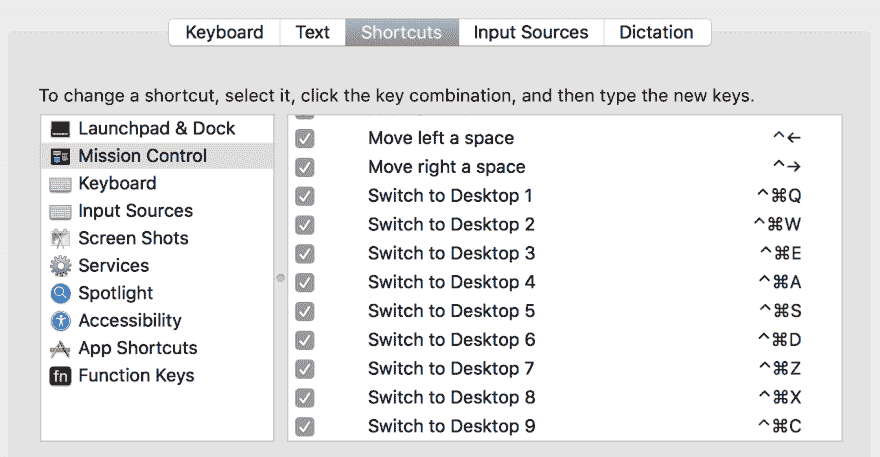
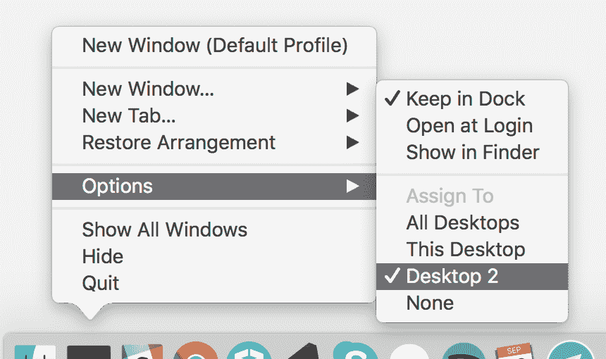
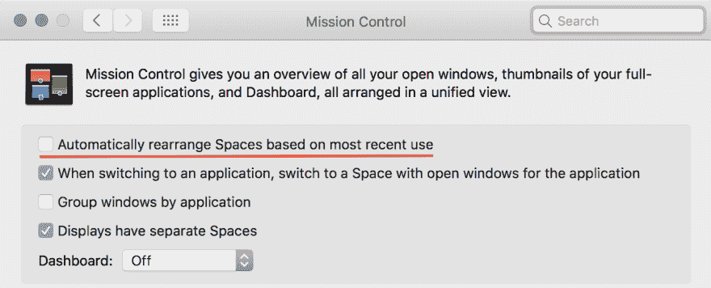

# 无需外部工具的 MacOS 工作空间网格

> 原文：<https://dev.to/mikkpr/workspace-grid-for-macos-without-external-tools>

*也贴到了[中](https://medium.com/@mikkpr/desktop-grid-for-macos-b2b2bfc34432)T3】*

我发现了一个巧妙的技巧，大大减少了我通常在打开的应用程序之间切换的时间。此外，它帮助我组织一切，以便只需按键即可找到特定的应用程序。

## 它一直就在我的眼皮底下

“诀窍非常简单——你只需要创建 9 个不同的空间，并分配特定的热键切换到每个空间。

我个人使用 Cmd+Ctrl+键盘上最左边的九个字母作为一个 3x3 的网格(我的布局是 QWE、ASD 和 ZXC)。我把我的 Caps Lock 兼作 Ctrl 键，所以按“Caps Lock + Cmd + D”来切换到第 6 个空格并不像看起来那么尴尬。9 个空间似乎足以容纳我所有的应用程序，但最多可以有 16 个不同的空间。

这里有一篇关于如何创造新空间的官方文章:[https://support.apple.com/kb/PH25574](https://support.apple.com/kb/PH25574)。

[T2】](https://res.cloudinary.com/practicaldev/image/fetch/s--ueV9CZW7--/c_limit%2Cf_auto%2Cfl_progressive%2Cq_auto%2Cw_880/https://thepracticaldev.s3.amazonaws.com/i/3j26vj417kbhyjocss8q.png)

要绑定热键切换到特定的空间，进入“系统偏好设置>键盘”，选择左侧边栏上的“快捷键”标签和“任务控制”。只有在您实际创建了额外的空格后，这些组合键才可用。

## 现在每个 app 都有家了

为了最大限度地利用这一点，我将我的应用程序分配到特定的空间，并按主题组织空间，这样我就可以立即切换到我需要的任何应用程序，而不用想太多。

我最重要的应用程序在最上面的三个位置(一般是 Chrome 和 iTerm)，中间一排是用于交流的(电子邮件、Slack、Skype 等)。)底部的三个空间是笔记应用、Finder 和 Spotify。

为了让应用程序真正坚持它们的分配空间，我使用 Dock 手动设置了它们的桌面偏好设置。

[T2】](https://res.cloudinary.com/practicaldev/image/fetch/s--m_X5G4a---/c_limit%2Cf_auto%2Cfl_progressive%2Cq_auto%2Cw_880/https://thepracticaldev.s3.amazonaws.com/i/8sqjlqzait4ij7vsqeoe.png)

为了保持空间的首选顺序，在 Mission Control 偏好设置中还有一个选项可以取消选中:“根据最近的使用情况自动重新排列空间”。

我使用[眼镜](https://www.spectacleapp.com/)轻松地将窗户分成两半或三分之一，以防我想同时看到同一空间的多个窗户。不必手动定位它们是另一个节省时间的方法。

这是系统允许我走的最远距离，但是——如果我觉得我的空间网格需要额外的功能，我很可能会考虑使用 [Totalspaces](https://totalspaces.binaryage.com/) 来代替。

我想知道 MacOS 中还隐藏着哪些简单的生产力工具和技巧？

编辑:

驱使我找到这个解决方案的最初想法:[http://code.krister.ee/my-coding-environment/](http://code.krister.ee/my-coding-environment/)

以下是一些关于如何降低动画速度和整体运动的提示:

*   [https://support.apple.com/kb/PH25204?locale=en_US](https://support.apple.com/kb/PH25204?locale=en_US)
*   [https://apple.stackexchange.com/a/253800](https://apple.stackexchange.com/a/253800)