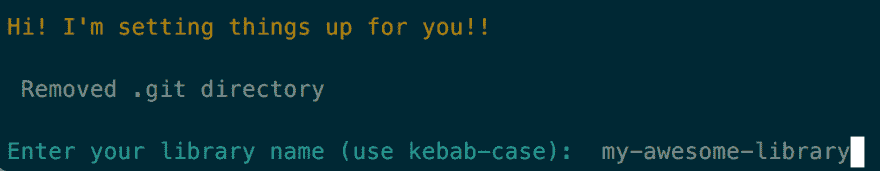
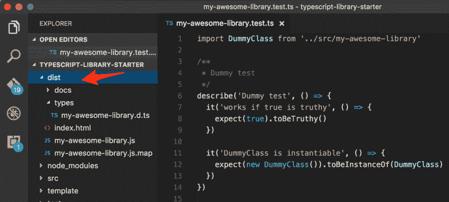
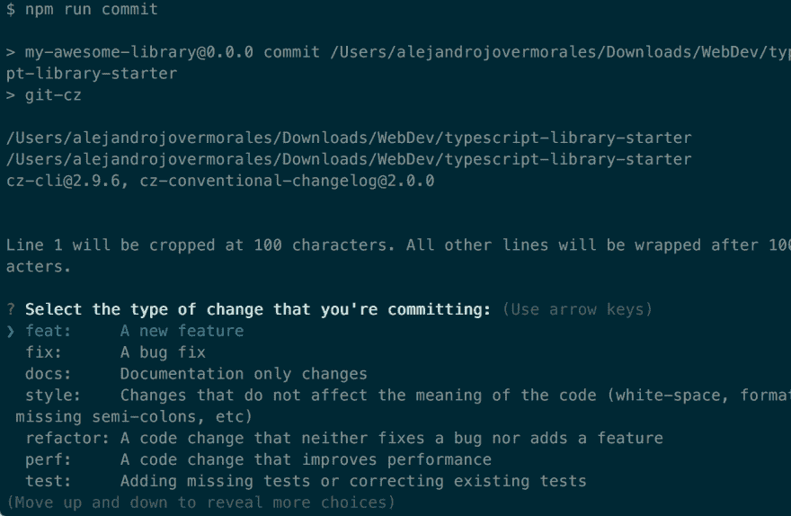

# 使用 TypeScript 库启动程序编写库

> 原文：<https://dev.to/alexjoverm/write-a-library-using-typescript-library-starter>

*在一个[视频课上讲解了书呆子](https://egghead.io/lessons/typescript-create-a-typescript-library-using-typescript-library-starter)*

你用 JavaScript 或者 TypeScript 写过库吗？你打算做吗？如果是这样，你必须试试 [Typescript library starter](https://github.com/alexjoverm/typescript-library-starter) ，这是一个初学者工具包，它将使入门变得容易，同时提供你所知道的用 Typescript 编写库的所有功能。

编写库或项目总是需要一些工作:

*   准备配置:package.json、tsconfig.json、CI、捆绑、构建、缩小、类型生成...
*   测试工具:单元测试(带观察模式)，覆盖率...
*   发布版本和变更日志:这是一项重复的工作，需要一些时间
*   API 文档生成

[Typescript library starter](https://github.com/alexjoverm/typescript-library-starter) 解决了所有这些问题，此外还有:

*   使用最新的工具:RollupJS(带[摇树](https://alexjoverm.github.io/2017/03/06/Tree-shaking-with-Webpack-2-TypeScript-and-Babel/))、Prettier、Jest、TSLint、Typedoc...
*   多束生成，如[2 技能](http://2ality.com/2017/04/setting-up-multi-platform-packages.html)中所述
*   专注于自动化:通过一组脚本，你作为一个用户已经完成了所有的工作
*   通过使用和配置语义发布，允许自动发布到 Github 和 Npm
*   已经配置为处理 Travis、连体工作服、生成类型等！

让我们看看它有多容易使用。

## 开始使用

让我们从跑步开始:

```
git clone https://github.com/alexjoverm/typescript-library-starter.git
cd typescript-library-starter
npm install 
```

Enter fullscreen mode Exit fullscreen mode

将出现一个提示，询问您的库名称:

[T2】](https://res.cloudinary.com/practicaldev/image/fetch/s--40MX3Uyi--/c_limit%2Cf_auto%2Cfl_progressive%2Cq_auto%2Cw_880/https://thepracticaldev.s3.amazonaws.com/i/3rylupedav8026le066s.png)

当您这样做时，它将根据库名和您的 git 配置为您配置项目。它重新初始化 git 目录，配置 rollup、package.json 和您的条目文件(src 和 test)。

自己看！试运行`npm t`，它将运行一个样本测试。或者运行`npm run build`，它将创建一个`dist`文件夹，其中包含包、打字文件和文档。

[T2】](https://res.cloudinary.com/practicaldev/image/fetch/s--TRGjA3gM--/c_limit%2Cf_auto%2Cfl_progressive%2Cq_auto%2Cw_880/https://thepracticaldev.s3.amazonaws.com/i/l09lupzu2ep9ya9al1s7.png)

查看 repo 自述文件中所有可用的[命令](https://github.com/alexjoverm/typescript-library-starter#npm-scripts)

现在开始编码。当你提交时，你会看到你的代码被自动格式化了！那要感谢更漂亮的:)

## 自动发布和特拉维斯 CI

我们需要做一些前面的步骤。首先，确保您已经在以下位置创建了帐户:

*   npm
*   特拉维斯
*   工装连体服

另外，确保您已经在您的`package.json`上设置了`repository.url`属性。

现在，运行下面的脚本:

```
node tools/semantic-release-prepare 
```

Enter fullscreen mode Exit fullscreen mode

该脚本将设置 2 个 githooks: commitmsg 和 prepush。它们很方便，因为[语义释放](https://github.com/semantic-release/semantic-release)通过遵循[常规提交消息](https://github.com/conventional-changelog/conventional-changelog)来工作。

此时，你只需要安装语义发布。**对“生成 travis.yml”这个问题回答 NO** ，因为它已经为你准备好了。

```
npm install -g semantic-release-cli
semantic-release setup 
```

Enter fullscreen mode Exit fullscreen mode

从现在开始，最好用`npm run commit`。它将向您显示一个提示，这对于创建常规提交非常方便。注意，如果没有正确的提交消息，运行`git commit -a`将会失败。

[T2】](https://res.cloudinary.com/practicaldev/image/fetch/s--oDbFBEFF--/c_limit%2Cf_auto%2Cfl_progressive%2Cq_auto%2Cw_880/https://thepracticaldev.s3.amazonaws.com/i/odilqrbecojf0hjaaqx2.png)

您会注意到，当您运行`git push`时，Travis CI 运行的完全相同的命令在您的机器上本地运行，因此您可以提前看到构建是否会失败。

## 包装完毕

我们没有投入任何种类的配置，但是我们不仅能够编写一个虚拟库，而且能够确保所有的质量步骤(林挺、测试、覆盖)都被断言，并且我们能够创建捆绑包、构建、类型化以及类型脚本库所需的所有东西。

不仅如此，还有如何通过自动化发布使可维护性变得容易！

如果你喜欢 [Typescript library starter](https://github.com/alexjoverm/typescript-library-starter) ，请给它一颗星。如果你有任何反馈，你可以发帖或者通过 [@alexjoverm](https://twitter.com/alexjoverm) 联系我