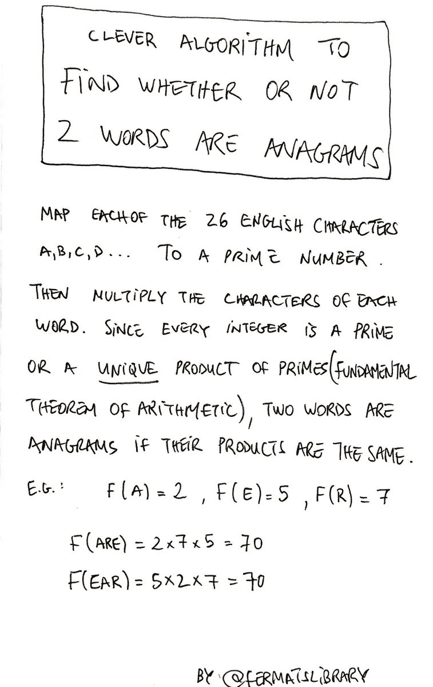

# 写一个脚本来识别一个变位词

> 原文：<https://dev.to/peter/write-a-script-to-identify-an-anagram-e9p>

灵感来自[这条来自永远令人敬畏的](https://twitter.com/fermatslibrary/status/958700402647674880)[费马图书馆](https://twitter.com/fermatslibrary)的推文。

> 费尔马图书馆@费尔马图书馆巧妙的算法找出 2 个单词是否是变位词13:56PM-2018 年 1 月 31 日[](https://twitter.com/intent/tweet?in_reply_to=958700402647674880)[](https://twitter.com/intent/retweet?tweet_id=958700402647674880)[](https://twitter.com/intent/like?tweet_id=958700402647674880)

## 挑战

用你选择的语言，**写一个脚本来确定两个字符串是否是彼此的变位词**。你可以使用推文中概述的方法，或者——为了加分——想出自己的解决方案🤓。

通过[维基百科](https://en.wikipedia.org/wiki/Anagram):

> 变位词是通过重新排列不同单词或短语的字母形成的单词或短语，通常使用所有原始字母一次。

对于我们的挑战，我们将使用严格的定义——每个字母**必须**恰好使用一次。

**预期行为** :

```
isAnagram(stressed, desserts) // TRUE
isAnagram(happy, sad) // FALSE 
```

Enter fullscreen mode Exit fullscreen mode

玩得开心！