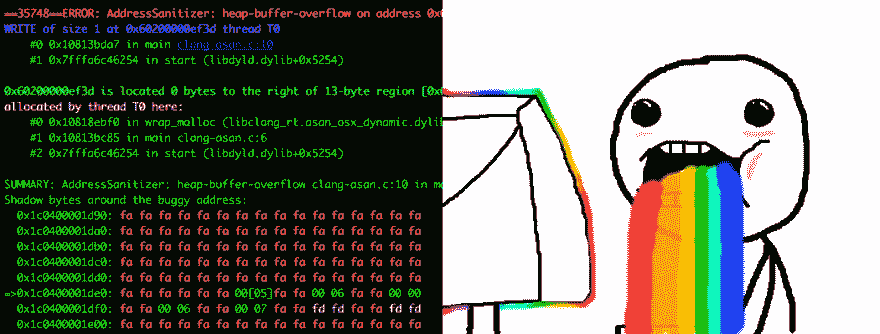

# 用 Clang 地址杀毒器写更安全的 C

> 原文：<https://dev.to/loderunner/writing-safer-c-with-clang-address-sanitizer>

# 开场白

我们想改进我们的密码强度算法，并决定采用 Dropbox 的人提出的行业标准 [zxcvbn](https://github.com/dropbox/zxcvbn) 。我们的 web 前端将使用默认的 Javascript 库，对于移动和桌面，我们选择使用 [C 实现](https://github.com/tsyrogit/zxcvbn-c)，因为它是所有平台的最小公分母。

所有这一切都很快完成了。我摆弄了几个[样本密码](https://xkcd.com/936/),所以我决定在之前的密码强度评估工具的测试套件中运行它。该测试根据不同的规则生成大量随机密码，并期望强度在给定的范围内。但是测试运行程序不断出现分段错误。

原来这个库有很多通常“无害”的缓冲区溢出情况，但是当你过多地运行求值器函数时，最终会使你的程序崩溃。我开始修复我能看到的案例，但是阅读别人的算法来跟踪微小的内存错误很快就过时了。我需要一个工具来帮助我。

这时候我想到了 Clang 的地址消毒剂。

# 遇见阿三

来自 [Clang 文档](https://clang.llvm.org/docs/AddressSanitizer.html):

> AddressSanitizer 是一个快速内存错误检测器。它由一个编译器工具模块和一个运行时库组成。该工具可以检测以下类型的错误:
> 
> *   对堆、堆栈和全局变量的越界访问
> *   免费后使用
> *   返回后使用
> *   范围后使用
> *   双倍免费，无效免费
> *   内存泄漏(实验性)

这涵盖了我在 c #中遇到的大部分崩溃及其对性能的影响？

> AddressSanitizer 引入的典型减速是 **2x** 。

在许多调试环境中完全可以接受。尤其是如果它能节省你在腐败的堆栈中寻找众所周知的针的时间。

# 第一步

让我们在一个简单的程序上尝试一下这个消毒剂。我们将在堆上分配一个缓冲区，将字符串的每个字符复制到其中，并将其打印到标准输出。

```
int main() {
    const char* hello = "Hello, World!";
    char* str = malloc(13 * sizeof(char)); // "Hello, World!" is 13 characters long

    for (int i = 0; i < 13; i++) {
        str[i] = hello[i];
    }
    str[13] = 0; // Don't forget the terminating nul character

    printf("%s\n", str);

    return 0;
} 
```

如果您编译并运行这个程序，它很可能会像预期的那样工作。

```
$ clang -o clang-asan clang-asan.c
$ ./clang-asan
Hello, World! 
```

但不应该。或者应该如此。是[未定义](http://blog.regehr.org/archives/213)。

当将`0`赋给索引 13 处的字符时，我们将写出数组边界，写入未分配的内存。虽然在这种情况下无害，但这是一个典型的缓冲区溢出错误。

让我们试着用地址消毒程序再编译一次。

```
$ clang -fsanitize=address -g -o clang-asan clang-asan.c
$ ./clang-asan 
```

哇哦。这样的输出。A E S T H E T I C！

[T2】](https://res.cloudinary.com/practicaldev/image/fetch/s--jIsi_YKH--/c_limit%2Cf_auto%2Cfl_progressive%2Cq_auto%2Cw_880/http://i.imgur.com/CIrbITi.jpg)

# 发生了什么？

那么我们能从这堆魔法中得到什么呢？让我们一行一行地过一遍。

```
==36293==ERROR: AddressSanitizer: heap-buffer-overflow on address 0x60200000ef3d
at pc 0x000105960da8 bp 0x7fff5a29fa30 sp 0x7fff5a29fa28 
```

AddressSanitizer 在`0x60200000ef3d`发现堆缓冲区溢出，这是一个看似有效的地址(不是 NULL 或任何其他明显错误的值)。其余的地址是[程序计数器、基址指针和堆栈指针寄存器](https://en.wikibooks.org/wiki/X86_Assembly/X86_Architecture)。

```
WRITE of size 1 at 0x60200000ef3d thread T0
    #0 0x105960da7 in main clang-asan.c:10
    #1 0x7fffa6c46254 in start (libdyld.dylib+0x5254) 
```

在第 10 行写大小为 1。10 号线是什么？

```
str[13] = 0; 
```

在这条指令中，我们是在堆外写的。地址消毒公司不同意。

```
0x60200000ef3d is located 0 bytes to the right of 13-byte region
[0x60200000ef30,0x60200000ef3d) 
```

这绝对是我最喜欢的适应症之一。除了告诉您代码中的哪一行失败了以及失败发生在内存中的什么地方，您还可以获得内存中最近的分配区域的完整描述(这可能就是您试图访问的区域)。

# 给调试器通电

我们已经看到地址杀毒软件有一些漂亮的技巧。主要的好处是，它将打破你的程序几乎任何坏的内存访问。但是当与调试器结合使用时，它的真正威力才显现出来。

让我们再次运行我们的程序，这次用`lldb`。

```
$ lldb -- ./clang-asan
(lldb) target create "./clang-asan"
Current executable set to './clang-asan' (x86_64)
(lldb) run 
```

不出所料，程序在同一行再次崩溃。但是让我们看看在通常的输出之后我们得到了什么。

```
(lldb) AddressSanitizer report breakpoint hit. Use 'thread info -s' to get extended information about the report.
Process 40049 stopped
* thread #1: tid = 0x13f073, 0x00000001000e30a0 libclang_rt.asan_osx_dynamic.dylib`__asan::AsanDie(), queue = 'com.apple.main-thread', stop reason = Heap buffer overflow detected
    frame #0: 0x00000001000e30a0 libclang_rt.asan_osx_dynamic.dylib`__asan::AsanDie()
libclang_rt.asan_osx_dynamic.dylib`__asan::AsanDie:
->  0x1000e30a0 <+0>: pushq  %rbp
    0x1000e30a1 <+1>: movq   %rsp, %rbp
    0x1000e30a4 <+4>: pushq  %rbx
    0x1000e30a5 <+5>: pushq  %rax 
```

正如我们所看到的，程序没有在`main()`函数中的分段错误上停止，而是在`libclang_rt.asan_osx_dynamic.dylib`中的一个特殊的`__asan::AsanDie()`函数中停止。显然，AddressSanitizer 负责触发断点。实际的堆栈跟踪是什么？

```
(lldb) bt
* thread #1: tid = 0x13f073, 0x00000001000e30a0 libclang_rt.asan_osx_dynamic.dylib`__asan::AsanDie(), queue = 'com.apple.main-thread', stop reason = Heap buffer overflow detected
  * frame #0: 0x00000001000e30a0 libclang_rt.asan_osx_dynamic.dylib`__asan::AsanDie()
    frame #1: 0x00000001000e8198 libclang_rt.asan_osx_dynamic.dylib`__sanitizer::Die() + 88
    frame #2: 0x00000001000e0a29 libclang_rt.asan_osx_dynamic.dylib`__asan::ScopedInErrorReport::~ScopedInErrorReport() + 249
    frame #3: 0x00000001000e0151 libclang_rt.asan_osx_dynamic.dylib`__asan::ReportGenericError(unsigned long, unsigned long, unsigned long, unsigned long, bool, unsigned long, unsigned int, bool) + 3953
    frame #4: 0x00000001000e11e9 libclang_rt.asan_osx_dynamic.dylib`__asan_report_store1 + 57
    frame #5: 0x0000000100000da8 clang-asan`main + 328 at clang-asan.c:10
    frame #6: 0x00007fffa6c46255 libdyld.dylib`start + 1
(lldb) frame select 5
frame #5: 0x0000000100000da8 clang-asan`main + 328 at clang-asan.c:10
   7        for (int i = 0; i < 13; i++) {
   8            str[i] = hello[i];
   9        }
-> 10       str[13] = 0;
   11
   12       printf("%s\n", str);
   13 
```

我们可以看到，当我们试图在第 10 行存储一些东西到内存中时，`asan`库就接管了。

另外几行引起了我的注意。先说:

```
AddressSanitizer report breakpoint hit. Use 'thread info -s' to get extended information about the report. 
```

如果我们尝试它，我们会得到一个 JSON 输出，它很好地重现了错误，如果我们需要它，我们可以再次提出来。

```
(lldb) thread info -s
thread #1: tid = 0x13f073, 0x00000001000e30a0 libclang_rt.asan_osx_dynamic.dylib`__asan::AsanDie(), queue = 'com.apple.main-thread', stop reason = Heap buffer overflow detected

{
  "access_size" : 1,
  "access_type" : 1,
  "address" : 105690555281181,
  "description" : "heap-buffer-overflow",
  "instrumentation_class" : "AddressSanitizer",
  "pc" : 4294970792,
  "stop_type" : "fatal_error"
} 
```

另一行引起了我的兴趣，是在我们启动这个程序之后:

```
AddressSanitizer debugger support is active. Memory error breakpoint has been installed and you can now use the 'memory history' command. 
```

`memory history`命令的文档是:

```
(lldb) help memory history
     Print recorded stack traces for allocation/deallocation events associated with an address.

Syntax: memory history <address> 
```

听起来很强大，让我们试一试。

```
(lldb) memory history str
  thread #4294967295: tid = 0x0001, 0x00000001000d8bf0 libclang_rt.asan_osx_dynamic.dylib`wrap_malloc + 192, name = 'Memory allocated by Thread 1'
    frame #0: 0x00000001000d8bf0 libclang_rt.asan_osx_dynamic.dylib`wrap_malloc + 192
    frame #1: 0x0000000100000c85 clang-asan`main + 37 at clang-asan.c:6
    frame #2: 0x00007fffa6c46254 libdyld.dylib`_dyld_process_info_notify_release + 44 
```

在分配内存中的这个地址时，我们得到确切的堆栈跟踪。在一个更复杂的程序中，我们将获得地址分配和释放的所有时间的历史记录，这使得它成为一个非常强大的工具来理解隐藏的内存错误。

# 物尽其用

回到我的实际案例，我是如何把地址消毒器用好的？我简单地用`lldb`运行了用杀毒软件编译的测试套件。果然，它在每一行可能导致崩溃的地方都停了下来。事实证明，在很多情况下，zxcvbn-c 在堆上和堆栈上写超过了分配的缓冲区的末尾。我在 C 库中修复了这些情况，并再次运行了测试。一辆赛格福特都看不见！

# 接下来呢？

我过去使用过记忆工具，但它们通常都很笨拙，或者对性能造成很大影响，以至于在现实生活中毫无用处。Clang 的地址杀毒软件被证明是详细的，可靠的，并且非常容易使用。我听说过 Valgrind 的奇迹，但 macOS 几乎不支持它，这让我在 MacBook Pro 上使用很痛苦。

再加上 Clang 的[静态分析器](https://clang-analyzer.llvm.org/)，AddressSanitizer 将成为评估代码质量的必停站。这也将是我面对令人困惑的记忆问题时的第一个工具。还有很多情况下，我可以使用早期失败和内存历史来调试代码。例如，如果一个程序在访问一个被释放的对象的成员时崩溃，我们可以很容易地跟踪导致释放的事件，节省了添加和读取日志来追溯所发生的事情的时间。

你能想到地址消毒器可以派上用场的例子吗？它会遗漏 bug 或导致误报的情况？在评论里告诉我！