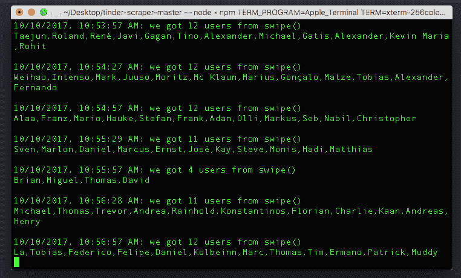
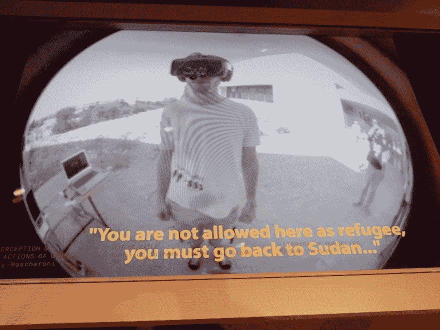
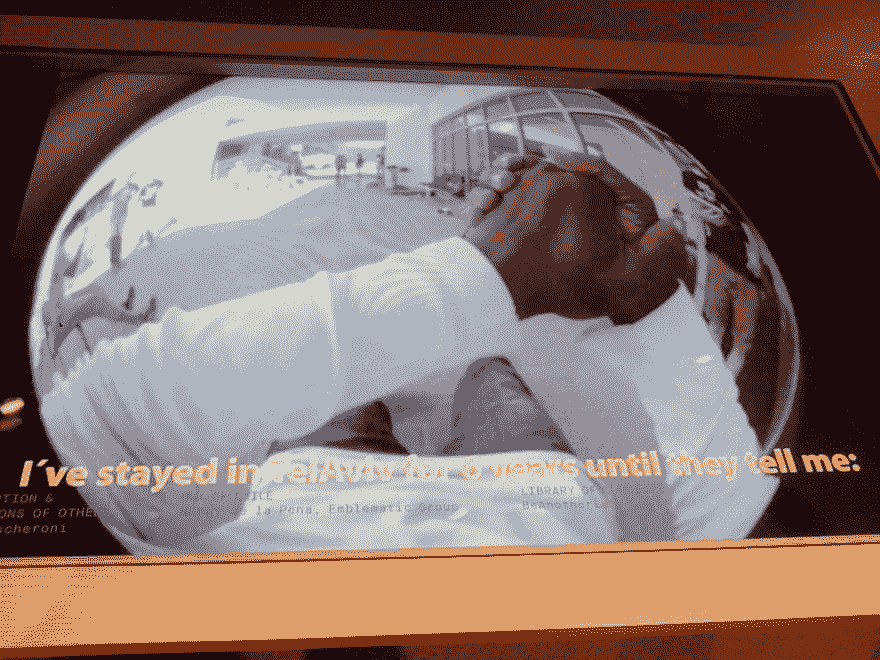
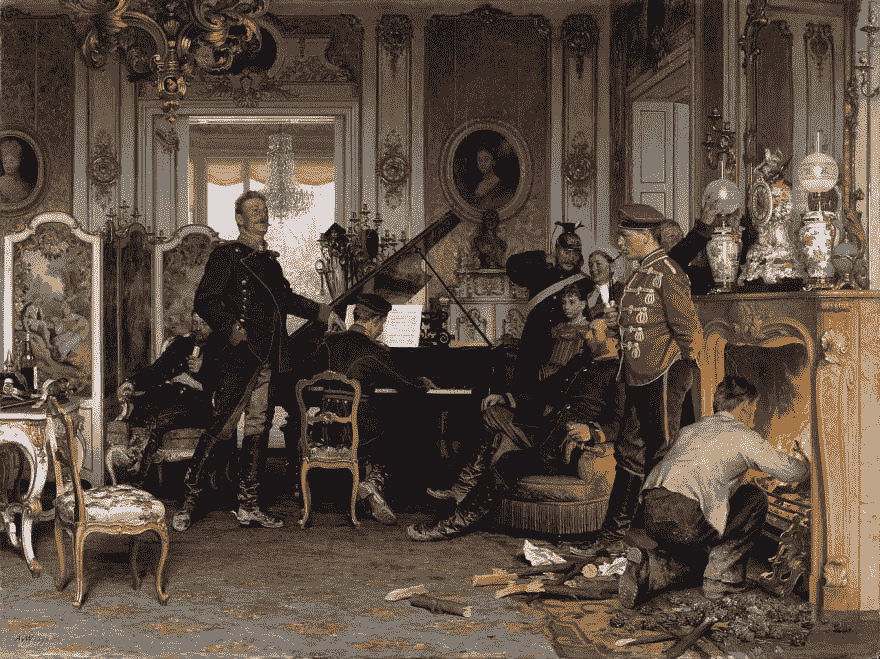

# 泽柏林极客日记，第三部分。

> 原文：<https://dev.to/guergana/ze-berlin-tech-diaries-part-iii-4dc>

嗯，上周不像前两个星期那样科技密集，因为我得了流感，但这并没有阻止我的好奇心，事实上我有更多的时间去探索。

还有！！！！我有几个有趣的发现:

第一个是这个发现，这三天来我觉得非常兴奋。想想我可以做的所有很酷的可视化项目，拥有大多数柏林 Tinder 用户的公共数据。三天后，兴奋感逐渐消失了。我仍然有一个大约 5000 人的数据库(当然有一些重复的数据，需要清理一下)。要使用这个工具，你不需要任何技术知识，它非常简单。

[T2】](https://res.cloudinary.com/practicaldev/image/fetch/s--4E-LM9Rr--/c_limit%2Cf_auto%2Cfl_progressive%2Cq_auto%2Cw_880/https://thepracticaldev.s3.amazonaws.com/i/q1v802zzfrjrqfy0l4cy.png)

你会怎么处理这些数据？

我意外遇到的另一件事是这个展览。

[T2】](https://res.cloudinary.com/practicaldev/image/fetch/s--m0DluG3---/c_limit%2Cf_auto%2Cfl_progressive%2Cq_auto%2Cw_880/https://www.aec.at/international/files/2017/07/berlin2017.jpg)

我有机会去参加今年的电子艺术节，但是没有去，我有点后悔，瞧。这当然不一样，但我尝到了它的味道。展厅不是很大，但他们有很多视频格式的项目。

一些亮点:

艺术家 Akinori goto 的 3D 打印机芯

从[出发的 toki- BALLET #01_ym](https://vimeo.com/user16179491) 在 [Vimeo](https://vimeo.com) 上的 Akinori Goto 。

在一个视频中提到了我的一个墨西哥朋友正在参与的项目:[这台机器将成为另一个](http://beanotherlab.org/)。恭喜你！

[T2】](https://res.cloudinary.com/practicaldev/image/fetch/s--6is3VARt--/c_limit%2Cf_auto%2Cfl_progressive%2Cq_auto%2Cw_880/https://thepracticaldev.s3.amazonaws.com/i/xewzl5ldt3cfb1eyx3pr.jpg)

[T2】](https://res.cloudinary.com/practicaldev/image/fetch/s--7Hx9WnGf--/c_limit%2Cf_auto%2Cfl_progressive%2Cq_auto%2Cw_880/https://thepracticaldev.s3.amazonaws.com/i/et9j66e28su35pnorqf6.jpg)

在这个项目中，两个不同的人戴着一个既有摄像头又有 3D 眼镜的设备，你有机会实验那个人的身体里会有什么。这是一个移情实验。

最后但同样重要的是，这幅画在柏林的阿尔特国家美术馆。早期多媒体的一个有趣例子。

[T2】](https://res.cloudinary.com/practicaldev/image/fetch/s--BaluY6L0--/c_limit%2Cf_auto%2Cfl_progressive%2Cq_auto%2Cw_880/https://upload.wikimedia.org/wikipedia/commons/thumb/4/43/Anton_von_Werner_-_Im_Etappenquartier_vor_Paris_-_Google_Art_Project.jpg/1280px-Anton_von_Werner_-_Im_Etappenquartier_vor_Paris_-_Google_Art_Project.jpg)

它的名字是“巴黎之旅”，由安东·冯·沃纳于 1894 年创作。

到目前为止，这幅画看起来像是一幅赞美普鲁士胜利的普通画作，更具体地说，是赞美德国相对于法国的优势，(你可以在这里阅读更多关于这幅画的象征意义和历史背景的内容:但如果你仔细看看这幅画的画框，你会发现它变得栩栩如生:

[T2】](https://res.cloudinary.com/practicaldev/image/fetch/s--Zp75zK97--/c_limit%2Cf_auto%2Cfl_progressive%2Cq_auto%2Cw_880/https://thepracticaldev.s3.amazonaws.com/i/ljbujj1uhlz0kk0419vy.jpg)

你可以看到他们演奏的是什么音乐！工作中的多媒体。

好了，这就是上周。我开始注意到这个博客可能会延伸到编码和技术领域之外。但是，嘿，生活的所有学科都是相互关联的。